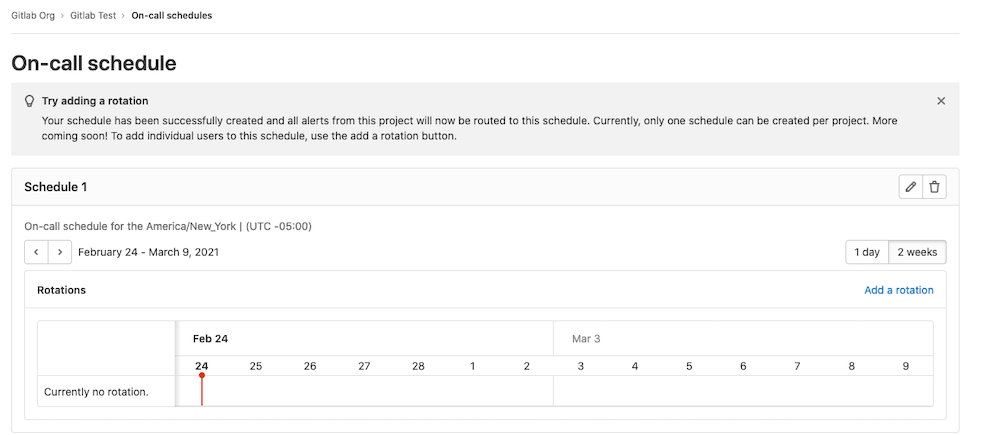
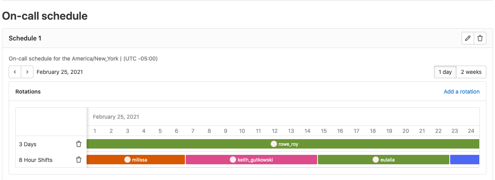

# On-call Schedule Management **(PREMIUM)**

> [Introduced](https://gitlab.com/groups/gitlab-org/-/epics/4544) in [GitLab Ultimate](https://about.gitlab.com/pricing/) 13.10.

On-call Schedule management allows you to create schedules for responders to rotate on-call responsibilities. Maintain the availabity of your software services by putting your teams on-call. When things go wrong, your team will be notified immediately so that they can quickly respond to service outages and disruptions.

If you have at least Maintainer [permissions](../../user/permissions.md), to create an
schedule, you have one option to do this manually.

## Schedules

Set-up an on-call schedule for your team to add rotations to.

### Create a schedule

> [Introduced](https://gitlab.com/gitlab-org/gitlab/-/issues/230857) in GitLab 13.10.

1. Go to **Operations > On-call Schedules**, and select **Add a schedule**.
1. In the **Add a schedule** modal, enter a schedule **name**, **description** and select a **timezone**.
1. You have now created an empty schedule with no rotations. This will render the below empty state prompting you to create rotations.

   

### Update a schedule

> [Introduced](https://gitlab.com/gitlab-org/gitlab/-/issues/262849) in GitLab 13.10.

1. Go to **Operations > On-call Schedules**, and select **Pencil** icon on the top right of the schedule card across from the schedule name.
1. In the **Edit a schedule** modal, update your schedule **name**, **description** and select a new **timezone** if needed.
1. Click the **Edit schedule** button to save your changes.

### Delete a schedule

> [Introduced](https://gitlab.com/gitlab-org/gitlab/-/issues/262850) in GitLab 13.10.

1. Go to **Operations > On-call Schedules**, and select **Trash can** icon on the top right of the schedule card.
1. In the **Delete Schedule** modal, click the **Delete schedule** button to save your changes and delete the current schedule.

## Rotations

Add rotations to an existing schedule to put your team members on-call.

### Create a rotation

> [Introduced](https://gitlab.com/gitlab-org/gitlab/-/issues/262857) in GitLab 13.10.

1. Go to **Operations > On-call Schedules**, and click the **Add a rotation** button on the top right of the current schedule.
1. In the **Add a rotation** modal, enter a **Name**, select your needed **Participants**, enter the **Rotation length** and finally the **Starts on** time/date.
1. Rotations can also be enabled to have fixed **Start/End** dates which can be enabled via the toggle and the end of the modal.
1. Rotations can also be enabled to be restricted to **Time intervals** which can be enabled via the toggle and the end of the modal.

| Modal Option | Value | Type | 
| ------ | ------ | ------ |
| Name | The name of the rotation to create | `String` | 
| Participants | The selection of users to assign to the rotation | `User`  |
| Rotation length value | The length each participant is on call | `Number` |
| Rotation length type | The time unit for the duration length | `Hours / Days / Weeks` |
| Starts on date | The start date of the rotation | `Date` |
| Starts on time | The start time for each shift within the rotation | `Time` |

#### Rotation Start/End Date

> [Introduced](https://gitlab.com/gitlab-org/gitlab/-/issues/262858) in GitLab 13.10.

1. Go to **Operations > On-call Schedules**, and click the **Add a rotation** button on the top right of the current schedule.
1. In the **Add a rotation** modal toggle the **Enable end date** option and then select a start/end date for the rotation being created.

#### Rotation Time Intervals

> [Introduced](https://gitlab.com/gitlab-org/gitlab/-/issues/262859) in GitLab 13.10.

1. Go to **Operations > On-call Schedules**, and click the **Add a rotation** button on the top right of the current schedule.
1. In the **Add a rotation** modal toggle the **Restrict to time intervals** option and then select a start/end time for each rotation shift to be restricted to.

### Edit a rotation

> [Introduced](https://gitlab.com/gitlab-org/gitlab/-/issues/262862) in GitLab 13.10.

1. Go to **Operations > On-call Schedules**, and select **Pencil** icon on the right of the rotation title that you want to update.
1. In the **Edit Rotation** modal, click the **Edit rotation** button.

### Delete a rotation

> [Introduced](https://gitlab.com/gitlab-org/gitlab/-/issues/262863) in GitLab 13.10.

1. Go to **Operations > On-call Schedules**, and select **Trash Can** icon on the right of the rotation title that you want to delete.
1. In the **Delete Rotation** modal, click the **Delete rotation** button to save your changes and remove the currently selected rotation.

### Schedule Rotation Views(Daily, Hourly)

> [Introduced](https://gitlab.com/gitlab-org/gitlab/-/issues/262860) in GitLab 13.10.

1. On-call Schedules can be viewed in two formats currently, `1 day` at a time or `2 weeks` at a time. 
1. To swap views please use the toggle in the top right of the schedule card. 
1. By default, `2 weeks` are selected. 
1. Rotation shift participants can be hovered over to view their individual shift details(Starts on/Ends On/Name).

   

### Paging an on-call responder

When an alert is created in a project, GitLab will send an email to the on-call responder(s) in the on-call schedule for that project. If there is no schedule or there is no one on-call in that schedule at the time the alert is triggered, no email will be sent.
