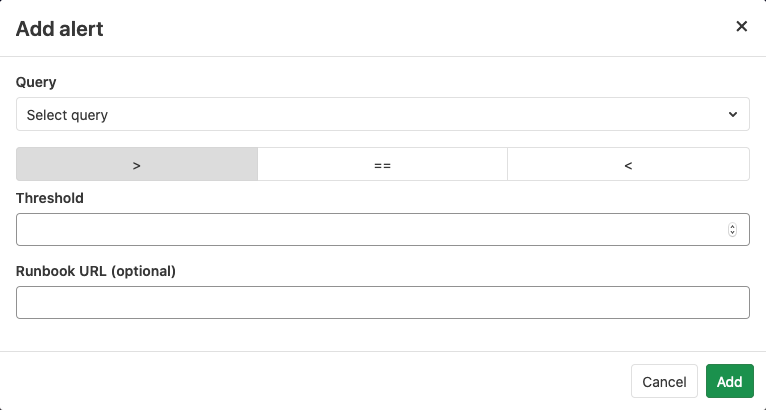

# Set up alerts for Prometheus metrics **(CORE)**

After [configuring metrics for your CI/CD environment](index.md), you can set up
alerting for Prometheus metrics depending on the location of your instances, and
[trigger actions from alerts](#trigger-actions-from-alerts-ultimate) to notify
your team when environment performance falls outside of the boundaries you set.

## Managed Prometheus instances

> [Introduced](https://gitlab.com/gitlab-org/gitlab/-/merge_requests/6590) in [GitLab Ultimate](https://about.gitlab.com/pricing/) 11.2 for [custom metrics](index.md#adding-custom-metrics), and 11.3 for [library metrics](../../user/project/integrations/prometheus_library/metrics.md).

For managed Prometheus instances using auto configuration, you can
[configure alerts for metrics](index.md#adding-custom-metrics) directly in the
[metrics dashboard](index.md). To set an alert:

1. In your project, navigate to **Operations > Metrics**,
1. Identify the metric you want to create the alert for, and click the
   **ellipsis** **{ellipsis_v}** icon in the top right corner of the metric.
1. Choose **Alerts**.
1. Set threshold and operator.
1. Click **Add** to save and activate the alert.



To remove the alert, click back on the alert icon for the desired metric, and click **Delete**.

## External Prometheus instances

>- [Introduced](https://gitlab.com/gitlab-org/gitlab/-/issues/9258) in [GitLab Ultimate](https://about.gitlab.com/pricing/) 11.8.
>- [Moved](https://gitlab.com/gitlab-org/gitlab/-/issues/42640) to [GitLab Core](https://about.gitlab.com/pricing/) in 12.10.

For manually configured Prometheus servers, GitLab provides a notify endpoint for
use with Prometheus webhooks. If you have manual configuration enabled, an
**Alerts** section is added to **Settings > Integrations > Prometheus**.
This section contains the **URL** and **Authorization Key** you will need. The
**Reset Key** button will invalidate the key and generate a new one.


To send GitLab alert notifications, copy the **URL** and **Authorization Key** into the
[`webhook_configs`](https://prometheus.io/docs/alerting/latest/configuration/#webhook_config)
section of your Prometheus Alertmanager configuration:

```yaml
receivers:
  name: gitlab
  webhook_configs:
    - http_config:
        bearer_token: 9e1cbfcd546896a9ea8be557caf13a76
      send_resolved: true
      url: http://192.168.178.31:3001/root/manual_prometheus/prometheus/alerts/notify.json
  ...
```

For GitLab to associate your alerts with an [environment](../../ci/environments/index.md),
you must configure a `gitlab_environment_name` label on the alerts you set up in
Prometheus. The value of this should match the name of your environment in GitLab.

NOTE: **Note:**
In GitLab versions 13.1 and greater, you can configure your manually configured
Prometheus server to use the
[Generic alerts integration](../../user/project/integrations/generic_alerts.md).

## Trigger actions from alerts **(ULTIMATE)**

>- [Introduced](https://gitlab.com/gitlab-org/gitlab/-/issues/4925) in [GitLab Ultimate](https://about.gitlab.com/pricing/) 11.11.
>- [From GitLab Ultimate 12.5](https://gitlab.com/gitlab-org/gitlab/-/issues/13401), when GitLab receives a recovery alert, it will automatically close the associated issue.

Alerts can be used to trigger actions, like opening an issue automatically
(disabled by default since `13.1`). To configure the actions:

1. Navigate to your project's **Settings > Operations > Incidents**.
1. Enable the option to create issues.
1. Choose the [issue template](../../user/project/description_templates.md) to create the issue from.
1. Optionally, select whether to send an email notification to the developers of the project.
1. Click **Save changes**.

After enabling, GitLab automatically opens an issue when an alert is triggered containing
values extracted from the [`alerts` field in webhook payload](https://prometheus.io/docs/alerting/latest/configuration/#webhook_config):

- Issue author: `GitLab Alert Bot`
- Issue title: Extracted from the alert payload fields `annotations/title`, `annotations/summary`, or `labels/alertname`.
- Alert `Summary`: A list of properties from the alert's payload.
  - `starts_at`: Alert start time from the payload's `startsAt` field
  - `full_query`: Alert query extracted from the payload's `generatorURL` field
  - Optional list of attached annotations extracted from `annotations/*`
- Alert [GFM](../../user/markdown.md): GitLab Flavored Markdown from the payload's `annotations/gitlab_incident_markdown` field.

When GitLab receives a **Recovery Alert**, it closes the associated issue.
This action is recorded as a system message on the issue indicating that it
was closed automatically by the GitLab Alert bot.

To further customize the issue, you can add labels, mentions, or any other supported
[quick action](../../user/project/quick_actions.md) in the selected issue template,
which applies to all incidents. To limit quick actions or other information to
only specific types of alerts, use the `annotations/gitlab_incident_markdown` field.

Since [version 12.2](https://gitlab.com/gitlab-org/gitlab-foss/-/issues/63373),
GitLab tags each incident issue with the `incident` label automatically. If the label
does not yet exist, it is also created automatically.

If the metric exceeds the threshold of the alert for over 5 minutes, GitLab sends
an email to all [Maintainers and Owners](../../user/permissions.md#project-members-permissions)
of the project.
