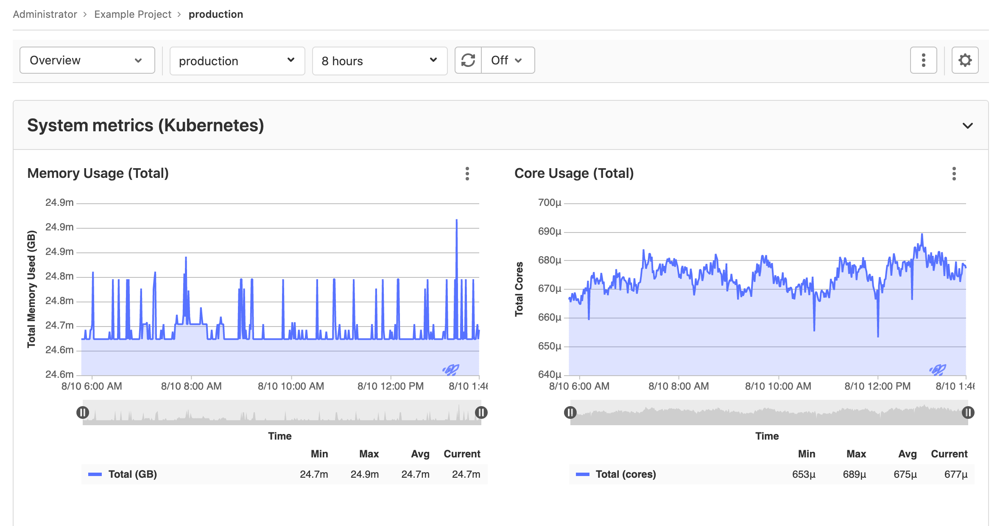
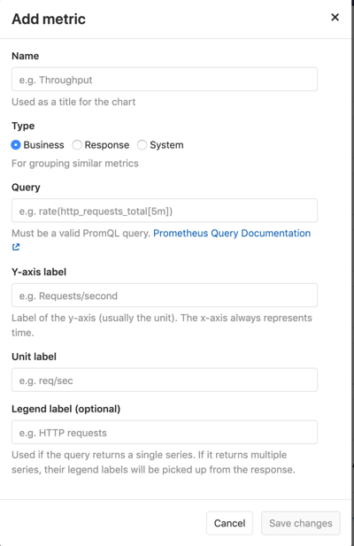

# Monitor your environment's metrics **(FREE)**

GitLab helps your team monitor the health and performance of your applications
and infrastructure by turning statistics and log files into charts and graphs
that are easy to understand, especially when time is short and decisions are
critical. For GitLab to display your information in charts, you must:

1. **Instrument your application** - Collect accurate and complete measurements.
   <I class="fa fa-youtube-play youtube" aria-hidden="true"></I>
   For an overview, see [How to instrument Prometheus metrics in GitLab](https://www.youtube.com/watch?v=tuI2oJ3TTB4).
1. **Expose metrics for capture** - Make logs, metrics, and traces available for capture.
1. [**Configure Prometheus to gather metrics**](#configure-prometheus-to-gather-metrics) -
   Deploy managed applications like Elasticsearch, Prometheus, and Jaeger to gather
   the data you've exposed.
1. **GitLab collects metrics** - GitLab uses Prometheus to scrape the data you've
   captured in your managed apps, and prepares the data for display. To learn more, read
   [Collect and process metrics](#collect-and-process-metrics).
1. **Display charts in the GitLab user interface** - GitLab converts your metrics
   into easy-to-read charts on a default dashboard. You can create as many custom charts
   and custom dashboards as needed so your team has full insight into your
   application's health.

## Configure Prometheus to gather metrics

You must connect a Prometheus instance to GitLab to collect metrics. How you configure
your Prometheus integration depends on where your apps are running:

- **For manually-configured Prometheus** -
  [Specify your Prometheus server](../../user/project/integrations/prometheus.md#manual-configuration-of-prometheus),
  and define at least one environment.
- **For GitLab-managed Prometheus** - GitLab can
  [deploy and manage Prometheus](../../user/project/integrations/prometheus.md#managed-prometheus-on-kubernetes) for you.
  You must also complete a code deployment, as described in
  [Deploy code with GitLab-managed Prometheus](#deploy-code-with-gitlab-managed-prometheus),
  for the **Operations > Metrics** page to contain data.

### Deploy code with GitLab-managed Prometheus

For GitLab-managed Prometheus, you can set up [Auto DevOps](../../topics/autodevops/index.md)
to quickly create a deployment:

1. Navigate to your project's **Operations > Kubernetes** page.
1. Ensure that, in addition to Prometheus, you also have GitLab Runner and Ingress
   installed.
1. After installing Ingress, copy its endpoint.
1. Navigate to your project's **Settings > CI/CD** page. In the
   **Auto DevOps** section, select a deployment strategy and save your changes.
1. On the same page, in the **Variables** section, add a variable named
   `KUBE_INGRESS_BASE_DOMAIN` with the value of the Ingress endpoint you
   copied previously. Leave the type as **Variable**.
1. Navigate to your project's **{rocket}** **CI/CD > Pipelines** page, and run a
   pipeline on any branch.
1. When the pipeline has run successfully, graphs are available on the
   **Operations > Metrics** page.

## Collect and process metrics

After [configuring Prometheus for a cluster](../../user/project/integrations/prometheus.md),
GitLab attempts to retrieve performance metrics for any [environment](../../ci/environments/index.md) with
a successful deployment.

GitLab scans the Prometheus server for metrics from known servers like Kubernetes
and NGINX, and attempts to identify individual environments. To learn more about
the supported metrics and scan processes, see the
[Prometheus Metrics Library documentation](../../user/project/integrations/prometheus_library/index.md).

To view the [default metrics dashboard](dashboards/default.md) for an environment that is
[configured to gather metrics](#configure-prometheus-to-gather-metrics):

1. *If the metrics dashboard is only visible to project members,* sign in to
   GitLab as a member of a project. Learn more about [metrics dashboard visibility](#metrics-dashboard-visibility).
1. In your project, navigate to **Operations > Metrics**.

GitLab displays the [default metrics dashboard](dashboards/default.md) for the environment,
like the following example:

The top of the dashboard contains a navigation bar. From left to right, the
navigation bar contains:

- **Dashboard** - A dropdown list of all dashboards available for the project,
  with starred dashboards listed first.
- **Environment** - A dropdown list of all [environments](../index.md) that searches
  through all environments as you type.
- **Range** - The time period of data to display.
- **Refresh dashboard** **{retry}** - Reload the dashboard with current data.
- **Set refresh rate** - Set a time frame for refreshing the data displayed.
- **More actions** **{ellipsis_v}** - More dashboard actions
  - **Add metric** - Adds a [custom metric](#adding-custom-metrics). Only available on GitLab-defined dashboards.
  ([Introduced](https://gitlab.com/gitlab-org/gitlab/-/issues/34779) in GitLab 12.5.)
  - **Edit dashboard YAML** - Edit the source YAML file of a custom dashboard. Only available on
  [custom dashboards](dashboards/index.md).
  ([Introduced](https://gitlab.com/gitlab-org/gitlab/-/issues/34779) in GitLab 12.5.)
  - **Duplicate current dashboard** - Save a [complete copy of a dashboard](dashboards/index.md#duplicate-a-gitlab-defined-dashboard). Only available on GitLab-defined dashboards.
  - **Star dashboard** **{star-o}** - Click to mark a dashboard as a favorite.
  Starred dashboards display a solid star **{star}** button, and display first
  in the **Dashboard** dropdown list.
  ([Introduced](https://gitlab.com/gitlab-org/gitlab/-/issues/214582) in GitLab 13.0.)
  - **Create new dashboard** - Create a [new custom dashboard for your project](dashboards/index.md#add-a-new-dashboard-to-your-project).
  ([Introduced](https://gitlab.com/gitlab-org/gitlab/-/issues/228856) in GitLab 13.3.)
- **Metrics settings** - Configure the
  [settings for this dashboard](dashboards/index.md#manage-the-metrics-dashboard-settings).

## Customize your metrics dashboard

After creating your dashboard, you can customize it to meet your needs:

- **Add custom metrics**: In addition to the GitLab default metrics, you can
  [create custom metrics](#adding-custom-metrics) and display them on your metrics dashboard.
- **Configure alerts for metrics**: [Configure custom alerts](alerts.md) for your team when
  environment performance falls outside of the boundaries you set.
- **Trigger actions from alerts**: [Open new issues for your team](alerts.md#trigger-actions-from-alerts) **(ULTIMATE)**
  when environment performance falls outside of the boundaries you set.

## Metrics dashboard visibility

> [Introduced](https://gitlab.com/gitlab-org/gitlab/-/issues/201924) in GitLab 13.0.

You can set the visibility of the metrics dashboard to **Only Project Members**
or **Everyone With Access**. When set to **Everyone with Access**, the metrics
dashboard is visible to authenticated and non-authenticated users.

## Adding custom metrics

> - [Moved](https://gitlab.com/gitlab-org/gitlab/-/merge_requests/28527) to GitLab Free in 12.10.

Custom metrics can be monitored by adding them on the monitoring dashboard page.
After saving them, they display on the environment metrics dashboard provided that either:

- A [connected Kubernetes cluster](../../user/project/clusters/add_remove_clusters.md)
  with the matching [environment scope](../../ci/environments/index.md#scoping-environments-with-specs) is used and
  [Prometheus installed on the cluster](../../user/project/integrations/prometheus.md#enabling-prometheus-integration).
- Prometheus is [manually configured](../../user/project/integrations/prometheus.md#manual-configuration-of-prometheus).

A few fields are required:

- **Name**: Chart title
- **Type**: Type of metric. Metrics of the same type are shown together.
- **Query**: Valid [PromQL query](https://prometheus.io/docs/prometheus/latest/querying/basics/).
- **Y-axis label**: Y axis title to display on the dashboard.
- **Unit label**: Query units, for example `req / sec`. Shown next to the value.

Multiple metrics can be displayed on the same chart if the fields **Name**, **Type**,
and **Y-axis label** match between metrics. For example, a metric with **Name**
`Requests Rate`, **Type** `Business`, and **Y-axis label** `rec / sec` would display
on the same chart as a second metric with the same values. A **Legend label** is
suggested if this feature is used.

## Editing additional metrics from the dashboard

> [Introduced](https://gitlab.com/gitlab-org/gitlab/-/issues/208976) in GitLab 12.9.

You can edit existing additional custom metrics for your dashboard by clicking the
**{ellipsis_v}** **More actions** dropdown and selecting **Edit metric**.

## Keyboard shortcuts for charts

> [Introduced](https://gitlab.com/gitlab-org/gitlab/-/issues/202146) in GitLab 13.2.

You can use keyboard shortcuts to interact more quickly with your currently-focused
chart panel. To activate keyboard shortcuts, use keyboard tabs to highlight the
**{ellipsis_v}** **More actions** dropdown menu, or hover over the dropdown menu
with your mouse, then press the key corresponding to your desired action:

- **Expand panel** - <kbd>e</kbd>
- **View logs** - <kbd>l</kbd> (lowercase 'L')
- **Download CSV** - <kbd>d</kbd>
- **Copy link to chart** - <kbd>c</kbd>
- **Alerts** - <kbd>a</kbd>
