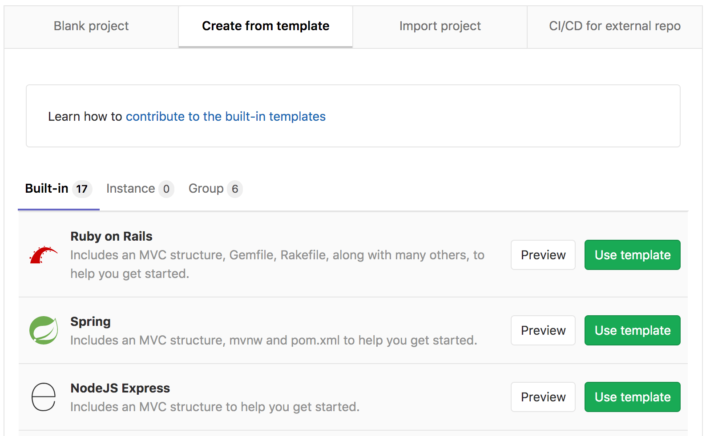
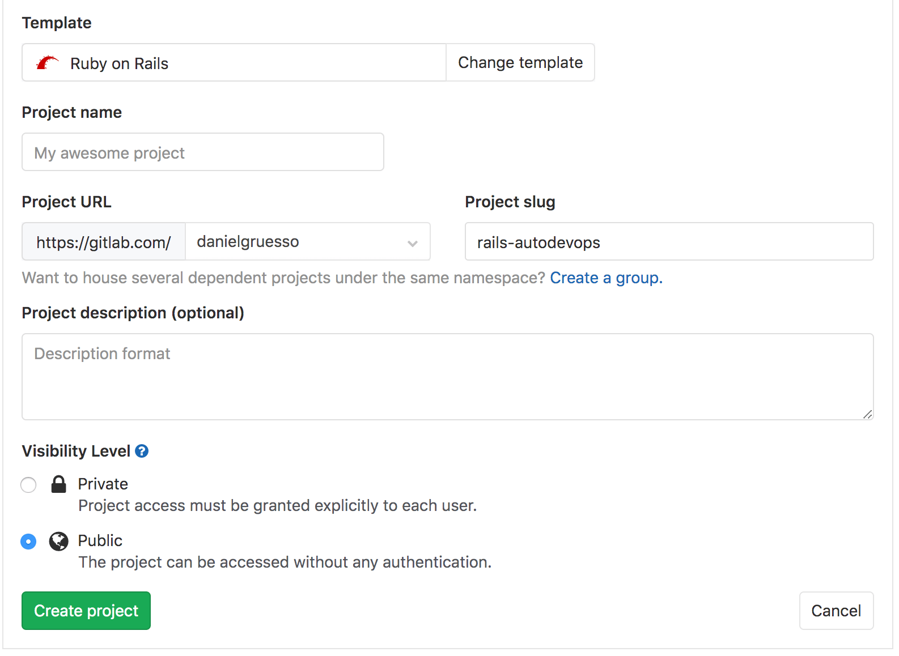
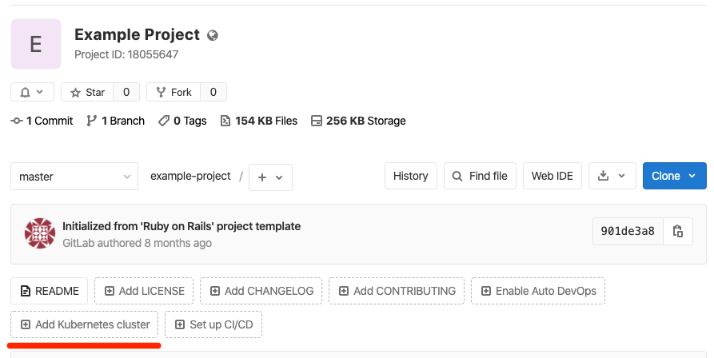
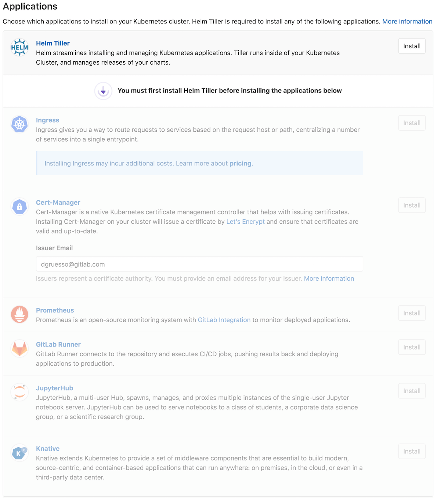
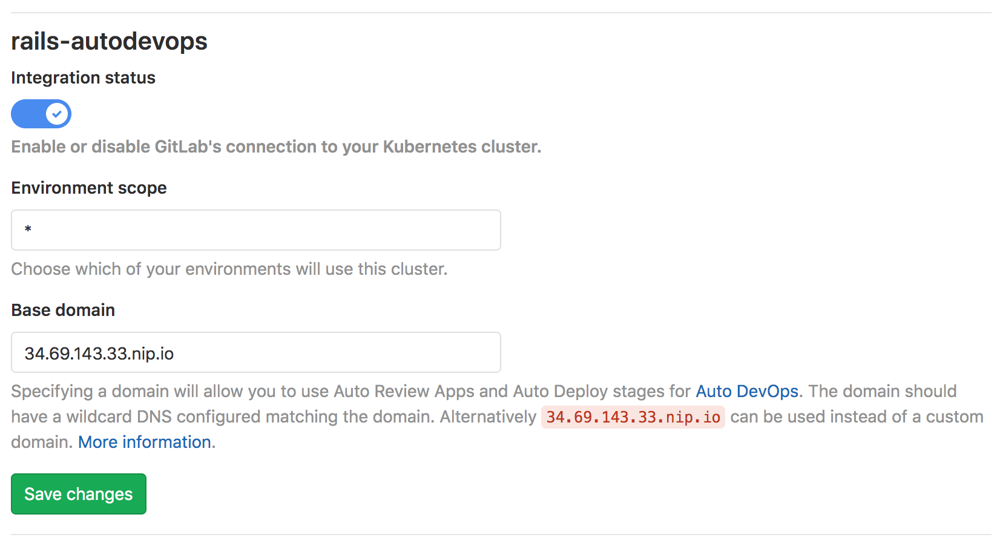
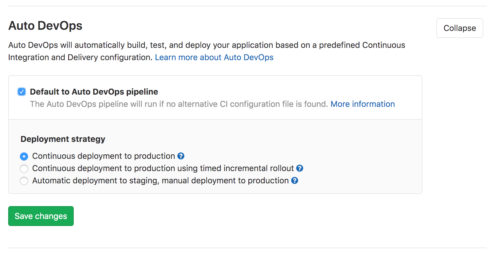
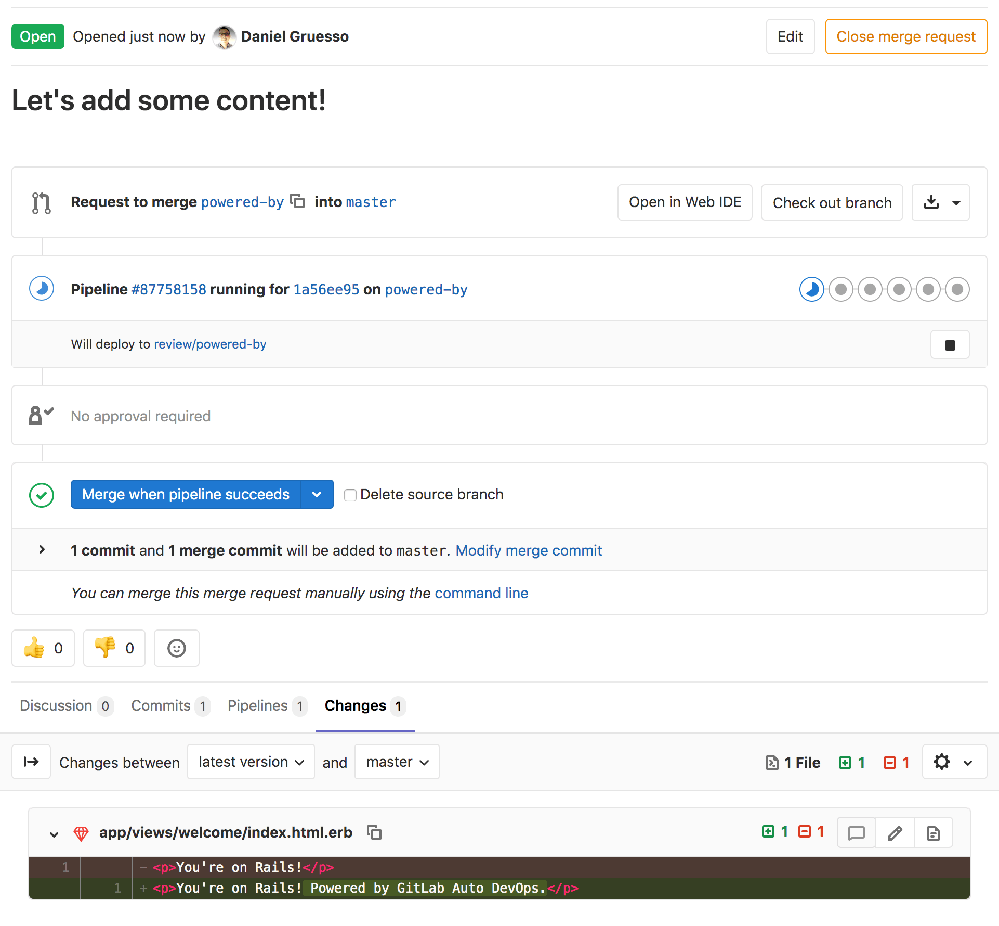
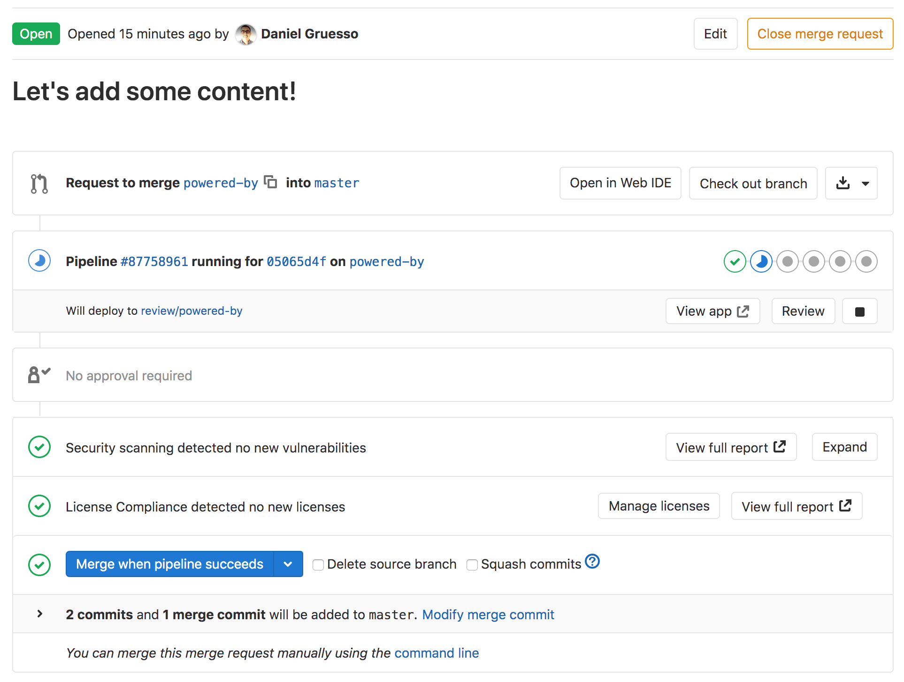

# Getting started with Auto DevOps

This step-by-step guide will help you use [Auto DevOps](index.md) to
deploy a project hosted on GitLab.com to Google Kubernetes Engine.

You will use GitLab's native Kubernetes integration, so you won't need
to create a Kubernetes cluster manually using the Google Cloud Platform console.
You will create and deploy a simple application that you create from a GitLab template.

These instructions will also work for a self-managed GitLab instance; you'll just
need to ensure your own [Runners are configured](../../ci/runners/README.md) and
[Google OAuth is enabled](../../integration/google.md).

## Configure your Google account

Before creating and connecting your Kubernetes cluster to your GitLab project,
you need a [Google Cloud Platform account](https://console.cloud.google.com).
Sign in with an existing Google account, such as the one you use to access Gmail
or Google Drive, or create a new one.

1. Follow the steps described in the ["Before you begin" section](https://cloud.google.com/kubernetes-engine/docs/quickstart#before-you-begin)
   of the Kubernetes Engine docs to enable the required APIs and related services.
1. Ensure you've created a [billing account](https://cloud.google.com/billing/docs/how-to/manage-billing-account)
   with Google Cloud Platform.

TIP: **Tip:**
Every new Google Cloud Platform (GCP) account receives [$300 in credit](https://console.cloud.google.com/freetrial),
and in partnership with Google, GitLab is able to offer an additional $200 for new
GCP accounts to get started with GitLab's Google Kubernetes Engine Integration.
[Follow this link](https://cloud.google.com/partners/partnercredit/?pcn_code=0014M00001h35gDQAQ#contact-form)
and apply for credit.

## Create a new project from a template

We will use one of GitLab's project templates to get started. As the name suggests,
those projects provide a bare-bones application built on some well-known frameworks.

1. In GitLab, click the plus icon (**{plus-square}**) at the top of the navigation bar, and select
   **New project**.
1. Go to the **Create from template** tab, where you can choose among a Ruby on
   Rails, Spring, or NodeJS Express project.
   For this tutorial, use the Ruby on Rails template.

   

1. Give your project a name, optionally a description, and make it public so that
   you can take advantage of the features available in the
   [GitLab Gold plan](https://about.gitlab.com/pricing/#gitlab-com).

   

1. Click **Create project**.

Now that you've created a project, you'll next create the Kubernetes cluster
to deploy this project to.

## Create a Kubernetes cluster from within GitLab

1. On your project's landing page, click **Add Kubernetes cluster**
   (note that this option is also available when you navigate to **{cloud-gear}** **Operations > Kubernetes**).

   

1. On the **Add a Kubernetes cluster integration** page, click the **Create new cluster** tab,
   then click **Google GKE**.

1. Connect with your Google account, and click **Allow** to allow access to your
   Google account. (This authorization request is only displayed the first time
   you connect GitLab with your Google account.)

   After authorizing access, the **Add a Kubernetes cluster integration** page
   is displayed.

1. In the **Enter the details for your Kubernetes cluster** section, provide
   details about your cluster:

   - **Kubernetes cluster name**
   - **Environment scope** - Leave this field unchanged.
   - **Google Cloud Platform project** - Select a project. When you
     [configured your Google account](#configure-your-google-account), a project
     should have already been created for you.
   - **Zone** - The [region/zone](https://cloud.google.com/compute/docs/regions-zones/) to
     create the cluster in.
   - **Number of nodes**
   - **Machine type** - For more information about
     [machine types](https://cloud.google.com/compute/docs/machine-types), see Google's documentation.
   - **Enable Cloud Run for Anthos** - Select this checkbox to use the
     [Cloud Run](../../user/project/clusters/add_gke_clusters.md#cloud-run-for-anthos),
     Istio, and HTTP Load Balancing add-ons for this cluster.
   - **GitLab-managed cluster** - Select this checkbox to
     [allow GitLab to manage namespace and service accounts](../../user/project/clusters/index.md#gitlab-managed-clusters) for this cluster.

1. Click **Create Kubernetes cluster**.

After a couple of minutes, the cluster will be created. You can also see its
status on your [GCP dashboard](https://console.cloud.google.com/kubernetes).

Next, you will install some applications on your cluster that are needed
to take full advantage of Auto DevOps.

## Install the package manager

After creating your Kubernetes cluster, GitLab's Kubernetes integration provides
[pre-defined applications](../../user/project/clusters/index.md#installing-applications)
for you to install. To install them, you must next install Helm Tiller, the
Kubernetes package manager for Kubernetes, to enable the installation of other applications.

Next to **Helm Tiller**, click **Install**.



After installation completes, the page reloads, and you can install other
applications.

## Install Ingress and Prometheus

After installing **Helm Tiller**, you can install other applications that rely on it,
including Ingress and Prometheus, which we will install in this quick start guide:

- Ingress - Provides load balancing, SSL termination, and name-based virtual hosting,
  using NGINX behind the scenes.
- Prometheus - An open-source monitoring and alerting system used to supervise the
  deployed application.

NOTE: **Note:**
We won't install GitLab Runner in this quick start guide, as this guide uses the
shared Runners provided by GitLab.com.

To install the applications:

- Click the **Install** button for **Ingress**.
- When the **Ingress Endpoint** is displayed, copy the IP address.
- Add your **Base domain**. For this guide, we will use the domain suggested by GitLab.
- Click **Save changes**.



## Enable Auto DevOps (optional)

While Auto DevOps is enabled by default, Auto DevOps can be disabled at both
the instance level (for self-managed instances) and the group level. Complete
these steps to enable Auto DevOps if it's disabled:

1. Navigate to **{settings}** **Settings > CI/CD > Auto DevOps**, and click **Expand**.
1. Select **Default to Auto DevOps pipeline** to display more options.
1. In **Deployment strategy**, select your desired [continuous deployment strategy](index.md#deployment-strategy)
   to deploy the application to production after the pipeline successfully runs on the `master` branch.
1. Click **Save changes**.

   

After you save your changes, GitLab creates a new pipeline. To view it, go to
**{rocket}** **CI/CD > Pipelines**.

In the next section, we explain what each job does in the pipeline.

## Deploy the application

When your pipeline runs, what is it doing?

To view the jobs in the pipeline, click the pipeline's status badge. The
**{status_running}** icon displays when pipeline jobs are running, and updates
without refreshing the page to **{status_success}** (for success) or
**{status_failed}** (for failure) when the jobs complete.

The jobs are separated into stages:


- **Build** - The application builds a Docker image and uploads it to your project's
  [Container Registry](../../user/packages/container_registry/index.md) ([Auto Build](stages.md#auto-build)).
- **Test** - GitLab runs various checks on the application:

  - The `test` job runs unit and integration tests by detecting the language and
    framework ([Auto Test](stages.md#auto-test))
  - The `code_quality` job checks the code quality and is allowed to fail
    ([Auto Code Quality](stages.md#auto-code-quality-starter)) **(STARTER)**
  - The `container_scanning` job checks the Docker container if it has any
    vulnerabilities and is allowed to fail ([Auto Container Scanning](stages.md#auto-container-scanning-ultimate))
  - The `dependency_scanning` job checks if the application has any dependencies
    susceptible to vulnerabilities and is allowed to fail
    ([Auto Dependency Scanning](stages.md#auto-dependency-scanning-ultimate)) **(ULTIMATE)**
  - Jobs suffixed with `-sast` run static analysis on the current code to check for potential
    security issues, and are allowed to fail ([Auto SAST](stages.md#auto-sast-ultimate)) **(ULTIMATE)**
  - The `license_management` job searches the application's dependencies to determine each of their
    licenses and is allowed to fail
    ([Auto License Compliance](stages.md#auto-license-compliance-ultimate)) **(ULTIMATE)**

   NOTE: **Note:**
   All jobs except `test` are allowed to fail in the test stage.

- **Review** - Pipelines on `master` include this stage with a `dast_environment_deploy` job.
  To learn more, see [Dynamic Application Security Testing (DAST)](../../user/application_security/dast/index.md).

- **Production** - After the tests and checks finish, the application deploys in
  Kubernetes ([Auto Deploy](stages.md#auto-deploy)).

- **Performance** - Performance tests are run on the deployed application
  ([Auto Browser Performance Testing](stages.md#auto-browser-performance-testing-premium)). **(PREMIUM)**

- **Cleanup** - Pipelines on `master` include this stage with a `stop_dast_environment` job.

After running a pipeline, you should view your deployed website and learn how
to monitor it.

### Monitor your project

After successfully deploying your application, you can view its website and check
on its health on the **Environments** page by navigating to
**{cloud-gear}** **Operations > Environments**. This page displays details about
the deployed applications, and the right-hand column displays icons that link
you to common environment tasks:


- **Open live environment** (**{external-link}**) - Opens the URL of the application deployed in production
- **Monitoring** (**{chart}**) - Opens the metrics page where Prometheus collects data
  about the Kubernetes cluster and how the application
  affects it in terms of memory usage, CPU usage, and latency
- **Deploy to** (**{play}** **{angle-down}**) - Displays a list of environments you can deploy to
- **Terminal** (**{terminal}**) - Opens a [web terminal](../../ci/environments/index.md#web-terminals)
  session inside the container where the application is running
- **Re-deploy to environment** (**{repeat}**) - For more information, see
  [Retrying and rolling back](../../ci/environments/index.md#retrying-and-rolling-back)
- **Stop environment** (**{stop}**) - For more information, see
  [Stopping an environment](../../ci/environments/index.md#stopping-an-environment)

GitLab displays the [Deploy Board](../../user/project/deploy_boards.md) below the
environment's information, with squares representing pods in your
Kubernetes cluster, color-coded to show their status. Hovering over a square on
the deploy board displays the state of the deployment, and clicking the square
takes you to the pod's logs page.

TIP: **Tip:**
The example shows only one pod hosting the application at the moment, but you can add
more pods by defining the [`REPLICAS` variable](customize.md#environment-variables)
in **{settings}** **Settings > CI/CD > Environment variables**.

### Work with branches

Following the [GitLab flow](../gitlab_flow.md#working-with-feature-branches),
you should next create a feature branch to add content to your application:

1. In your project's repository, navigate to the following file: `app/views/welcome/index.html.erb`.
   This file should only contain a paragraph: `<p>You're on Rails!</p>`.
1. Open the GitLab [Web IDE](../../user/project/web_ide/index.md) to make the change.
1. Edit the file so it contains:

   ```html
   <p>You're on Rails! Powered by GitLab Auto DevOps.</p>
   ```

1. Stage the file. Add a commit message, then create a new branch and a merge request
   by clicking **Commit**.

   

After submitting the merge request, GitLab runs your pipeline, and all the jobs
in it, as [described previously](#deploy-the-application), in addition to
a few more that run only on branches other than `master`.



After a few minutes you'll notice a test failed, which means a test was
'broken' by your change. Click on the failed `test` job to see more information
about it:

```plaintext
Failure:
WelcomeControllerTest#test_should_get_index [/app/test/controllers/welcome_controller_test.rb:7]:
<You're on Rails!> expected but was
<You're on Rails! Powered by GitLab Auto DevOps.>..
Expected 0 to be >= 1.

bin/rails test test/controllers/welcome_controller_test.rb:4
```

To fix the broken test:

1. Return to the **Overview** page for your merge request, and click **Open in Web IDE**.
1. In the left-hand directory of files, find the `test/controllers/welcome_controller_test.rb`
   file, and click it to open it.
1. Change line 7 to say `You're on Rails! Powered by GitLab Auto DevOps.`
1. Click **Commit**.
1. In the left-hand column, under **Unstaged changes**, click the checkmark icon
   (**{stage-all}**) to stage the changes.
1. Write a commit message, and click **Commit**.

Return to the **Overview** page of your merge request, and you should not only
see the test passing, but also the application deployed as a
[review application](stages.md#auto-review-apps). You can visit it by clicking
the **View app** **{external-link}** button to see your changes deployed.



After merging the merge request, GitLab runs the pipeline on the `master` branch,
and then deploys the application to production.

## Conclusion

After implementing this project, you should have a solid understanding of the basics of Auto DevOps.
You started from building and testing, to deploying and monitoring an application
all within GitLab. Despite its automatic nature, Auto DevOps can also be configured
and customized to fit your workflow. Here are some helpful resources for further reading:

1. [Auto DevOps](index.md)
1. [Multiple Kubernetes clusters](index.md#using-multiple-kubernetes-clusters-premium) **(PREMIUM)**
1. [Incremental rollout to production](customize.md#incremental-rollout-to-production-premium) **(PREMIUM)**
1. [Disable jobs you don't need with environment variables](customize.md#environment-variables)
1. [Use a static IP for your cluster](../../user/clusters/applications.md#using-a-static-ip)
1. [Use your own buildpacks to build your application](customize.md#custom-buildpacks)
1. [Prometheus monitoring](../../user/project/integrations/prometheus.md)
