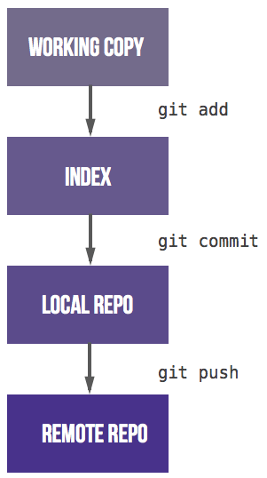
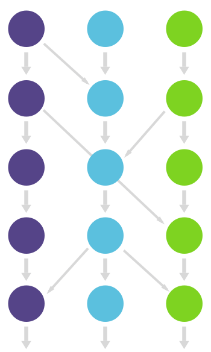
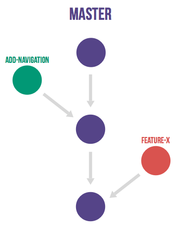
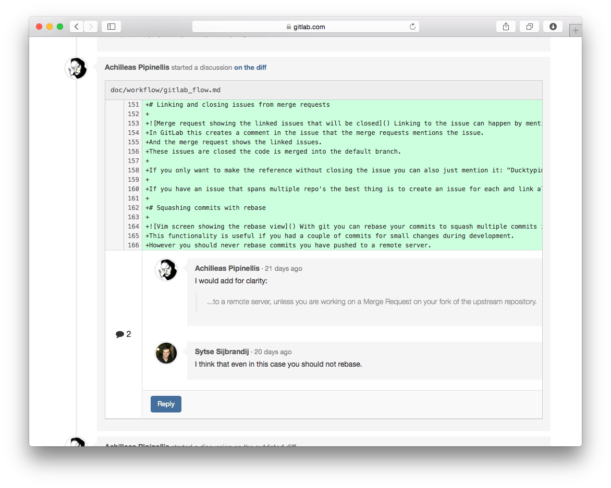
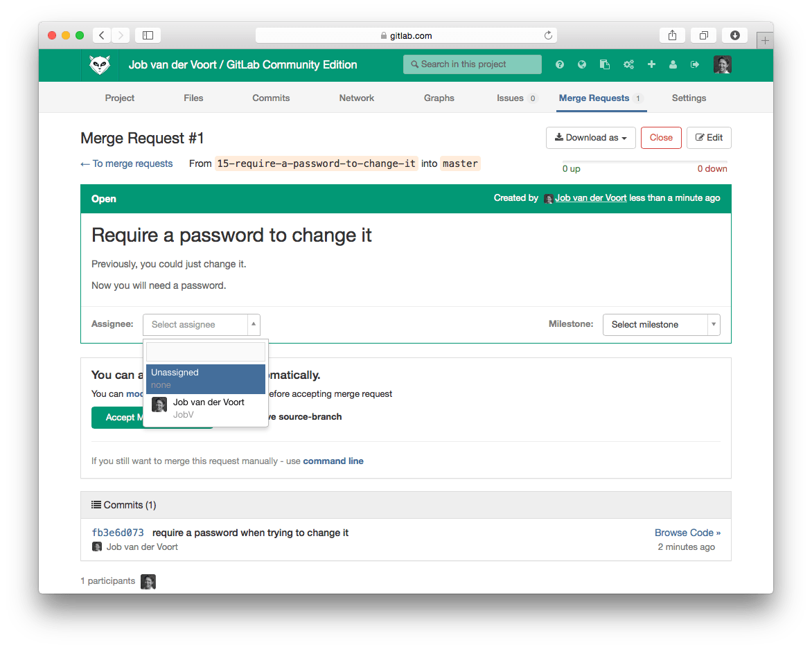
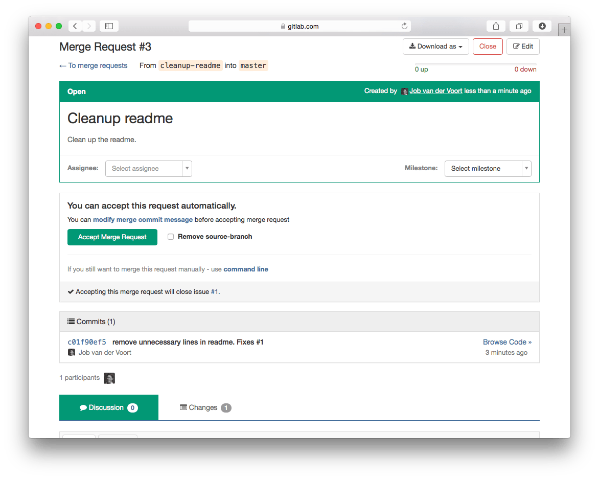
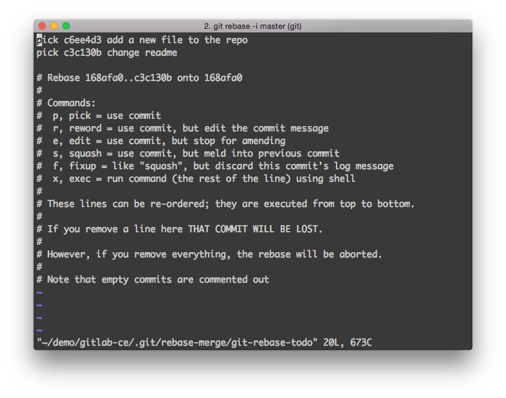
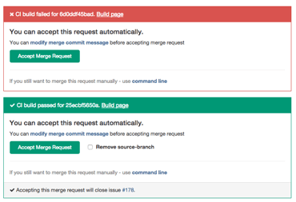

# Introduction to GitLab Flow

Git allows a wide variety of branching strategies and workflows.
Because of this, many organizations end up with workflows that are too complicated, not clearly defined, or not integrated with issue tracking systems.
Therefore, we propose GitLab flow as a clearly defined set of best practices.
It combines [feature-driven development](https://en.wikipedia.org/wiki/Feature-driven_development) and [feature branches](https://martinfowler.com/bliki/FeatureBranch.html) with issue tracking.

Organizations coming to Git from other version control systems frequently find it hard to develop a productive workflow.
This article describes GitLab flow, which integrates the Git workflow with an issue tracking system.
It offers a simple, transparent, and effective way to work with Git.

When converting to Git, you have to get used to the fact that it takes three steps to share a commit with colleagues.
Most version control systems have only one step: committing from the working copy to a shared server.
In Git, you add files from the working copy to the staging area. After that, you commit them to your local repo.
The third step is pushing to a shared remote repository.
After getting used to these three steps, the next challenge is the branching model.

Since many organizations new to Git have no conventions for how to work with it, their repositories can quickly become messy.
The biggest problem is that many long-running branches emerge that all contain part of the changes.
People have a hard time figuring out which branch has the latest code, or which branch to deploy to production.
Frequently, the reaction to this problem is to adopt a standardized pattern such as [Git flow](https://nvie.com/posts/a-successful-git-branching-model/) and [GitHub flow](http://scottchacon.com/2011/08/31/github-flow.html).
We think there is still room for improvement. In this document, we describe a set of practices we call GitLab flow.

For a video introduction of how this works in GitLab, see [GitLab Flow](https://youtu.be/InKNIvky2KE).

## Git flow and its problems

Git flow was one of the first proposals to use Git branches, and it has received a lot of attention.
It suggests a `master` branch and a separate `develop` branch, as well as supporting branches for features, releases, and hotfixes.
The development happens on the `develop` branch, moves to a release branch, and is finally merged into the `master` branch.

Git flow is a well-defined standard, but its complexity introduces two problems.
The first problem is that developers must use the `develop` branch and not `master`. `master` is reserved for code that is released to production.
It is a convention to call your default branch `master` and to mostly branch from and merge to this.
Since most tools automatically use the `master` branch as the default, it is annoying to have to switch to another branch.

The second problem of Git flow is the complexity introduced by the hotfix and release branches.
These branches can be a good idea for some organizations but are overkill for the vast majority of them.
Nowadays, most organizations practice continuous delivery, which means that your default branch can be deployed.
Continuous delivery removes the need for hotfix and release branches, including all the ceremony they introduce.
An example of this ceremony is the merging back of release branches.
Though specialized tools do exist to solve this, they require documentation and add complexity.
Frequently, developers make mistakes such as merging changes only into `master` and not into the `develop` branch.
The reason for these errors is that Git flow is too complicated for most use cases.
For example, many projects do releases but don't need to do hotfixes.

## GitHub flow as a simpler alternative

In reaction to Git flow, GitHub created a simpler alternative.
[GitHub flow](https://guides.github.com/introduction/flow/index.html) has only feature branches and a `master` branch.
This flow is clean and straightforward, and many organizations have adopted it with great success.
Atlassian recommends [a similar strategy](https://www.atlassian.com/blog/git/simple-git-workflow-is-simple), although they rebase feature branches.
Merging everything into the `master` branch and frequently deploying means you minimize the amount of unreleased code, which is in line with lean and continuous delivery best practices.
However, this flow still leaves a lot of questions unanswered regarding deployments, environments, releases, and integrations with issues.
With GitLab flow, we offer additional guidance for these questions.

## Production branch with GitLab flow

GitHub flow assumes you can deploy to production every time you merge a feature branch.
While this is possible in some cases, such as SaaS applications, there are many cases where this is not possible.
One case is where you don't control the timing of a release, for example, an iOS application that is released when it passes App Store validation.
Another case is when you have deployment windows &mdash; for example, workdays from 10&nbsp;AM to 4&nbsp;PM when the operations team is at full capacity &mdash; but you also merge code at other times.
In these cases, you can make a production branch that reflects the deployed code.
You can deploy a new version by merging `master` into the production branch.
If you need to know what code is in production, you can just checkout the production branch to see.
The approximate time of deployment is easily visible as the merge commit in the version control system.
This time is pretty accurate if you automatically deploy your production branch.
If you need a more exact time, you can have your deployment script create a tag on each deployment.
This flow prevents the overhead of releasing, tagging, and merging that happens with Git flow.

## Environment branches with GitLab flow

It might be a good idea to have an environment that is automatically updated to the `master` branch.
Only, in this case, the name of this environment might differ from the branch name.
Suppose you have a staging environment, a pre-production environment, and a production environment.
In this case, deploy the `master` branch to staging.
To deploy to pre-production, create a merge request from the `master` branch to the pre-production branch.
Go live by merging the pre-production branch into the production branch.
This workflow, where commits only flow downstream, ensures that everything is tested in all environments.
If you need to cherry-pick a commit with a hotfix, it is common to develop it on a feature branch and merge it into `master` with a merge request.
In this case, do not delete the feature branch yet.
If `master` passes automatic testing, you then merge the feature branch into the other branches.
If this is not possible because more manual testing is required, you can send merge requests from the feature branch to the downstream branches.

## Release branches with GitLab flow

You only need to work with release branches if you need to release software to the outside world.
In this case, each branch contains a minor version, for example, 2-3-stable, 2-4-stable, etc.
Create stable branches using `master` as a starting point, and branch as late as possible.
By doing this, you minimize the length of time during which you have to apply bug fixes to multiple branches.
After announcing a release branch, only add serious bug fixes to the branch.
If possible, first merge these bug fixes into `master`, and then cherry-pick them into the release branch.
If you start by merging into the release branch, you might forget to cherry-pick them into `master`, and then you'd encounter the same bug in subsequent releases.
Merging into `master` and then cherry-picking into release is called an "upstream first" policy, which is also practiced by [Google](https://www.chromium.org/chromium-os/chromiumos-design-docs/upstream-first) and [Red Hat](https://www.redhat.com/en/blog/a-community-for-using-openstack-with-red-hat-rdo).
Every time you include a bug fix in a release branch, increase the patch version (to comply with [Semantic Versioning](https://semver.org/)) by setting a new tag.
Some projects also have a stable branch that points to the same commit as the latest released branch.
In this flow, it is not common to have a production branch (or Git flow `master` branch).

## Merge/pull requests with GitLab flow

Merge or pull requests are created in a Git management application. They ask an assigned person to merge two branches.
Tools such as GitHub and Bitbucket choose the name "pull request" since the first manual action is to pull the feature branch.
Tools such as GitLab and others choose the name "merge request" since the final action is to merge the feature branch.
In this article, we'll refer to them as merge requests.

If you work on a feature branch for more than a few hours, it is good to share the intermediate result with the rest of the team.
To do this, create a merge request without assigning it to anyone.
Instead, mention people in the description or a comment, for example, "/cc @mark @susan."
This indicates that the merge request is not ready to be merged yet, but feedback is welcome.
Your team members can comment on the merge request in general or on specific lines with line comments.
The merge request serves as a code review tool, and no separate code review tools should be needed.
If the review reveals shortcomings, anyone can commit and push a fix.
Usually, the person to do this is the creator of the merge request.
The diff in the merge request automatically updates when new commits are pushed to the branch.

When you are ready for your feature branch to be merged, assign the merge request to the person who knows most about the codebase you are changing.
Also, mention any other people from whom you would like feedback.
After the assigned person feels comfortable with the result, they can merge the branch.
If the assigned person does not feel comfortable, they can request more changes or close the merge request without merging.

In GitLab, it is common to protect the long-lived branches, e.g., the `master` branch, so that [most developers can't modify them](../user/permissions.md).
So, if you want to merge into a protected branch, assign your merge request to someone with maintainer permissions.

After you merge a feature branch, you should remove it from the source control software.
In GitLab, you can do this when merging.
Removing finished branches ensures that the list of branches shows only work in progress.
It also ensures that if someone reopens the issue, they can use the same branch name without causing problems.

NOTE: **Note:**
When you reopen an issue you need to create a new merge request.

## Issue tracking with GitLab flow

GitLab flow is a way to make the relation between the code and the issue tracker more transparent.

Any significant change to the code should start with an issue that describes the goal.
Having a reason for every code change helps to inform the rest of the team and to keep the scope of a feature branch small.
In GitLab, each change to the codebase starts with an issue in the issue tracking system.
If there is no issue yet, create the issue, as long as the change will take a significant amount of work, i.e., more than 1 hour.
In many organizations, raising an issue is part of the development process because they are used in sprint planning.
The issue title should describe the desired state of the system.
For example, the issue title "As an administrator, I want to remove users without receiving an error" is better than "Admin can't remove users."

When you are ready to code, create a branch for the issue from the `master` branch.
This branch is the place for any work related to this change.

NOTE: **Note:**
The name of a branch might be dictated by organizational standards.

When you are done or want to discuss the code, open a merge request.
A merge request is an online place to discuss the change and review the code.

If you open the merge request but do not assign it to anyone, it is a "Work In Progress" merge request.
These are used to discuss the proposed implementation but are not ready for inclusion in the `master` branch yet.
Start the title of the merge request with `[WIP]` or `WIP:` to prevent it from being merged before it's ready.

When you think the code is ready, assign the merge request to a reviewer.
The reviewer can merge the changes when they think the code is ready for inclusion in the `master` branch.
When they press the merge button, GitLab merges the code and creates a merge commit that makes this event easily visible later on.
Merge requests always create a merge commit, even when the branch could be merged without one.
This merge strategy is called "no fast-forward" in Git.
After the merge, delete the feature branch since it is no longer needed.
In GitLab, this deletion is an option when merging.

Suppose that a branch is merged but a problem occurs and the issue is reopened.
In this case, it is no problem to reuse the same branch name since the first branch was deleted when it was merged.
At any time, there is at most one branch for every issue.
It is possible that one feature branch solves more than one issue.

## Linking and closing issues from merge requests

Link to issues by mentioning them in commit messages or the description of a merge request, for example, "Fixes #16" or "Duck typing is preferred. See #12."
GitLab then creates links to the mentioned issues and creates comments in the issues linking back to the merge request.

To automatically close linked issues, mention them with the words "fixes" or "closes," for example, "fixes #14" or "closes #67." GitLab closes these issues when the code is merged into the default branch.

If you have an issue that spans across multiple repositories, create an issue for each repository and link all issues to a parent issue.

## Squashing commits with rebase

With Git, you can use an interactive rebase (`rebase -i`) to squash multiple commits into one or reorder them.
This functionality is useful if you want to replace a couple of small commits with a single commit, or if you want to make the order more logical.

However, you should never rebase commits you have pushed to a remote server.
Rebasing creates new commits for all your changes, which can cause confusion because the same change would have multiple identifiers.
It also causes merge errors for anyone working on the same branch because their history would not match with yours.
Also, if someone has already reviewed your code, rebasing makes it hard to tell what changed since the last review.

You should also never rebase commits authored by other people.
Not only does this rewrite history, but it also loses authorship information.
Rebasing prevents the other authors from being attributed and sharing part of the [`git blame`](https://git-scm.com/docs/git-blame).

If a merge involves many commits, it may seem more difficult to undo.
You might think to solve this by squashing all the changes into one commit before merging, but as discussed earlier, it is a bad idea to rebase commits that you have already pushed.
Fortunately, there is an easy way to undo a merge with all its commits.
The way to do this is by reverting the merge commit.
Preserving this ability to revert a merge is a good reason to always use the "no fast-forward" (`--no-ff`) strategy when you merge manually.

NOTE: **Note:**
If you revert a merge commit and then change your mind, revert the revert commit to redo the merge.
Git does not allow you to merge the code again otherwise.

## Reducing merge commits in feature branches

Having lots of merge commits can make your repository history messy.
Therefore, you should try to avoid merge commits in feature branches.
Often, people avoid merge commits by just using rebase to reorder their commits after the commits on the `master` branch.
Using rebase prevents a merge commit when merging `master` into your feature branch, and it creates a neat linear history.
However, as discussed in [the section about rebasing](#squashing-commits-with-rebase), you should never rebase commits you have pushed to a remote server.
This restriction makes it impossible to rebase work in progress that you already shared with your team, which is something we recommend.

Rebasing also creates more work, since every time you rebase, you have to resolve similar conflicts.
Sometimes you can reuse recorded resolutions (`rerere`), but merging is better since you only have to resolve conflicts once.
Atlassian has a more thorough explanation of the tradeoffs between merging and rebasing [on their blog](https://www.atlassian.com/blog/git/git-team-workflows-merge-or-rebase).

A good way to prevent creating many merge commits is to not frequently merge `master` into the feature branch.
There are three reasons to merge in `master`: utilizing new code, resolving merge conflicts, and updating long-running branches.

If you need to utilize some code that was introduced in `master` after you created the feature branch, you can often solve this by just cherry-picking a commit.

If your feature branch has a merge conflict, creating a merge commit is a standard way of solving this.

NOTE: **Note:**
Sometimes you can use `.gitattributes` to reduce merge conflicts.
For example, you can set your changelog file to use the [union merge driver](https://git-scm.com/docs/gitattributes#gitattributes-union) so that multiple new entries don't conflict with each other.

The last reason for creating merge commits is to keep long-running feature branches up-to-date with the latest state of the project.
The solution here is to keep your feature branches short-lived.
Most feature branches should take less than one day of work.
If your feature branches often take more than a day of work, try to split your features into smaller units of work.

If you need to keep a feature branch open for more than a day, there are a few strategies to keep it up-to-date.
One option is to use continuous integration (CI) to merge in `master` at the start of the day.
Another option is to only merge in from well-defined points in time, for example, a tagged release.
You could also use [feature toggles](https://martinfowler.com/bliki/FeatureToggle.html) to hide incomplete features so you can still merge back into `master` every day.

> **Note:** Don't confuse automatic branch testing with continuous integration.
> Martin Fowler makes this distinction in [his article about feature branches](https://martinfowler.com/bliki/FeatureBranch.html):
>
> "I've heard people say they are doing CI because they are running builds, perhaps using a CI server, on every branch with every commit.
> That's continuous building, and a Good Thing, but there's no *integration*, so it's not CI."

In conclusion, you should try to prevent merge commits, but not eliminate them.
Your codebase should be clean, but your history should represent what actually happened.
Developing software happens in small, messy steps, and it is OK to have your history reflect this.
You can use tools to view the network graphs of commits and understand the messy history that created your code.
If you rebase code, the history is incorrect, and there is no way for tools to remedy this because they can't deal with changing commit identifiers.

## Commit often and push frequently

Another way to make your development work easier is to commit often.
Every time you have a working set of tests and code, you should make a commit.
Splitting up work into individual commits provides context for developers looking at your code later.
Smaller commits make it clear how a feature was developed, and they make it easy to roll back to a specific good point in time or to revert one code change without reverting several unrelated changes.

Committing often also makes it easy to share your work, which is important so that everyone is aware of what you are working on.
You should push your feature branch frequently, even when it is not yet ready for review.
By sharing your work in a feature branch or [a merge request](#mergepull-requests-with-gitlab-flow), you prevent your team members from duplicating work.
Sharing your work before it's complete also allows for discussion and feedback about the changes, which can help improve the code before it gets to review.

## How to write a good commit message

A commit message should reflect your intention, not just the contents of the commit.
It is easy to see the changes in a commit, so the commit message should explain why you made those changes.
An example of a good commit message is: "Combine templates to reduce duplicate code in the user views."
The words "change," "improve," "fix," and "refactor" don't add much information to a commit message.
For example, "Improve XML generation" could be better written as "Properly escape special characters in XML generation."
For more information about formatting commit messages, please see this excellent [blog post by Tim Pope](https://tbaggery.com/2008/04/19/a-note-about-git-commit-messages.html).

## Testing before merging

In old workflows, the continuous integration (CI) server commonly ran tests on the `master` branch only.
Developers had to ensure their code did not break the `master` branch.
When using GitLab flow, developers create their branches from this `master` branch, so it is essential that it never breaks.
Therefore, each merge request must be tested before it is accepted.
CI software like Travis CI and GitLab CI/CD show the build results right in the merge request itself to make this easy.

There is one drawback to testing merge requests: the CI server only tests the feature branch itself, not the merged result.
Ideally, the server could also test the `master` branch after each change.
However, retesting on every commit to `master` is computationally expensive and means you are more frequently waiting for test results.
Since feature branches should be short-lived, testing just the branch is an acceptable risk.
If new commits in `master` cause merge conflicts with the feature branch, merge `master` back into the branch to make the CI server re-run the tests.
As said before, if you often have feature branches that last for more than a few days, you should make your issues smaller.

## Working with feature branches

When creating a feature branch, always branch from an up-to-date `master`.
If you know before you start that your work depends on another branch, you can also branch from there.
If you need to merge in another branch after starting, explain the reason in the merge commit.
If you have not pushed your commits to a shared location yet, you can also incorporate changes by rebasing on `master` or another feature branch.
Do not merge from upstream again if your code can work and merge cleanly without doing so.
Merging only when needed prevents creating merge commits in your feature branch that later end up littering the `master` history.
