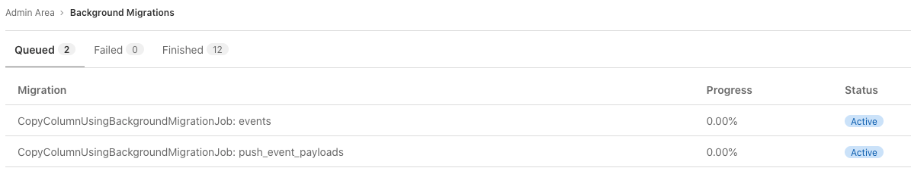

# Batched Background Migrations **(FREE SELF)**

> - [Introduced](https://gitlab.com/gitlab-org/gitlab/-/merge_requests/51332) in GitLab 13.11.
> - [Deployed behind a feature flag](../../../user/feature_flags.md), disabled by default.
> - [Enabled by default](https://gitlab.com/gitlab-org/gitlab/-/issues/329511) in GitLab 13.12.
> - Enabled on GitLab.com.
> - Recommended for production use.
> - For GitLab self-managed instances, GitLab administrators can opt to [disable it](#enable-or-disable-batched-background-migrations). **(FREE SELF)**

There can be [risks when disabling released features](../../../user/feature_flags.md#risks-when-disabling-released-features).
Refer to this feature's version history for more details.

To update database tables in batches, GitLab can use batched background migrations. These migrations
are created by GitLab developers and run automatically on upgrade. However, such migrations are
limited in scope to help with migrating some `integer` database columns to `bigint`. This is needed to
prevent integer overflow for some tables.

## Check the status of Batched Background Migrations **(FREE SELF)**

All migrations must be finished before upgrading GitLab. To check the status of the existing
migrations:

1. On the top bar, select **Menu >** **{admin}** **Admin**.
1. On the left sidebar, select **Monitoring > Background Migrations**



## Enable or disable Batched Background Migrations **(FREE SELF)**

Batched Background Migrations is under development but ready for production use.
It is deployed behind a feature flag that is **enabled by default**.
[GitLab administrators with access to the GitLab Rails console](../../../administration/feature_flags.md)
can opt to disable it.

To enable it:
```
ture.enable(:execute_batched_migrations_on_schedule)
```

To disable it:

```ruby
Feature.disable(:execute_batched_migrations_on_schedule)
```

## Automatic batch size optimization **(FREE SELF)**

> - [Introduced](https://gitlab.com/gitlab-org/gitlab/-/merge_requests/60133) in GitLab 13.12.
> - [Deployed behind a feature flag](../../../user/feature_flags.md), disabled by default.
> - [Enabled by default](https://gitlab.com/gitlab-org/gitlab/-/issues/329511) in GitLab 13.12.
> - Enabled on GitLab.com.
> - Recommended for production use.
> - For GitLab self-managed instances, GitLab administrators can opt to [disable it](#enable-or-disable-automatic-batch-size-optimization). **(FREE SELF)**

There can be [risks when disabling released features](../../../user/feature_flags.md#risks-when-disabling-released-features).
Refer to this feature's version history for more details.

To maximize throughput of batched background migrations (in terms of the number of tuples updated per time unit), batch sizes are automatically adjusted based on how long the previous batches took to complete.

## Enable or disable automatic batch size optimization **(FREE SELF)**

Automatic batch size optimization for Batched Background Migrations is under development but ready for production use.
It is deployed behind a feature flag that is **enabled by default**.
[GitLab administrators with access to the GitLab Rails console](../../../administration/feature_flags.md)
can opt to disable it.

To enable it:

```ruby
Feature.enable(:optimize_batched_migrations)
```

To disable it:

```ruby
Feature.disable(:optimize_batched_migrations)
```

## Troubleshooting

### Database migrations failing when upgrading to GitLab 14.2 and higher

In case there is a database migration failing with a message like

```plaintext
== 20210622041846 FinalizePushEventPayloadsBigintConversion: migrating ========
rake aborted!
StandardError: An error has occurred, all later migrations canceled:

Expected batched background migration for the given configuration to be marked as 'finished', but it is 'active':
	{:job_class_name=>"CopyColumnUsingBackgroundMigrationJob", :table_name=>"push_event_payloads", :column_name=>"event_id", :job_arguments=>[["event_id"], ["event_id_convert_to_bigint"]]}
```

when upgrading to GitLab 14.2 or higher, first upgrade to either 14.0.3 or 14.1.

Before proceeding with the upgrade to 14.2 (or higher version), [check the status](#check-the-status-of-batched-background-migrations) of the batched background migration from the error message, and make sure it is listed as finished. In case it is still active, either wait until it is done, or finalize it manually using the command suggested in the error, for example

```plaintext
gitlab-rake gitlab:background_migrations:finalize[CopyColumnUsingBackgroundMigrationJob,push_event_payloads,event_id,'[["event_id"]\, ["event_id_convert_to_bigint"]]']
```
