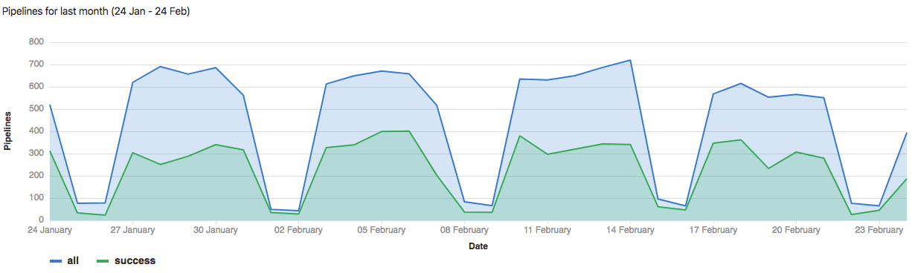
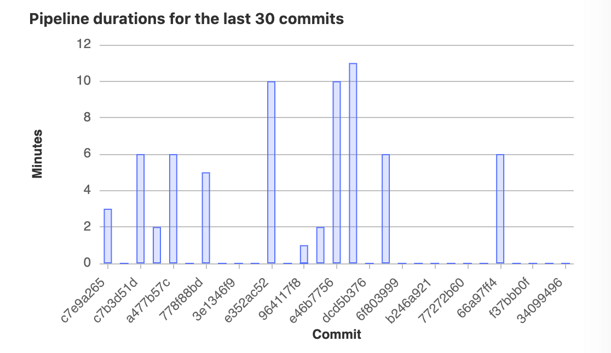
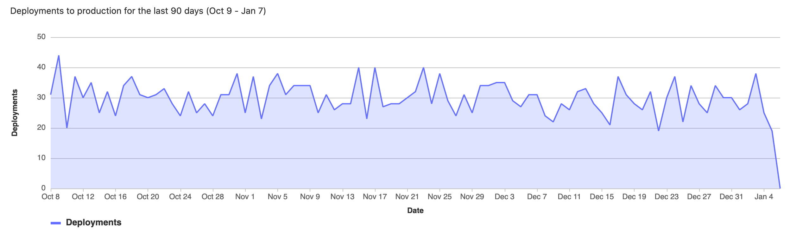

# CI/CD Analytics

## Pipeline success and duration charts **(CORE)**

> - Introduced in GitLab 3.1.1 as Commit Stats, and later renamed to Pipeline Charts.
> - [Renamed](https://gitlab.com/gitlab-org/gitlab/-/issues/38318) to CI/CD Analytics in GitLab 12.8.

GitLab tracks the history of your pipeline successes and failures, as well as how long each pipeline
ran. To view this information, go to **Analytics > CI/CD Analytics**.

View successful pipelines:

View pipeline duration history:

## DORA4 Metrics 

Customer experience is a key metric. Users want to measure platform stability and other
post-deployment performance KPIs, and set targets for customer behavior, experience, and financial
impact. Tracking and measuring these indicators solves an important pain point. Similarly, creating
views that manage products, not projects or repos, provides users with a more relevant data set.
Since GitLab is a tool for the entire DevOps life-cycle, information from different workflows is
integrated and can be used to measure the success of the teams.

The DevOps Research and Assesment ([DORA](https://cloud.google.com/blog/products/devops-sre/the-2019-accelerate-state-of-devops-elite-performance-productivity-and-scaling)) team have come up with four key metrics that have been widely adopted by the industry and can be used to measure and indicate the performance of spftware development teams.

These metrics are:

- Deployment Frequency: How often an organization successfully releases to production

- Lead Time for Changes: The amount of time it takes a for code to get committed to get into production

- Change Failure Rate: The percentage of deployments causing a failure in production

-Time to Restore Service: How long it takes an organization to recover from a failure in production

GitLab plans to add support for all the DORA4 metrics on the project and the group level. The first metric of Deployment Frequency was added to the project level [CI/CD charts](ci_cd_analytics.md#deployment-frequency-charts) and [API]( ../../api/project_analytics.md).

## Deployment frequency charts **(ULTIMATE)**

> [Introduced](https://gitlab.com/gitlab-org/gitlab/-/issues/275991) in GitLab 13.8.

The **Analytics > CI/CD Analytics** page shows information about the deployment frequency to the
`production` environment. The environment **must** be named `production` for its deployment
information to appear on the graphs.

