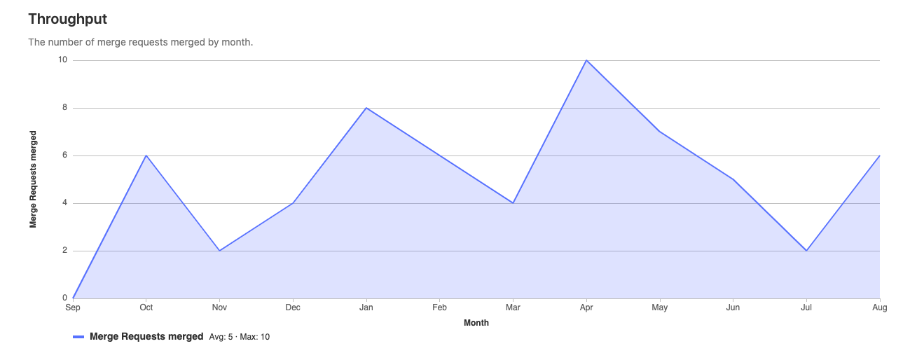

# Merge Request Analytics **(STARTER)**

> [Introduced](https://gitlab.com/gitlab-org/gitlab/-/issues/229045) in [GitLab Starter](https://about.gitlab.com/pricing/) 13.3.

Track development throughput with Merge Request Analytics.

## Supported features

Merge Request Analytics allows GitLab users to:

- Inspect throughput by providing a visualization of the time it takes Merge Requests to be merged.

## Visualizations and data

To access the chart, navigate to a projects's sidebar and select **Analytics > Merge Request**.

The following visualizations and data are available - currently only covering **merged** merge requests for the past 12 months

### Throughput chart

Area chart showing the number of merge request merged per month.



### Throughput table

Data table displaying a maximum of the 100 most recent merge requests merged for the time period.


## Permissions

The **Merge Request Analytics** dashboard can be accessed only:

- On [Starter](https://about.gitlab.com/pricing/) and above.
- By users with [Reporter access](../permissions.md) and above.

## Enabling and disabling using feature flags

Merge Request Analytics is disabled by default but can be enabled using the following feature flag:

- `project_merge_request_analytics`

A GitLab administrator can:

- Enabled this feature from GitLab 13.3 by running the follow in a Rails console:

  ```ruby
  Feature.enable(:project_merge_request_analytics)
  ```
