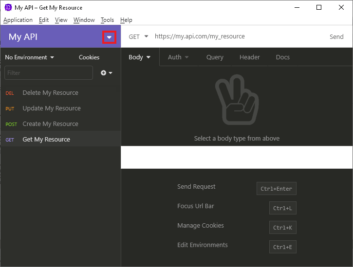
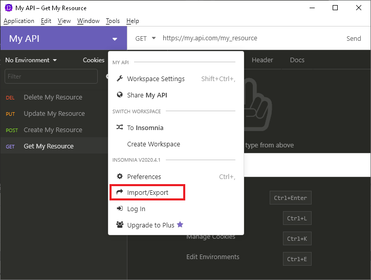
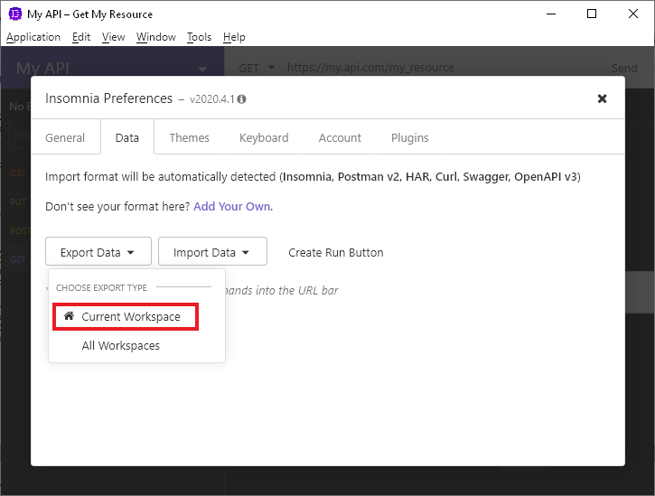
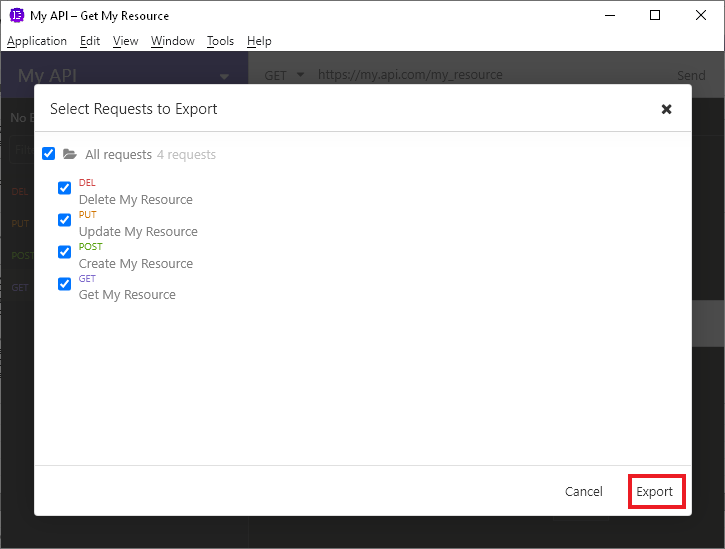
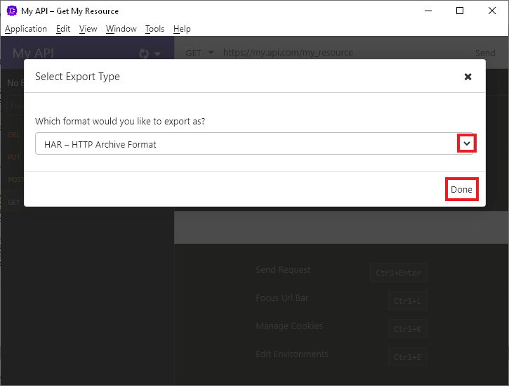

---
stage: Secure
group: Fuzz Testing
info: To determine the technical writer assigned to the Stage/Group associated with this page, see https://about.gitlab.com/handbook/engineering/ux/technical-writing/#designated-technical-writers
type: howto
---

# How to create HAR files

DANGER: **Warning:**
HAR files may contain sensitive information such as authentication tokens, API keys, and session cookies. We recommend that you review the HAR file contents before adding them to a repository.

### GitLab HAR Recorder

1. Install Python 3.6 or greater
1. Install HAR Recorder
1. Start recorder w/proxy port + har filename
1. Run things using proxy
   1. Make sure proxy is used!
1. Stop recorder
1. Done!
1. [HAR Viewer (online)](http://www.softwareishard.com/har/viewer/) can be used to verify HAR has all requests

### Insomnia API Client

1. Define or import your API
   1. Postman v2
   1. Curl
   1. OpenAPI v2, v3
1. Make sure each API call works
   1. If you imported an OpenAPI specification, go through and add working data
1. Workspace carrot -> Import/export

   
   

1. Export Data carrot -> Current Workspace

   

1. Select requests to include in HAR

   

1. Click Export
1. Select `HAR -- HTTP Archive Format` from dropdown

   

1. Click Done
1. Select location and filename for har file

### Chrome

1. Right click Inspect
1. Network tab
1. Check `Preserve log`
1. Browse pages that call API
1. Select one or more requests
1. Right click `Save all as HAR with content`
1. Profile filename and hit `Save`
1. Repeat using same filename to append additional requests

### Fiddler debugging proxy

