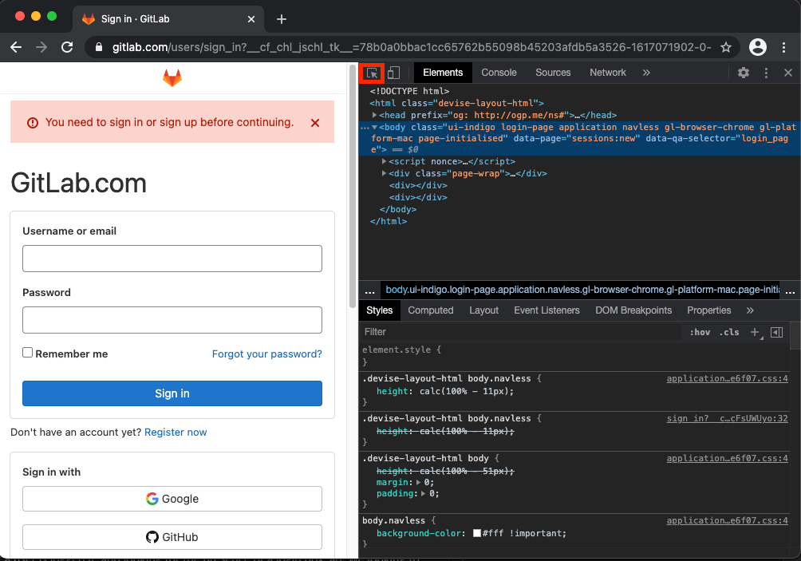
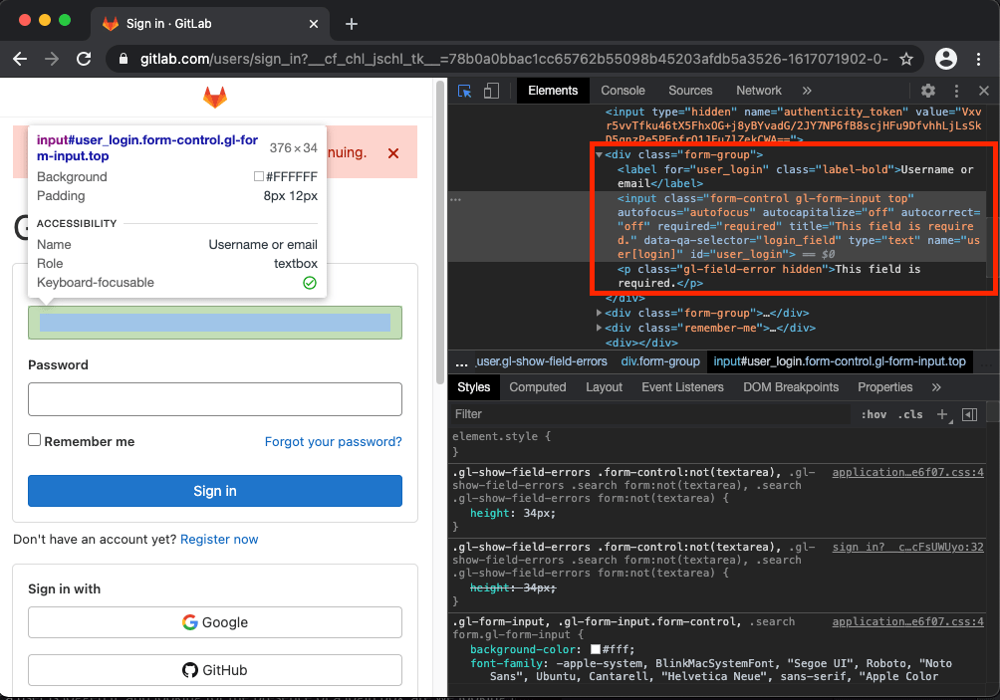

# DAST browser-based crawler **(ULTIMATE)**

> [Introduced](https://gitlab.com/gitlab-org/gitlab/-/issues/323423) in GitLab 13.11.

WARNING:
This product is an early access and is considered a [beta](https://about.gitlab.com/handbook/product/gitlab-the-product/#beta) feature.

GitLab DAST's new browser-based crawler is a crawl engine built by GitLab to test Single Page Applications (SPAs) and traditional web applications.
Due to the reliance of modern web applications on JavaScript, handling SPAs or applications that are dependent on JavaScript is paramount to ensuring proper coverage of an application for Dynamic Application Security Testing (DAST).

The browser-based crawler works by loading the target application into a specially-instrumented Chromium browser. A snapshot of the page is taken prior to a search to find any actions that a user might perform,
such as clicking on a link or filling in a form. For each action found, the crawler will execute it, take a new snapshot and determine what in the page changed from the previous snapshot.
Crawling continues by taking more snapshots and finding subsequent actions.

The benefit of crawling by following user actions in a browser is that the crawler can interact with the target application much like a real user would, identifying complex flows that traditional web crawlers don’t understand. This results in better coverage of the website.

Scanning a web application with both the browser-based crawler and GitLab DAST should provide greater coverage, compared with only GitLab DAST. The new crawler does not support API scanning or the DAST AJAX crawler.

## Enable browser-based crawling

The browser-based crawler is an extension to the GitLab DAST product. DAST should be included in the CI/CD configuration and the browser-based crawler enabled using CI/CD variables:

1. Install the DAST [prerequisites](index.md#prerequisite).
1. Include the [DAST CI template](index.md#include-the-dast-template).
1. Set the target website using the `DAST_WEBSITE` CI/CD variable.
1. Set the CI/CD variable `DAST_BROWSER_SCAN` to `true`.
 
An example configuration might look like the following:

```yaml
include:
  - template: DAST.gitlab-ci.yml

variables:
  DAST_WEBSITE: "https://example.com"
  DAST_BROWSER_SCAN: "true"
```

### Available variables

The browser-based crawler can be configured using CI/CD variables.

| CI/CD variable                       | Type            | Example                           | Description | 
|--------------------------------------| ----------------| --------------------------------- | ------------|
| `DAST_WEBSITE`                       | URL             | `http://www.site.com`             | The URL of the website to scan. |
| `DAST_BROWSER_SCAN`               | boolean         | `true`                            | Configures DAST to use the browser-based crawler engine. |
| `DAST_BROWSER_ALLOWED_HOSTS`      | List of strings | `site.com,another.com`            | Hostnames included in this variable are considered in scope when crawled. By default the `DAST_WEBSITE` hostname is included in the allowed hosts list. |
| `DAST_BROWSER_EXCLUDED_HOSTS`     | List of strings | `site.com,another.com`            | Hostnames included in this variable are considered excluded and connections are forcibly dropped. |
| `DAST_BROWSER_IGNORED_HOSTS`      | List of strings | `site.com,another.com`            | Hostnames included in this variable are accessed but not reported against. |
| `DAST_BROWSER_MAX_ACTIONS`        | number          | `10000`                           | The maximum number of actions that the crawler performs. For example, clicking a link, or filling a form.  |
| `DAST_BROWSER_MAX_DEPTH`          | number          | `10`                              | The maximum number of chained actions that the crawler takes. For example, `Click -> Form Fill -> Click` is a depth of three. |
| `DAST_BROWSER_NUMBER_OF_BROWSERS` | number          | `3`                               | The maximum number of concurrent browser instances to use. For shared runners on GitLab.com we recommended a maximum of three. Private runners with more resources may benefit from a higher number, but will likely produce little benefit after five to seven instances. |
| `DAST_BROWSER_COOKIES`            | dictionary      | `abtesting_group:3,region:locked` | A cookie name and value to be added to every request. |
| `DAST_BROWSER_LOG`                | List of strings | `brows:debug,auth:debug`          | A list of modules and their intended log level. |
| `DAST_AUTH_URL`                      | string          | `https://example.com/sign-in`     | The URL of page that hosts the sign-in form. |
| `DAST_USERNAME`                      | string          | `user123`                         | The username to enter into the username field on the sign-in HTML form. |
| `DAST_PASSWORD`                      | string          | `p@55w0rd`                        | The password to enter into the password field on the sign-in HTML form. |
| `DAST_USERNAME_FIELD`                | selector        | `id:user`                         | A selector describing the username field on the sign-in HTML form. |
| `DAST_PASSWORD_FIELD`                | selector        | `css:.password-field`             | A selector describing the password field on the sign-in HTML form. | 
| `DAST_SUBMIT_FIELD`                  | selector        | `xpath://input[@value='Login']`   | A selector describing the element that when clicked submits the login form or the password form of a multi-page login process. |
| `DAST_FIRST_SUBMIT_FIELD`            | selector        | `.submit`                         | A selector describing the element that when clicked submits the username form of a multi-page login process. |
| `DAST_BROWSER_AUTH_REPORT`               | boolean         | `true`                            | Used in combination with exporting the `gl-dast-debug-auth-report.html` artifact to aid in debugging authentication issues. |

The [DAST variables](index.md#available-variables) `SECURE_ANALYZERS_PREFIX`, `DAST_FULL_SCAN_ENABLED`, `DAST_AUTO_UPDATE_ADDONS`, `DAST_EXCLUDE_RULES`, `DAST_REQUEST_HEADERS`, `DAST_HTML_REPORT`, `DAST_MARKDOWN_REPORT`, `DAST_XML_REPORT`,
`DAST_INCLUDE_ALPHA_VULNERABILITIES`, `DAST_PATHS_FILE`, `DAST_PATHS`, `DAST_ZAP_CLI_OPTIONS`, and `DAST_ZAP_LOG_CONFIGURATION` are also compatible with browser-based crawler scans.   

#### Selectors

Selectors are used by CI/CD variables to specify the location of an element displayed on a page in a browser.
Selectors have the format `type`:`search string`. The crawler will search for the selector using the search string based on the type.

| Selector type | Example                        | Description |
| ------------- | ------------------------------ | ----------- |
| `css`         | `css:.password-field`          | Searches for a HTML element having the supplied CSS selector. Selectors should be as specific as possible for performance reasons. |
| `id`          | `id:element`                   | Searches for an HTML element with the provided element ID. |
| `name`        | `name:element`                 | Searches for an HTML element with the provided element name. |
| `xpath`       | `xpath://*[@id="my-button"]/a` | Searches for a HTML element with the provided XPath. Note that XPath searches are expected to be less performant than other searches. |
| None provided | `a.click-me`                   | Defaults to searching using a CSS selector. |

## Vulnerability detection

While the browser-based crawler crawls modern web applications efficiently, vulnerability detection is still managed by the standard DAST/Zed Attack Proxy (ZAP) solution.

THe crawler runs the target website in a browser with DAST/ZAP configured as the proxy server. This ensures that all requests and responses made by the browser are passively scanned by DAST/ZAP.
When running a full scan, active vulnerability checks executed by DAST/ZAP do not use a browser. This difference in how vulnerabilities are checked can cause issues that require certain features of the target website to be disabled to ensure the scan works as intended.

For example, for a target website that contains forms with Anti-CSRF tokens, a passive scan will scan as intended because the browser displays pages/forms as if a user is viewing the page.
However, active vulnerability checks run in a full scan will not be able to submit forms containing Anti-CSRF tokens. In such cases we recommend you disable Anti-CSRF tokens when running a full scan.

## Authentication

As most of your application is likely not accessible without authentication, we highly recommended
that you configure the scanner to authenticate to the application. It is also recommended
that you periodically confirm the scanner's authentication is still working as this tends to break over
time due to authentication changes to the application.

Browserker has a number of features to assist in ensuring you can authenticate to your application.

- Automatic login form detection
- Manual login via CSS Selectors
- Multi-step authentication support
- Support for loading and authenticating to URLs outside of the configured target URL

### Automatic Login Form Detection

By providing a username, password and login URL, Browserker will attempt to authenticate to the
target application. It will attempt to identify login forms by searching for username or password fields.

Automatic Login Process:

- If it finds a username and password field, it will enter the details into the form fields and attempt to click any submit button found.
- If it finds only a username field, it will assume that the login form is part of a multi-step authentication process.
  - It will attempt to click any submit button after filling out the username field
  - It will then search for a password field, filling it out and clicking any submit button found.

After a login is attempted, Browserker will attempt to find the login form. If it finds the login form again,
it assumes that the login failed. It will also treat any HTTP status code above 400 as a login failure.

NOTE: This process is "best effort" and may not work in many cases. It is highly recommended that you review
both login success and failure to ensure it works properly for your application.

```yaml
include:
  - template: DAST.gitlab-ci.yml

variables:
  DAST_WEBSITE: "https://example.com"
  DAST_BROWSER_SCAN: true
  DAST_AUTH_URL: "https://login.example.com/"
  DAST_USERNAME: "admin"
  DAST_PASSWORD: "P@55w0rd!"
```

### Manual Login via CSS Selectors

Manual login is the preferred method of authenticating to your application, as it allows more precise detection of the login fields.

With manual login, you must provide at least, the following variables:

- `DAST_AUTH_URL`
- `DAST_USERNAME`
- `DAST_USERNAME_FIELD`
- `DAST_PASSWORD`
- `DAST_PASSWORD_FIELD`
- `DAST_SUBMIT_FIELD`

To support multi-step authentication flows, you may provide the `DAST_FIRST_SUBMIT_FIELD` which correlates to the submit button for the username data.

Here's how you can add multi-step authentication flows to your scan:

```yaml
include:
  - template: DAST.gitlab-ci.yml

variables:
  DAST_WEBSITE: "https://example.com"
  DAST_AUTH_URL: "https://login.example.com/"
  DAST_USERNAME: "admin"
  DAST_USERNAME_FIELD: "id:user"
  DAST_FIRST_SUBMIT_FIELD: "css:type=submit"
  DAST_PASSWORD: "P@55w0rd!"
  DAST_PASSWORD_FIELD: "css:.password-field"
  DAST_SUBMIT_FIELD: "css:type=submit"
```

#### How to find valid CSS Selectors

Finding the correct CSS selectors is important to ensuring the authentication process is as stable as possible.

#### Finding CSS Selectors with Google Chrome

Due to the dynamic nature of Single Page Applications (SPAs) it is recommended to use Chrome DevTools element selector tool to identify the fields necessary for configuring authentication. By bringing up the DevTools view (⌥`+`⌘`+`i in osx ctrl+shift+i in windows), you can use the `Select an element in the page to select it` tool to find the username field:



Once the tool is active, highlight a field you wish to view the details of.



Once highlighted, you will be able to find the elements details, including attributes that would make a good candidate for a CSS Selector.

In the case above, the `id="user_login"` appears to be a good candidate. As a convenience you may add this selector in a few ways: `css:[id=user_login]` or more simply: `id:user_login`.

NOTE:
Be careful of choosing attributes that are prone to change, such as dynamically generated attribute names.

Here's how you would use this selector in the yaml configuration:

```yaml
variables:
  ...
  DAST_USERNAME: "gitlab-user"
  DAST_USERNAME_FIELD: "css:[id=user_login]"
  ...
```

#### Configuring the authentication debug output

It is often difficult to understand why authentication may fail when running DAST in a CI/CD pipeline. To assist users in debugging authentication issues, an optional debug report can be configured to be saved as a job artifact. This HTML report contains all steps the browser crawler took, along with HTTP requests and responses, the Document Object Model (DOM) and screen shots.

```yaml
variables:
  ...
  DAST_BROWSER_SCAN: "true"
  DAST_BROWSER_AUTH_REPORT: "true"
  ...
artifacts:
  paths: [gl-dast-debug-auth-report.html]
  when: always
  ...
```

## Managing scan time

It is expected that running the browser-based crawler will result in better coverage for many web applications, when compared to the normal GitLab DAST solution,.
This can come at a cost of increased scan time.

You can manage the trade-off between coverage and scan time with the following measures:

- Limit the number of actions executed by the browser with the [variable](#available-variables) `DAST_BROWSER_MAX_ACTIONS`. The default is `10,000`.
- Limit the page depth that the browser-based crawler will check coverage on with the [variable](#available-variables) `DAST_BROWSER_MAX_DEPTH`. The crawler uses a breadth-first search strategy, so pages with smaller depth are crawled first. The default is `10`.
- Vertically scaling the runner and using a higher number of browsers with [variable](#available-variables) `DAST_BROWSER_NUMBER_OF_BROWSERS`. The default is `3`.

## Debugging scans using logging

Logging can be used to facilitate further analysis of what is happening with a scan. 

The CI/CD variable `DAST_BROWSER_LOG` configures the logging level for particular modules of the crawler. Each module represents a component of the browser-based crawler and is separated so that debug logs can be configured just for the area of the crawler that requires further inspection. 

For example, the following job definition enables the browsing module and the authentication module to be logged in debug-mode:

```yaml
include:
  - template: DAST.gitlab-ci.yml

variables:
  DAST_WEBSITE: "https://my.site.com"
  DAST_BROWSER_SCAN: "true"
  DAST_BROWSER_LOG: "brows:debug,auth:debug"
```

Log messages have the format `[time] [log level] [log module] [message] [additional properties]`. For example, the following log entry has level `INFO`, is part of the `CRAWL` log module and has message `Crawled path`.

```txt
2021-04-21T00:34:04.000 INF CRAWL Crawled path nav_id=0cc7fd path="LoadURL [https://my.site.com:8090]"
```

The modules that can be configured for logging are as follows:

| Log module | Component overview |
| ---------- | ----------- |
| `AUTH`     | Used for creating an authenticated scan. |
| `BROWS`    | Used for querying the state/page of the browser. |
| `BPOOL`    | The set of browsers that are leased out for crawling. |
| `CRAWL`    | Used for the core crawler algorithm. |
| `DATAB`    | Used for persisting data to the internal database. |
| `LEASE`    | Used to create browsers to add them to the browser pool. |
| `MAIN`     | Used for the flow of the main event loop of the crawler. |
| `NAVDB`    | Used for persistence mechanisms to store navigation entries. |
| `REPT`     | Used for generating reports. |
| `STAT`     | Used for general statistics while running the scan. |
