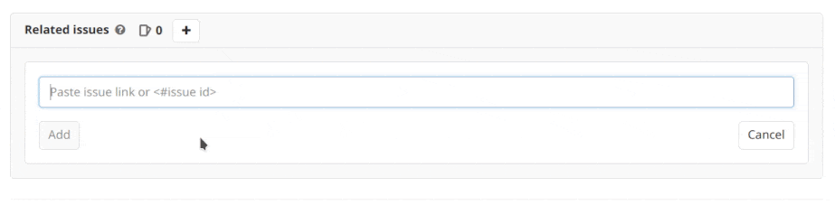
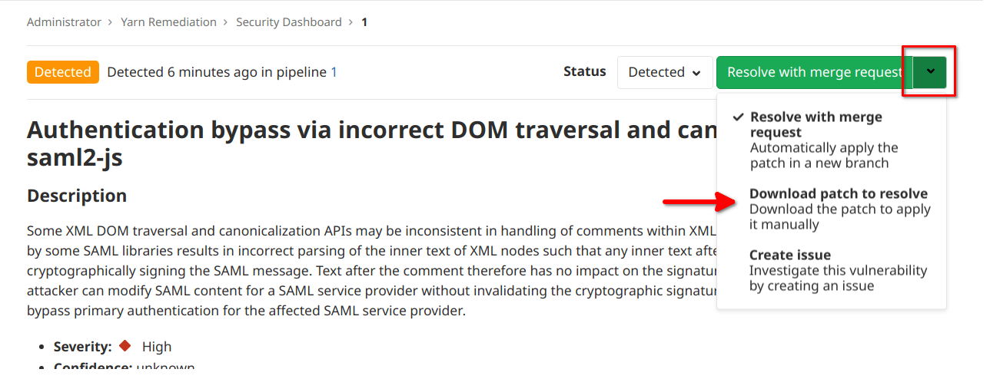
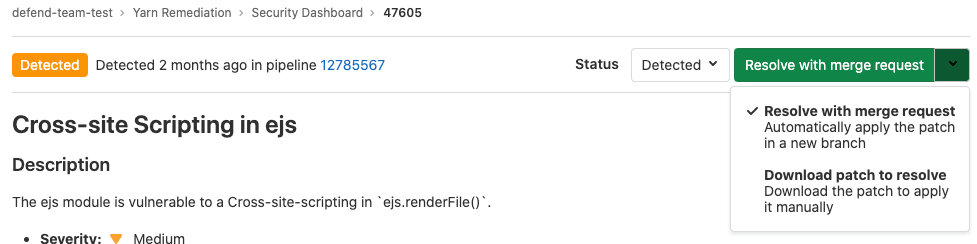

# Addressing vulnerabilities

For each security vulnerability in a merge request or [Vulnerability Report](../vulnerability_report/index.md),
you can:

- [Dismiss the vulnerability](#dismiss-a-vulnerability).
- Create a [confidential](../../project/issues/confidential_issues.md)
  [issue](index.md#create-a-gitlab-issue-for-a-vulnerability).
- Apply an [automatically remediation](#apply-an-automatic-remediation-for-a-vulnerability).

## Dismiss a vulnerability

> Introduced in [GitLab Ultimate](https://about.gitlab.com/pricing/) 12.0, a dismissal reason.

You can dismiss a vulnerability for the entire project.

1. Select the vulnerability in the Security Dashboard.
1. In the top-right, from the **Status** selector menu, select **Dismissed**.
1. Optional. Add a reason for the dismissal and select **Save comment**.

To undo this action, select a different status from the same menu.

### Dismiss multiple vulnerabilities

> [Introduced](https://gitlab.com/gitlab-org/gitlab/-/issues/35816) in [GitLab Ultimate](https://about.gitlab.com/pricing/) 12.9.

You can dismiss multiple vulnerabilities at once.

1. In the list of vulnerabilities, select the checkbox for each vulnerability you want to dismiss.
   To select all, select the checkbox in the table header.
1. Above the table, select a dismissal reason.
1. Select **Dismiss Selected**.

## Create an issue for a vulnerability

You can create a GitLab or Jira issue for a vulnerability. For details, see [Vulnerability Pages](index.md).

### Link to an existing issue

If you already have an open issue, you can link to it from the vulnerability.

- The vulnerability page shows related issues, but the issue page doesn't show the vulnerability it's related to.
- An issue can only be related to one vulnerability at a time.
- Issues can be linked across groups and projects.

To link to an existing issue:

1. Open the vulnerability.
1. In the **Related Issues** section, select the plus (**{plus}**) icon.
1. In the text box that appears, type an issue number or paste an issue link.
   - Type `#` followed by a number to show an autocomplete menu.
   - You can enter multiple issues at once. Press the space bar after each issue number or link to converts them to tags.
1. Select **Add**.

To remove an issue, to the right of the issue number, select **{close}**.

## Apply an automatic remediation for a vulnerability

> [Introduced](https://gitlab.com/gitlab-org/gitlab/-/issues/5656) in [GitLab Ultimate](https://about.gitlab.com/pricing/) 11.7.

Some vulnerabilities can be fixed by applying the solution that GitLab automatically generates.
The following scanners are supported:

- [Dependency Scanning](../dependency_scanning/index.md).
  Automatic Patch creation is only available for Node.js projects managed with
  `yarn`.
- [Container Scanning](../container_scanning/index.md).

### Manually apply the suggested patch

To manually apply the patch that GitLab generated for a vulnerability:

1. Select the **Resolve with merge request** dropdown, then select **Download patch to resolve**:

   

1. Ensure your local project has the same commit checked out that was used to generate the patch.
1. Run `git apply remediation.patch`.
1. Verify and commit the changes to your branch.

### Create a merge request with the suggested patch

> [Introduced](https://gitlab.com/gitlab-org/gitlab/-/issues/9224) in [GitLab Ultimate](https://about.gitlab.com/pricing/) 11.9.

In some cases, you can create a merge request that automatically remediates the
vulnerability. Any vulnerability that has a
[solution](#apply-an-automatic-remediation-for-a-vulnerability) can have a merge
request created to automatically solve the issue.

If this action is available:

1. Select the **Resolve with merge request** dropdown, then select **Resolve with merge request**.

   

A merge request is created. It that applies the solution to the source branch.
