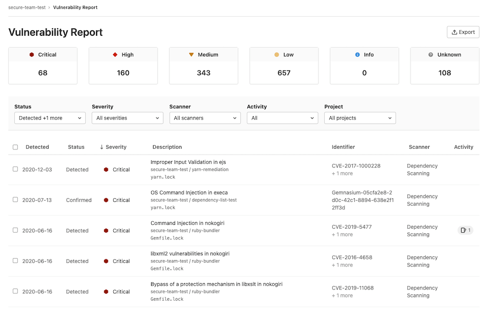
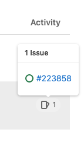

# GitLab Vulnerability Reports **(ULTIMATE)**

Each vulnerability report contains vulnerabilities from the scans of the most recent branch merged into the default branch.

The vulnerability reports display the total number of vulnerabilities by severity (for example,
Critical, High, Medium, Low, Info, Unknown). Below this, a table shows each vulnerability's detected date, status, severity, description, identifier, the scanner where it was detected, and activity (including related issues or available solutions). By default, the vulnerability report is filtered to display all detected and confirmed vulnerabilities.

You can filter which vulnerabilities display by:

| Filter | Available Options |
| --- | --- |
| Status | Detected, Confirmed, Dismissed, Resolved |
| Severity | Critical, High, Medium, Low, Info, Unknown |
| Scanner | [Available Scanners](../index.md#security-scanning-tools) |
| Project | Projects configured in the Security Center settings, or all projects in the group for the group level report. This filter is not displayed on the project level vulnerability report |
| Activity | Vulnerabilities with issues and vulnerabilities that are no longer detected in the default branch |

The Activity filter behaves differently from the other Vulnerability Report filters. The other filter options all OR together to show results from any vulnerability matching one of the filter criteria. With the Activity filter, the selected values form mutually exclusive sets to allow for precisely locating the desired vulnerability records. Additionally, not all options can be selected in combination. Selection behavior when using the Activity filter:

| Activity Selection | Results Displayed |
| --- | --- |
|  All | Vulnerabilities with any Activity status (same as ignoring this filter). Selecting this will deselect any other Activity filter options. |
|  No activity | Only vulnerabilities without either an associated Issue or that are no longer detected. Selecting this will deselect any other Activity filter options. |
|  With issues | Only vulnerabilities with one or more associated issues. Does not include vulnerabilities that also are no longer detected. |
|  No longer detected | Only vulnerabilities that are no longer detected in the latest pipeline scan of the `default` branch. Does not include vulnerabilities with one or more associated issues. |
|  With issues and No longer detected | Only vulnerabilities that have one or more associated issues and also are no longer detected in the latest pipeline scan of the `default` branch. |

Clicking any vulnerability in the table takes you to its
[vulnerability details](../vulnerabilities) page to see more information on that vulnerability.

To create an issue associated with the vulnerability, click the **Create Issue** button.

After you create the issue, the linked issue icon in the vulnerability list:

- Indicates that an issue has been created for that vulnerability.
- Shows a tooltip that contains a link to the issue.

Contents of the unfiltered vulnerability report can be exported using our [export feature](#export-vulnerabilities)

You can also dismiss vulnerabilities in the table:

1. Select the checkbox for each vulnerability you want to dismiss.
1. In the menu that appears, select the reason for dismissal and click **Dismiss Selected**.

## Project Vulnerability Report

> [Introduced](https://gitlab.com/gitlab-org/gitlab/-/issues/6165) in [GitLab Ultimate](https://about.gitlab.com/pricing/) 11.1.

The vulnerabilities that exist in your project's
[default branch](../../project/repository/branches/index.md#default-branch) are accessed by navigating to
**Security & Compliance > Vulnerability Report**.

The project vulnerability report first displays the time at which the last pipeline completed on the project's
default branch. There's also a link to view this in more detail. In the case of any pipeline failures,
the number of failures is indicated. The failure notification takes you directly to
the **Failed jobs** tab of the pipeline page.

## Export vulnerabilities

> [Introduced](https://gitlab.com/gitlab-org/gitlab/-/issues/213014) in [GitLab Ultimate](https://about.gitlab.com/pricing/) 12.10.

You can export all your vulnerabilities in CSV (comma separated values) format by clicking the
**{upload}** **Export** button located at top right of the Security Dashboard. When the report is
ready, the CSV report downloads to your local machine. The report contains all vulnerabilities for
the projects defined in the Security Dashboard, as filters don't apply to the export function.

NOTE:
It may take several minutes for the download to start if your project contains
thousands of vulnerabilities. Don't close the page until the download finishes.

The fields in the export include:

- Group Name
- Project Name
- Scanner Type
- Scanner Name
- Status
- Vulnerability
- Details
- Additional Information
- Severity
- [CVE](https://cve.mitre.org/) (Common Vulnerabilities and Exposures)
- [CWE](https://cwe.mitre.org/) (Common Weakness Enumeration)
- Other Identifiers
