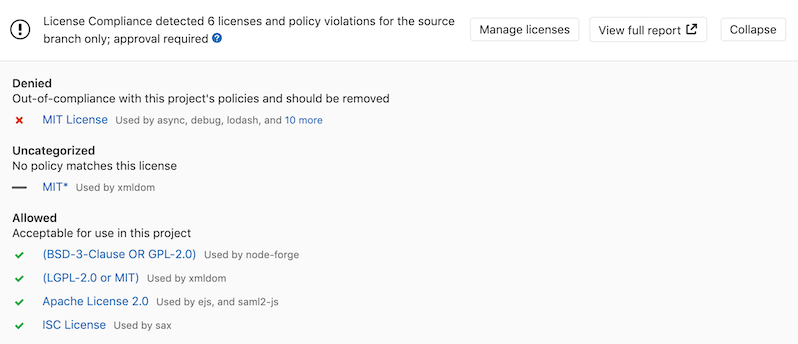
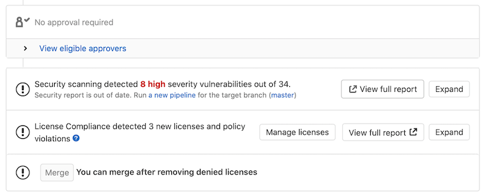
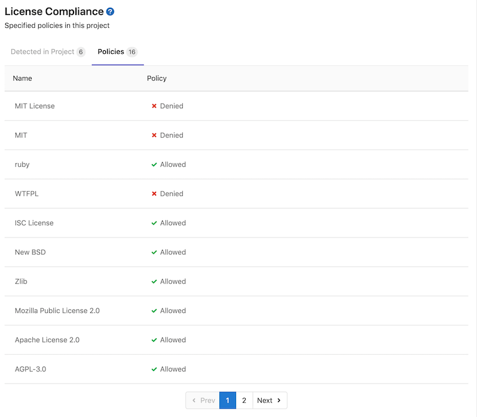
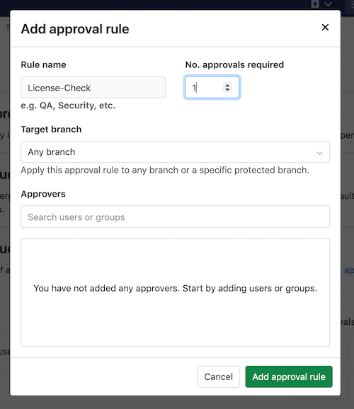

# License Compliance **(ULTIMATE)**

> [Introduced](https://gitlab.com/gitlab-org/gitlab/-/issues/5483) in [GitLab Ultimate](https://about.gitlab.com/pricing/) 11.0.

If you're using [GitLab CI/CD](../../../ci/README.md), you can use License Compliance to search your
project's dependencies for their licenses. You can then decide whether to allow or deny the use of
each license. For example, if your application uses an external (open source) library whose license
is incompatible with yours, then you can deny the use of that license.

You can take advantage of License Compliance by either [including the job](#configuration)
in your existing `.gitlab-ci.yml` file or by implicitly using
[Auto License Compliance](../../../topics/autodevops/stages.md#auto-license-compliance)
that is provided by [Auto DevOps](../../../topics/autodevops/index.md).

The [License Finder](https://github.com/pivotal/LicenseFinder) scan tool runs as part of the CI/CD
pipeline, and detects the licenses in use. GitLab checks the License Compliance report, compares the
licenses between the source and target branches, and shows the information right on the merge
request. Denied licenses are indicated by a `x` red icon next to them as well as new licenses that
need a decision from you. In addition, you can [manually allow or deny](#policies) licenses in your
project's license compliance policy section. If a denied license is detected in a new commit,
GitLab blocks any merge requests containing that commit and instructs the developer to remove the
license.

NOTE:
If the license compliance report doesn't have anything to compare to, no information
is displayed in the merge request area. That is the case when you add the
`license_scanning` job in your `.gitlab-ci.yml` for the first time.
Consecutive merge requests have something to compare to and the license
compliance report is shown properly.



You can click on a license to see more information.

When GitLab detects a **Denied** license, you can view it in the [license list](#license-list).


You can view and modify existing policies from the [policies](#policies) tab.


## Supported languages and package managers

The following languages and package managers are supported.

Java 8 and Gradle 1.x projects are not supported. The minimum supported version of Maven is 3.2.5.

| Language   | Package managers                                                                             | Notes |
|------------|----------------------------------------------------------------------------------------------|-------|
| JavaScript | [Bower](https://bower.io/), [npm](https://www.npmjs.com/)                                    |       |
| Go         | [Godep](https://github.com/tools/godep), [go mod](https://github.com/golang/go/wiki/Modules) |       |
| Java       | [Gradle](https://gradle.org/), [Maven](https://maven.apache.org/)                            |       |
| .NET       | [NuGet](https://www.nuget.org/)                                                              | The .NET Framework is supported via the [mono project](https://www.mono-project.com/). There are, however, some limitations. The scanner doesn't support Windows-specific dependencies and doesn't report dependencies of your project's listed dependencies. Also, the scanner always marks detected licenses for all dependencies as `unknown`. |
| Python     | [pip](https://pip.pypa.io/en/stable/)                                                        | Python is supported through [requirements.txt](https://pip.pypa.io/en/stable/user_guide/#requirements-files) and [Pipfile.lock](https://github.com/pypa/pipfile#pipfilelock). |
| Ruby       | [gem](https://rubygems.org/) |  |

### Experimental support

The following languages and package managers are [supported experimentally](https://github.com/pivotal/LicenseFinder#experimental-project-types).
The reported licenses might be incomplete or inaccurate.

| Language   | Package managers                                                                                              |
|------------|---------------------------------------------------------------------------------------------------------------|
| JavaScript | [Yarn](https://yarnpkg.com/)                                                                                  |
| Go         | `go get`, `gvt`, `glide`, `dep`, `trash`, `govendor`                                                          |
| Erlang     | [Rebar](https://www.rebar3.org/)                                                                              |
| Objective-C, Swift | [Carthage](https://github.com/Carthage/Carthage), [CocoaPods](https://cocoapods.org/) v0.39 and below |
| Elixir     | [Mix](https://elixir-lang.org/getting-started/mix-otp/introduction-to-mix.html)                               |
| C++/C      | [Conan](https://conan.io/)                                                                                    |
| Scala      | [sbt](https://www.scala-sbt.org/)                                                                             |
| Rust       | [Cargo](https://crates.io/)                                                                                   |
| PHP        | [Composer](https://getcomposer.org/)                                                                          |

## Requirements

To run a License Compliance scanning job, you need GitLab Runner with the
[`docker` executor](https://docs.gitlab.com/runner/executors/docker.html).

## Configuration

For GitLab 12.8 and later, to enable License Compliance, you must
[include](../../../ci/yaml/README.md#includetemplate) the
[`License-Scanning.gitlab-ci.yml` template](https://gitlab.com/gitlab-org/gitlab/blob/master/lib/gitlab/ci/templates/Security/License-Scanning.gitlab-ci.yml)
that's provided as a part of your GitLab installation.
For older versions of GitLab from 11.9 to 12.7, you must
[include](../../../ci/yaml/README.md#includetemplate) the
[`License-Management.gitlab-ci.yml` template](https://gitlab.com/gitlab-org/gitlab/blob/master/lib/gitlab/ci/templates/Security/License-Management.gitlab-ci.yml).
For GitLab versions earlier than 11.9, you can copy and use the job as defined
that template.

Add the following to your `.gitlab-ci.yml` file:

```yaml
include:
  - template: Security/License-Scanning.gitlab-ci.yml
```

The included template creates a `license_scanning` job in your CI/CD pipeline and scans your
dependencies to find their licenses.

NOTE:
Before GitLab 12.8, the `license_scanning` job was named `license_management`. GitLab 13.0 removes
the `license_management` job, so you must migrate to the `license_scanning` job and use the new
`License-Scanning.gitlab-ci.yml` template.

The results are saved as a
[License Compliance report artifact](../../../ci/pipelines/job_artifacts.md#artifactsreportslicense_scanning)
that you can later download and analyze. Due to implementation limitations, we
always take the latest License Compliance artifact available. Behind the scenes, the
[GitLab License Compliance Docker image](https://gitlab.com/gitlab-org/security-products/analyzers/license-finder)
is used to detect the languages/frameworks and in turn analyzes the licenses.

The License Compliance settings can be changed through [environment variables](#available-variables) by using the
[`variables`](../../../ci/yaml/README.md#variables) parameter in `.gitlab-ci.yml`.

### When License Compliance runs

When using the GitLab `License-Scanning.gitlab-ci.yml` template, the License Compliance job doesn't
wait for other stages to complete.

### Available variables

License Compliance can be configured using environment variables.

| Environment variable        | Required | Description |
|-----------------------------|----------|-------------|
| `ADDITIONAL_CA_CERT_BUNDLE` | no       | Bundle of trusted CA certificates (currently supported in Pip, Pipenv, Maven, Gradle, Yarn, and NPM projects). |
| `ASDF_JAVA_VERSION`         | no       | Version of Java to use for the scan. |
| `ASDF_NODEJS_VERSION`       | no       | Version of Node.js to use for the scan. |
| `ASDF_PYTHON_VERSION`       | no       | Version of Python to use for the scan. |
| `ASDF_RUBY_VERSION`         | no       | Version of Ruby to use for the scan. |
| `GRADLE_CLI_OPTS`           | no       | Additional arguments for the Gradle executable. If not supplied, defaults to `--exclude-task=test`. |
| `LICENSE_FINDER_CLI_OPTS`   | no       | Additional arguments for the `license_finder` executable. For example, if you have multiple projects in nested directories, you can update your `.gitlab-ci-yml` template to specify a recursive scan, like `LICENSE_FINDER_CLI_OPTS: '--recursive'`. |
| `LM_JAVA_VERSION`           | no       | Version of Java. If set to `11`, Maven and Gradle use Java 11 instead of Java 8. |
| `LM_PYTHON_VERSION`         | no       | Version of Python. If set to `3`, dependencies are installed using Python 3 instead of Python 2.7. |
| `MAVEN_CLI_OPTS`            | no       | Additional arguments for the `mvn` executable. If not supplied, defaults to `-DskipTests`. |
| `PIP_INDEX_URL`             | no       | Base URL of Python Package Index (default: `https://pypi.org/simple/`). |
| `SECURE_ANALYZERS_PREFIX`   | no       | Set the Docker registry base address to download the analyzer from. |
| `SETUP_CMD`                 | no       | Custom setup for the dependency installation (experimental). |

### Installing custom dependencies

> Introduced in [GitLab Ultimate](https://about.gitlab.com/pricing/) 11.4.

The `license_management` image already embeds many auto-detection scripts, languages,
and packages. Nevertheless, it's almost impossible to cover all cases for all projects.
That's why sometimes it's necessary to install extra packages, or to have extra steps
in the project automated setup, like the download and installation of a certificate.
For that, a `LICENSE_MANAGEMENT_SETUP_CMD` environment variable can be passed to the container,
with the required commands to run before the license detection.

If present, this variable overrides the setup step necessary to install all the packages
of your application (e.g.: for a project with a `Gemfile`, the setup step could be
`bundle install`).

For example:

```yaml
include:
  - template: Security/License-Scanning.gitlab-ci.yml

variables:
  LICENSE_MANAGEMENT_SETUP_CMD: sh my-custom-install-script.sh
```

In this example, `my-custom-install-script.sh` is a shell script at the root
directory of your project.

### Overriding the template

WARNING:
Beginning in GitLab 13.0, the use of [`only` and `except`](../../../ci/yaml/README.md#onlyexcept-basic)
is no longer supported. When overriding the template, you must use [`rules`](../../../ci/yaml/README.md#rules) instead.

If you want to override the job definition (for example, change properties like
`variables` or `dependencies`), you need to declare a `license_scanning` job
after the template inclusion and specify any additional keys under it. For example:

```yaml
include:
  - template: Security/License-Scanning.gitlab-ci.yml

license_scanning:
  variables:
    CI_DEBUG_TRACE: "true"
```

### Configuring Maven projects

The License Compliance tool provides a `MAVEN_CLI_OPTS` environment variable which can hold
the command line arguments to pass to the `mvn install` command which is executed under the hood.
Feel free to use it for the customization of Maven execution. For example:

```yaml
include:
  - template: Security/License-Scanning.gitlab-ci.yml

license_scanning:
  variables:
    MAVEN_CLI_OPTS: --debug
```

`mvn install` runs through all of the [build life cycle](http://maven.apache.org/guides/introduction/introduction-to-the-lifecycle.html)
stages prior to `install`, including `test`. Running unit tests is not directly
necessary for the license scanning purposes and consumes time, so it's skipped
by having the default value of `MAVEN_CLI_OPTS` as `-DskipTests`. If you want
to supply custom `MAVEN_CLI_OPTS` and skip tests at the same time, don't forget
to explicitly add `-DskipTests` to your options.
If you still need to run tests during `mvn install`, add `-DskipTests=false` to
`MAVEN_CLI_OPTS`.

#### Using private Maven repositories

If you have a private Maven repository which requires login credentials,
you can use the `MAVEN_CLI_OPTS` environment variable.

Read more on [how to use private Maven repositories](../../application_security/index.md#using-private-maven-repos).

You can also use `MAVEN_CLI_OPTS` to connect to a trusted Maven repository that uses a self-signed
or internally trusted certificate. For example:

```yaml
include:
  - template: Security/License-Scanning.gitlab-ci.yml

license_scanning:
  variables:
    MAVEN_CLI_OPTS: -Dmaven.wagon.http.ssl.allowall=true -Dmaven.wagon.http.ssl.ignore.validity.dates=true -Dmaven.wagon.http.ssl.insecure=true
```

Alternatively, you can use a Java key store to verify the TLS connection. For instructions on how to
generate a key store file, see the
[Maven Guide to Remote repository access through authenticated HTTPS](http://maven.apache.org/guides/mini/guide-repository-ssl.html).

### Selecting the version of Python

> - [Introduced](https://gitlab.com/gitlab-org/security-products/license-management/-/merge_requests/36) in [GitLab Ultimate](https://about.gitlab.com/pricing/) 12.0.
> - In [GitLab 12.2](https://gitlab.com/gitlab-org/gitlab/-/issues/12032), Python 3.5 became the default.
> - In [GitLab 12.7](https://gitlab.com/gitlab-org/security-products/license-management/-/merge_requests/101), Python 3.8 became the default.

License Compliance uses Python 3.8 and pip 19.1 by default.
If your project requires Python 2, you can switch to Python 2.7 and pip 10.0
by setting the `LM_PYTHON_VERSION` environment variable to `2`.

```yaml
include:
  - template: Security/License-Scanning.gitlab-ci.yml

license_scanning:
  variables:
    LM_PYTHON_VERSION: 2
```

### Custom root certificates for Python

You can supply a custom root certificate to complete TLS verification by using the
`ADDITIONAL_CA_CERT_BUNDLE` [environment variable](#available-variables).

#### Using private Python repositories

If you have a private Python repository you can use the `PIP_INDEX_URL` [environment variable](#available-variables)
to specify its location.

### Configuring NPM projects

You can configure NPM projects by using an [`.npmrc`](https://docs.npmjs.com/configuring-npm/npmrc.html/)
file.

#### Using private NPM registries

If you have a private NPM registry you can use the
[`registry`](https://docs.npmjs.com/using-npm/config/#registry)
setting to specify its location.

For example:

```plaintext
registry = https://npm.example.com
```

#### Custom root certificates for NPM

You can supply a custom root certificate to complete TLS verification by using the
`ADDITIONAL_CA_CERT_BUNDLE` [environment variable](#available-variables).

To disable TLS verification you can provide the [`strict-ssl`](https://docs.npmjs.com/using-npm/config/#strict-ssl)
setting.

For example:

```plaintext
strict-ssl = false
```

### Configuring Yarn projects

You can configure Yarn projects by using a [`.yarnrc.yml`](https://yarnpkg.com/configuration/yarnrc/)
file.

#### Using private Yarn registries

If you have a private Yarn registry you can use the
[`npmRegistryServer`](https://yarnpkg.com/configuration/yarnrc/#npmRegistryServer)
setting to specify its location.

For example:

```plaintext
npmRegistryServer: "https://npm.example.com"
```

#### Custom root certificates for Yarn

You can supply a custom root certificate to complete TLS verification by using the
`ADDITIONAL_CA_CERT_BUNDLE` [environment variable](#available-variables).

### Configuring Bower projects

You can configure Bower projects by using a [`.bowerrc`](https://bower.io/docs/config/#bowerrc-specification)
file.

#### Using private Bower registries

If you have a private Bower registry you can use the
[`registry`](https://bower.io/docs/config/#bowerrc-specification)
setting to specify its location.

For example:

```plaintext
{
  "registry": "https://registry.bower.io"
}
```

#### Custom root certificates for Bower

You can supply a custom root certificate to complete TLS verification by using the
`ADDITIONAL_CA_CERT_BUNDLE` [environment variable](#available-variables), or by
specifying a `ca` setting in a [`.bowerrc`](https://bower.io/docs/config/#bowerrc-specification)
file.

### Configuring Bundler projects

#### Using private Bundler registries

If you have a private Bundler registry you can use the
[`source`](https://bundler.io/man/gemfile.5.html#GLOBAL-SOURCES)
setting to specify its location.

For example:

```plaintext
source "https://gems.example.com"
```

#### Custom root certificates for Bundler

You can supply a custom root certificate to complete TLS verification by using the
`ADDITIONAL_CA_CERT_BUNDLE` [environment variable](#available-variables), or by
specifying a [`BUNDLE_SSL_CA_CERT`](https://bundler.io/v2.0/man/bundle-config.1.html)
[environment variable](../../../ci/variables/README.md#custom-environment-variables)
in the job definition.

### Configuring Cargo projects

#### Using private Cargo registries

If you have a private Cargo registry you can use the
[`registries`](https://doc.rust-lang.org/cargo/reference/registries.html)
setting to specify its location.

For example:

```toml
[registries]
my-registry = { index = "https://my-intranet:8080/git/index" }
```

#### Custom root certificates for Cargo

To supply a custom root certificate to complete TLS verification, do one of the following:

- Use the `ADDITIONAL_CA_CERT_BUNDLE` [environment variable](#available-variables).
- Specify a [`CARGO_HTTP_CAINFO`](https://doc.rust-lang.org/cargo/reference/environment-variables.html)
  [environment variable](../../../ci/variables/README.md#custom-environment-variables)
  in the job definition.

### Configuring Composer projects

#### Using private Composer registries

If you have a private Composer registry you can use the
[`repositories`](https://getcomposer.org/doc/05-repositories.md)
setting to specify its location.

For example:

```json
{
  "repositories": [
    { "packagist.org": false },
    {
      "type": "composer",
      "url": "https://composer.example.com"
    }
  ],
  "require": {
    "monolog/monolog": "1.0.*"
  }
}
```

#### Custom root certificates for Composer

You can supply a custom root certificate to complete TLS verification by using the
`ADDITIONAL_CA_CERT_BUNDLE` [environment variable](#available-variables), or by
specifying a [`COMPOSER_CAFILE`](https://getcomposer.org/doc/03-cli.md#composer-cafile)
[environment variable](../../../ci/variables/README.md#custom-environment-variables)
in the job definition.

### Configuring Conan projects

You can configure [Conan](https://conan.io/) projects by adding a `.conan` directory to your
project root. The project root serves as the [`CONAN_USER_HOME`](https://docs.conan.io/en/latest/reference/env_vars.html#conan-user-home).

Consult the [Conan](https://docs.conan.io/en/latest/reference/config_files/conan.conf.html#conan-conf)
documentation for a list of settings that you can apply.

The `license_scanning` job runs in a [Debian 10](https://www.debian.org/releases/buster/) Docker
image. The supplied image ships with some build tools such as [CMake](https://cmake.org/) and [GCC](https://gcc.gnu.org/).
However, not all project types are supported by default. To install additional tools needed to
compile dependencies, use a [`before_script`](../../../ci/yaml/README.md#before_script)
to install the necessary build tools using the [`apt`](https://wiki.debian.org/PackageManagementTools)
package manager. For a comprehensive list, consult [the Conan documentation](https://docs.conan.io/en/latest/introduction.html#all-platforms-all-build-systems-and-compilers).

The default [Conan](https://conan.io/) configuration sets [`CONAN_LOGIN_USERNAME`](https://docs.conan.io/en/latest/reference/env_vars.html#conan-login-username-conan-login-username-remote-name)
to `ci_user`, and binds [`CONAN_PASSWORD`](https://docs.conan.io/en/latest/reference/env_vars.html#conan-password-conan-password-remote-name)
to the [`CI_JOB_TOKEN`](../../../ci/variables/predefined_variables.md)
for the running job. This allows Conan projects to fetch packages from a [GitLab Conan Repository](../../packages/conan_repository/#fetch-conan-package-information-from-the-package-registry)
if a GitLab remote is specified in the `.conan/remotes.json` file.

To override the default credentials specify a [`CONAN_LOGIN_USERNAME_{REMOTE_NAME}`](https://docs.conan.io/en/latest/reference/env_vars.html#conan-login-username-conan-login-username-remote-name)
matching the name of the remote specified in the `.conan/remotes.json` file.

NOTE:
[MSBuild](https://github.com/mono/msbuild#microsoftbuild-msbuild) projects aren't supported. The
`license_scanning` image ships with [Mono](https://www.mono-project.com/) and [MSBuild](https://github.com/mono/msbuild#microsoftbuild-msbuild).
Additional setup may be required to build packages for this project configuration.

#### Using private Conan registries

By default, [Conan](https://conan.io/) uses the `conan-center` remote. For example:

```json
{
 "remotes": [
  {
   "name": "conan-center",
   "url": "https://conan.bintray.com",
   "verify_ssl": true
  }
 ]
}
```

To fetch dependencies from an alternate remote, specify that remote in a `.conan/remotes.json`. For
example:

```json
{
 "remotes": [
  {
   "name": "gitlab",
   "url": "https://gitlab.com/api/v4/packages/conan",
   "verify_ssl": true
  }
 ]
}
```

If credentials are required to authenticate then you can configure a [protected variable](../../../ci/variables/README.md#protect-a-custom-variable)
following the naming convention described in the [`CONAN_LOGIN_USERNAME` documentation](https://docs.conan.io/en/latest/reference/env_vars.html#conan-login-username-conan-login-username-remote-name).

#### Custom root certificates for Conan

You can provide custom certificates by adding a `.conan/cacert.pem` file to the project root and
setting [`CA_CERT_PATH`](https://docs.conan.io/en/latest/reference/env_vars.html#conan-cacert-path)
to `.conan/cacert.pem`.

If you specify the `ADDITIONAL_CA_CERT_BUNDLE` [environment variable](#available-variables), this
variable's X.509 certificates are installed in the Docker image's default trust store and Conan is
configured to use this as the default `CA_CERT_PATH`.

### Configuring Go projects

To configure [Go modules](https://github.com/golang/go/wiki/Modules)
based projects, specify [environment variables](https://golang.org/pkg/cmd/go/#hdr-Environment_variables)
in the `license_scanning` job's [variables](#available-variables) section in `.gitlab-ci.yml`.

If a project has [vendored](https://golang.org/pkg/cmd/go/#hdr-Vendor_Directories) its modules,
then the combination of the `vendor` directory and `mod.sum` file are used to detect the software
licenses associated with the Go module dependencies.

#### Using private Go registries

You can use the [`GOPRIVATE`](https://golang.org/pkg/cmd/go/#hdr-Environment_variables)
and [`GOPROXY`](https://golang.org/pkg/cmd/go/#hdr-Environment_variables)
environment variables to control where modules are sourced from. Alternatively, you can use
[`go mod vendor`](https://golang.org/ref/mod#tmp_28) to vendor a project's modules.

#### Custom root certificates for Go

You can specify the [`-insecure`](https://golang.org/pkg/cmd/go/internal/get/) flag by exporting the
[`GOFLAGS`](https://golang.org/cmd/go/#hdr-Environment_variables)
environment variable. For example:

```yaml
include:
  - template: Security/License-Scanning.gitlab-ci.yml

license_scanning:
  variables:
    GOFLAGS: '-insecure'
```

#### Using private NuGet registries

If you have a private NuGet registry you can add it as a source
by adding it to the [`packageSources`](https://docs.microsoft.com/en-us/nuget/reference/nuget-config-file#package-source-sections)
section of a [`nuget.config`](https://docs.microsoft.com/en-us/nuget/reference/nuget-config-file) file.

For example:

```xml
<?xml version="1.0" encoding="utf-8"?>
<configuration>
  <packageSources>
    <clear />
    <add key="custom" value="https://nuget.example.com/v3/index.json" />
  </packageSources>
</configuration>
```

#### Custom root certificates for NuGet

You can supply a custom root certificate to complete TLS verification by using the
`ADDITIONAL_CA_CERT_BUNDLE` [environment variable](#available-variables).

### Migration from `license_management` to `license_scanning`

In GitLab 12.8 a new name for `license_management` job was introduced. This change was made to improve clarity around the purpose of the scan, which is to scan and collect the types of licenses present in a projects dependencies.
GitLab 13.0 drops support for `license_management`.
If you're using a custom setup for License Compliance, you're required
to update your CI configuration accordingly:

1. Change the CI template to `License-Scanning.gitlab-ci.yml`.
1. Change the job name to `license_scanning` (if you mention it in `.gitlab-ci.yml`).
1. Change the artifact name to `license_scanning`, and the filename to `gl-license-scanning-report.json` (if you mention it in `.gitlab-ci.yml`).

For example, the following `.gitlab-ci.yml`:

```yaml
include:
  - template: License-Management.gitlab-ci.yml

license_management:
  artifacts:
    reports:
      license_management: gl-license-management-report.json
```

Should be changed to:

```yaml
include:
  - template: Security/License-Scanning.gitlab-ci.yml

license_scanning:
  artifacts:
    reports:
      license_scanning: gl-license-scanning-report.json
```

If you use the `license_management` artifact in GitLab 13.0 or later, the License Compliance job generates this error:

```plaintext
WARNING: Uploading artifacts to coordinator... failed id=:id responseStatus=400 Bad Request status=400 Bad Request token=:sha

FATAL: invalid_argument
```

If you encounter this error, follow the instructions described in this section.

## Running License Compliance in an offline environment

For self-managed GitLab instances in an environment with limited, restricted, or intermittent access
to external resources through the internet, some adjustments are required for the License Compliance job to
successfully run. For more information, see [Offline environments](../../application_security/offline_deployments/index.md).

### Requirements for offline License Compliance

To use License Compliance in an offline environment, you need:

- GitLab Runner with the [`docker` or `kubernetes` executor](#requirements).
- Docker Container Registry with locally available copies of License Compliance [analyzer](https://gitlab.com/gitlab-org/security-products/analyzers) images.

NOTE:
GitLab Runner has a [default `pull policy` of `always`](https://docs.gitlab.com/runner/executors/docker.html#using-the-always-pull-policy),
meaning the runner tries to pull Docker images from the GitLab container registry even if a local
copy is available. The GitLab Runner [`pull_policy` can be set to `if-not-present`](https://docs.gitlab.com/runner/executors/docker.html#using-the-if-not-present-pull-policy)
in an offline environment if you prefer using only locally available Docker images. However, we
recommend keeping the pull policy setting to `always` if not in an offline environment, as this
enables the use of updated scanners in your CI/CD pipelines.

### Make GitLab License Compliance analyzer images available inside your Docker registry

For License Compliance with all [supported languages and package managers](#supported-languages-and-package-managers),
import the following default License Compliance analyzer images from `registry.gitlab.com` to your
offline [local Docker container registry](../../packages/container_registry/index.md):

```plaintext
registry.gitlab.com/gitlab-org/security-products/analyzers/license-finder:latest
```

The process for importing Docker images into a local offline Docker registry depends on
**your network security policy**. Please consult your IT staff to find an accepted and approved
process by which external resources can be imported or temporarily accessed. Note that these scanners are [updated periodically](../../application_security/index.md#maintenance-and-update-of-the-vulnerabilities-database)
with new definitions, so consider if you are able to make periodic updates yourself.

For details on saving and transporting Docker images as a file, see Docker's documentation on
[`docker save`](https://docs.docker.com/engine/reference/commandline/save/), [`docker load`](https://docs.docker.com/engine/reference/commandline/load/),
[`docker export`](https://docs.docker.com/engine/reference/commandline/export/), and [`docker import`](https://docs.docker.com/engine/reference/commandline/import/).

### Set License Compliance CI job variables to use local License Compliance analyzers

Add the following configuration to your `.gitlab-ci.yml` file. You must replace `image` to refer to
the License Compliance Docker image hosted on your local Docker container registry:

```yaml
include:
  - template: Security/License-Scanning.gitlab-ci.yml

license_scanning:
  image:
    name: localhost:5000/analyzers/license-management:latest
```

The License Compliance job should now use local copies of the License Compliance analyzers to scan
your code and generate security reports, without requiring internet access.

Additional configuration may be needed for connecting to
[private Bower registries](#using-private-bower-registries),
[private Bundler registries](#using-private-bundler-registries),
[private Conan registries](#using-private-bower-registries),
[private Go registries](#using-private-go-registries),
[private Maven repositories](#using-private-maven-repos),
[private NPM registries](#using-private-npm-registries),
[private Python repositories](#using-private-python-repos),
and [private Yarn registries](#using-private-yarn-registries).

### SPDX license list name matching

> [Introduced](https://gitlab.com/gitlab-org/gitlab/-/issues/212388) in [GitLab Ultimate](https://about.gitlab.com/pricing/) 13.3.

Prior to GitLab 13.3, offline environments required an exact name match for [project policies](#policies).
In GitLab 13.3 and later, GitLab matches the name of [project policies](#policies)
with identifiers from the [SPDX license list](https://spdx.org/licenses/).
A local copy of the SPDX license list is distributed with the GitLab instance. If needed, the GitLab
instance's administrator can manually update it with a [Rake task](../../../raketasks/spdx.md).

## License list

> [Introduced](https://gitlab.com/gitlab-org/gitlab/-/issues/13582) in [GitLab Ultimate](https://about.gitlab.com/pricing/) 12.7.

The License list allows you to see your project's licenses and key
details about them.

In order for the licenses to appear under the license list, the following
requirements must be met:

1. The License Compliance CI job must be [configured](#configuration) for your project.
1. Your project must use at least one of the
   [supported languages and package managers](#supported-languages-and-package-managers).

Once everything is set, navigate to **Security & Compliance > License Compliance**
in your project's sidebar, and the licenses are displayed, where:

- **Name:** The name of the license.
- **Component:** The components which have this license.
- **Policy Violation:** The license has a [license policy](#policies) marked as **Deny**.


## Policies

> [Introduced](https://gitlab.com/gitlab-org/gitlab/-/merge_requests/22465) in [GitLab Ultimate](https://about.gitlab.com/pricing/) 12.9.

Policies allow you to specify licenses that are `allowed` or `denied` in a project. If a `denied`
license is newly committed it blocks the merge request and instructs the developer to remove it.
Note, the merge request is not able to be merged until the `denied` license is removed.
You may add a [`License-Check` approval rule](#enabling-license-approvals-within-a-project),
which enables a designated approver that can approve and then merge a merge request with `denied` license.



The **Policies** tab in the project's license compliance section displays your project's license
policies. Project maintainers can specify policies in this section.


Developers of the project can view the policies configured in a project.



## Enabling License Approvals within a project

> [Introduced](https://gitlab.com/gitlab-org/gitlab/-/issues/13067) in [GitLab Ultimate](https://about.gitlab.com/pricing/) 12.3.

`License-Check` is a [security approval](../../application_security/index.md#enabling-security-approvals-within-a-project) rule you can enable to allow an individual or group to approve a
merge request that contains a `denied` license.

You can enable `License-Check` one of two ways:

1. Navigate to your project's **Settings > General** and expand **Merge request approvals**.
1. Click **Enable** or **Edit**.
1. Add or change the **Rule name** to `License-Check` (case sensitive).



- Create an approval group in the [project policies section for License Compliance](#policies).
  You must set this approval group's number of approvals required to greater than zero. Once you
  enable this group in your project, the approval rule is enabled for all merge requests.

Any code changes cause the approvals required to reset.

An approval is required when a license report:

- Contains a dependency that includes a software license that is `denied`.
- Is not generated during pipeline execution.

An approval is optional when a license report:

- Contains no software license violations.
- Contains only new licenses that are `allowed` or unknown.

## Troubleshooting

### `ERROR -- : asdf: No preset version installed for command`

This error occurs when the version of the tools used by your project
do not match the version of the pre-installed tools available in the
`license_scanning` Docker image. The `license_scanning` job uses
[asdf-vm](https://asdf-vm.com/) to activate the appropriate version of
a tool that your project relies on. For example, if your project relies on a specific
version of [Node.js](https://nodejs.org/) or any other supported tool you can
specify the desired version by adding a
[`.tool-versions`](https://asdf-vm.com/#/core-configuration?id=tool-versions) file to the project
or using the appropriate [`ASDF_<tool>_VERSION`](https://asdf-vm.com/#/core-configuration?id=environment-variables) environment variable to
activate the appropriate version.

For example, the following `.tool-versions` file activates version `12.16.3` of [Node.js](https://nodejs.org/)
and version `2.7.2` of [Ruby](https://www.ruby-lang.org/).

```plaintext
nodejs 12.16.3
ruby 2.7.2
```

The next example shows how to activate the same versions of the tools mentioned above by using environment variables defined in your
project's `.gitlab-ci.yml` file.

```yaml
include:
  - template: Security/License-Scanning.gitlab-ci.yml

license_scanning:
  variables:
    ASDF_NODEJS_VERSION: '12.16.3'
    ASDF_RUBY_VERSION: '2.7.2'
```

A full list of variables can be found in [environment variables](#available-variables).

To find out what tools are pre-installed in the `license_scanning` Docker image use the following command:

```shell
$ docker run --entrypoint='' registry.gitlab.com/gitlab-org/security-products/analyzers/license-finder:3 /bin/bash -lc 'asdf list'
golang
  1.14
gradle
  6.3
java
  adopt-openjdk-11.0.7+10
  adopt-openjdk-8u242-b08
maven
  3.6.3
nodejs
  10.20.1
  12.16.3
php
  7.4.5
python
  2.7.18
  3.8.2
ruby
  2.6.6
sbt
  1.3.8
```

To interact with the `license_scanning` runtime environment use the following command:

```shell
$ docker run -it --entrypoint='' registry.gitlab.com/gitlab-org/security-products/analyzers/license-finder:3 /bin/bash -l
root@6abb70e9f193:~#
```

NOTE:
Selecting a custom version of [Mono](https://www.mono-project.com/) or [.NET Core](https://dotnet.microsoft.com/download/dotnet-core) is currently not supported.
