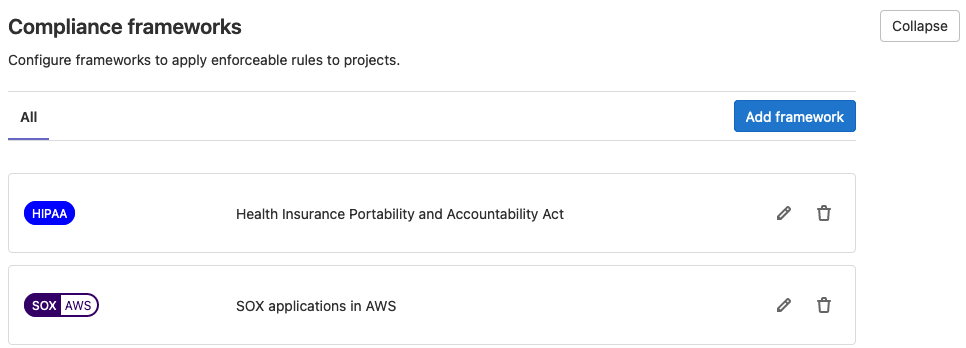
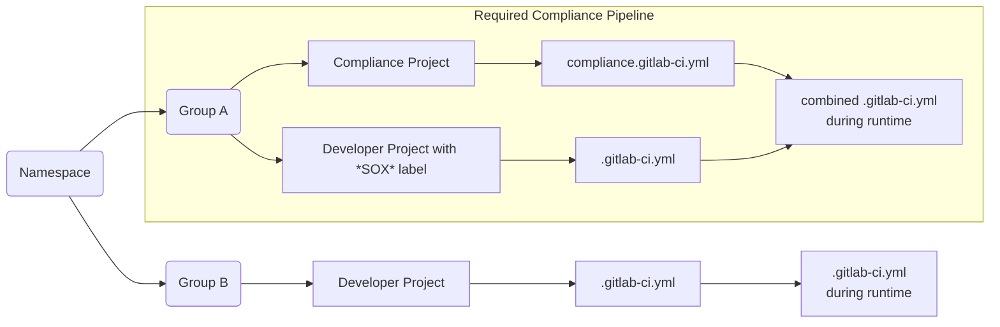

## Compliance frameworks **(PREMIUM)**

> - [Introduced](https://gitlab.com/gitlab-org/gitlab/-/issues/276221) in GitLab 13.9.
> - [Deployed behind a feature flag](../../feature_flags.md).
> - [Enabled by default](https://gitlab.com/gitlab-org/gitlab/-/issues/287779) in GitLab 13.11.
> - Enabled on GitLab.com.
> - Recommended for production use.

WARNING:
This feature might not be available to you. Check the **version history** note above for details.

GitLab 13.9 introduces customizable compliance frameworks at the group-level. A group owner can create a compliance framework label and assign it to any number of projects within that group or subgroups. When this feature is enabled, projects can only be assigned compliance frameworks that already exist within that group. 

New compliance frameworks can be created and updated using GraphQL.

#### Scoped compliance frameworks
A scoped compliance framework will appear if the name is using the (`::`) syntax. These do not carry any unique workflow like [scoped labels](../project/../../../project/labels.md#scoped-labels), and only show as a visual flair.

#### Pipeline Compliance
Any projects using a compliance framework with a location specified for its `compliance pipeline configuration` will be required to include this .yml file during its runtime.

