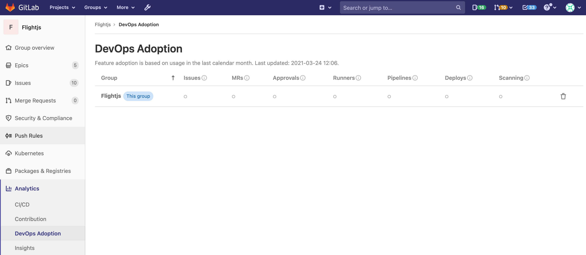

# Group DevOps Adoption **(ULTIMATE)**

> - [Introduced](https://gitlab.com/gitlab-org/gitlab/-/issues/321083) in GitLab 13.11.
> - [Deployed behind a feature flag](../../../user/feature_flags.md), disabled by default.
> - Disabled on GitLab.com.
> - Not recommended for production use.
> - To use in GitLab self-managed instances, ask a GitLab administrator to [enable it](#enable-or-disable-group-devops-adoption).

WARNING:
This feature might not be available to you. Check the **version history** note above for details.

[Introduced](https://gitlab.com/gitlab-org/gitlab/-/issues/321083) in GitLab 13.11 as a [Beta feature](https://about.gitlab.com/handbook/product/gitlab-the-product/#beta).

To access Group DevOps Adoption, navigate to your group sidebar and select **Analytics > DevOps Adoption**

Group DevOps Adoption shows you how individual groups and sub-groups within your organization use the following features:

- Issues
- Merge Requests
- Approvals
- Runners
- Pipelines
- Deployments
- Scans

When managing groups in the UI, you can manage your sub-groups with the **Add/Remove sub-groups**
button, in the top right hand section of your Groups pages.

DevOps Adoption allows you to:

- Verify whether you are getting the return on investment that you expected from GitLab.
- Identify specific sub-groups that are lagging in their adoption of GitLab so you can help them along in their DevOps journey.
- Find the sub-groups that have adopted certain features and can provide guidance to other sub-groups on how to use those features.



## How it works

### Enabling data processing

Group DevOps Adoption relies on data that has been gathered by a daily data processing task.
This task is disabled by default.
If you want to begin using Group DevOps Adoption,
simply access the feature for the first time and GitLab will automatically enable the data processing for that group.
Please note that the group data will not appear immediately,
because GitLab requires a few moments to process it.
Generally the group data will be visible in less than one minute.

### What is displayed

DevOps Adoption displays feature adoption data for the given group,
and any added sub-groups, for the current calendar month.
Please expect adoption to be lower at the beginning of the month,
before you have had an opportunity to use all the features listed in the table.
Understanding this is not ideal behavior, we
[plan to implement](https://gitlab.com/gitlab-org/gitlab/-/issues/329708)
a rollling 30-day perspective instead.

### When a feature is considered "adopted"

A feature is considered "adopted" if it has been used anywhere in the group in the time period, even just once.
For example, if one issue was created in one project in a group, the group is considered to have "adopted" issues in that time period.

### No penalties for normal adoption

DevOps Adoption does not penalize groups with normal adoption.
Following that guideline, we have developed some specific rules:

1. Don't penalize for having dormant projects. It is normal for groups have a mix of active and dormant projects. That means we should not measure adoption by how many projects within the group have used a feature, only whether a feature was used anywhere in the group.
1. Don't penalize for GitLab adding new features over time. It is normal for a group's feature usage to be consistent over time. If GitLab adds a new feature, the group's feature adoption has not decreased. That means we should not measure adoption by percentages, only total counts.

### Adding a sub-group

If you want to add a sub-group to your Group DevOps Adoption report,
just click the button to "Add/remove sub-groups".
Select the sub-group you want to add and click to save.
Please note that the sub-group data might not appear immediately,
because GitLab requires a few moments to collect the data.
Generally the data will be visible in less than one minute.

## Enable or disable Group DevOps Adoption **(ULTIMATE)**

Group DevOps Adoption is under development and not ready for production use. It is
deployed behind a feature flag that is **disabled by default**.
[GitLab administrators with access to the GitLab Rails console](../../../administration/feature_flags.md)
can enable it.

To enable it:

```ruby
Feature.enable(:group_devops_adoption)
```

To disable it:

```ruby
Feature.disable(:group_devops_adoption)
```
