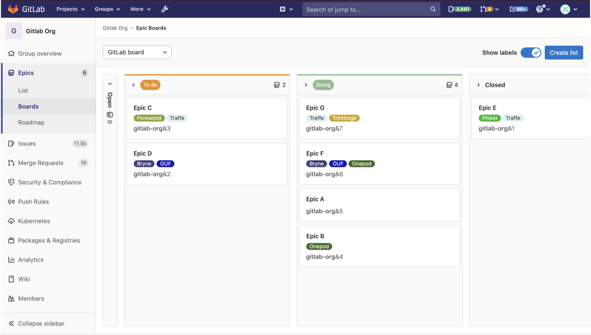

# Epic Boards **(PREMIUM)**

> - [Introduced](https://gitlab.com/groups/gitlab-org/-/epics/2864) in GitLab 13.10.
> - [Deployed behind a feature flag](../../feature_flags.md), disabled by default.
> - [Enabled by default](https://gitlab.com/gitlab-org/gitlab/-/issues/290039) in GitLab 14.0.
> - Enabled on GitLab.com.
> - Recommended for production use.
> - For GitLab self-managed instances, GitLab administrators can opt to [disable it](../../../administration/feature_flags.md).

Epic boards build on the existing [epic tracking functionality](index.md) and
[labels](../../project/labels.md). Your epics appear as cards in vertical lists, organized by their assigned
labels.

To view an epic board, in a group, select **Epics > Boards**.

## Create an epic board

To create a new epic board:

1. Select the dropdown with the current board name in the upper left corner of the Epic Boards page.
1. Select **Create new board**.
1. Enter the new board's name and select **Create**.

## Delete an epic board

To delete the currently active epic board:

1. Click the dropdown with the current board name in the upper left corner of the Epic Boards page.
1. Click **Delete board**.
1. Click **Delete** to confirm.

## Actions you can take on an issue board

- Create a new list.
- Remove an existing list.
- Filter epics.
- Create workflows.
- Drag epics between lists.
- Drag and reorder the lists.
- Change epic labels (by dragging an epic between lists).
- Close an epic (by dragging it to the **Done** list).
- Configure the scope of the board.

If you're not able to do some of the things above, make sure you have the right
[permissions](#permissions).

## Permissions

Users with the [Reporter and higher roles](../../permissions.md) can use all the functionality of the
Epic Board feature to create or delete lists. They can also drag epics from one list to another.
