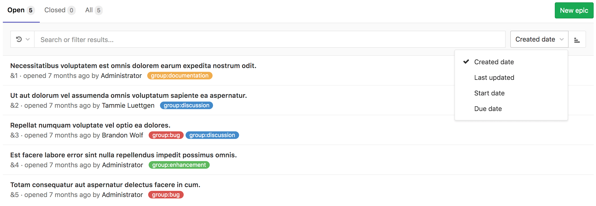

# Epics **[ULTIMATE]**

> Introduced in [GitLab Ultimate][ee] 10.2.

Epics let you manage your portfolio of projects more efficiently and with less
effort by tracking groups of issues that share a theme, across projects and
milestones.

## Use cases

- Track a group of issues together that contribute to a single feature.
- Track when the work for the group of issues is targeted to begin, and when it is targeted to end.
- Discuss and collaborate on feature ideas and scope at a high-level.

## Creating an epic

A paginated list of epics is available in each group from where you can create
a new epic. The list of epics includes also epics from all subgroups of the
selected group. From your group page:

1. Go to **Epics**
1. Click the **New epic** button at the top right
1. Enter a descriptive title and hit **Create epic**

Once created, you will be taken to the view for that newly-created epic where
you can change its title, description, planned start date, and planned end date.
The planned end date cannot be before the planned start date
(but they can be the same day).

An epic contains a list of issues, and an issue can be associated with at most
one epic. You can add issues associated with the epic by clicking the
plus icon (<kbd>+</kbd>) under the epic description, pasting the link of the
issue, and clicking **Add**. Any issue belonging to a project in the epic's
group or any of the epic's subgroups are eligible to be added. To remove an
issue from an epic, simply click on the <kbd>x</kbd> button in the epic's
issue list.

When you add an issue to an epic that's already associated with another epic,
the issue is automatically removed from the previous epic. In other words, an
issue can be associated with at most one epic.

## Reordering issues in an epic

Drag and drop to reorder issues in an epic. New issues added to an epic appear at the top of the list.

## Deleting an epic

NOTE: **Note:**
To delete an epic, you need to be an [Owner][permissions] of a group/subgroup.

When inside a single epic view, click the **Delete** button to delete the epic.
A modal will pop-up to confirm your action.

Deleting an epic releases all existing issues from their associated epic in the
system.

## Navigating to an epic from an issue

If an issue belongs to an epic, you can navigate to the containing epic with the
link in the issue sidebar.

## Searching for an epic from epics list page

> Introduced in [GitLab Ultimate][ee] 10.5.

You can search for an epic from the list of epics using filtered search bar (similar to
that of Issues and Merge requests) based on following parameters:

- Title or description
- Author name / username
- Labels

To search, go to the list of epics and click on the field **Search or filter results...**.
It will display a dropdown menu, from which you can add an author. You can also enter plain
text to search by epic title or description. When done, press <kbd>Enter</kbd> on your
keyboard to filter the list.

You can also sort epics list by **Created date** or **Last updated**.

## Permissions

If you have access to view an epic and have access to view an issue already
added to that epic, then you can view the issue in the epic issue list.

If you have access to edit an epic and have access to edit an issue, then you
can add the issue to or remove it from the epic.

Note that for a given group, the visibility of all projects must be the same as
the group, or less restrictive. That means if you have access to a group's epic,
then you already have access to its projects' issues.

You may also consult the [group permissions table][permissions].

[ee]: https://about.gitlab.com/pricing/
[permissions]: ../../permissions.md#group-members-permissions

## Thread

- Comments: collaborate on that epic by posting comments in its thread.
These text fields also fully support
[GitLab Flavored Markdown](../../markdown.md#gitlab-flavored-markdown-gfm).

## Comment, or start a discussion

Once you wrote your comment, you can either:

- Click "Comment" and your comment will be published.
- Click "Start discussion": start a thread within that epic's thread to discuss specific points.

## Award emoji

- You can [award an emoji](../../award_emojis.md) to that epic or its comments.
