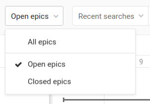

# Roadmap **(PREMIUM)**

> - Introduced in [GitLab Ultimate](https://about.gitlab.com/pricing/) 10.5.
> - In [GitLab 12.9](https://gitlab.com/gitlab-org/gitlab/-/issues/198062), Roadmaps were moved to the Premium tier.
> - In [GitLab 12.9](https://gitlab.com/gitlab-org/gitlab/-/issues/5164) and later, the epic bars show epics' title, progress, and completed weight percentage.
> - Milestones appear in roadmaps in [GitLab 12.10](https://gitlab.com/gitlab-org/gitlab/-/issues/6802), and later.
> - Feature flag for milestones visible in roadmaps removed in [GitLab 13.0](https://gitlab.com/gitlab-org/gitlab/-/merge_requests/29641).

Epics and milestones within a group containing **Start date** and/or **Due date**
can be visualized in a form of a timeline (that is, a Gantt chart). The Roadmap page
shows such a visualization for all the epics and milestones which are under a group or one of its
subgroups.

On the epic bars, you can see the each epic's title, progress, and completed weight percentage.
When you hover over an epic bar, a popover appears with the epic's title, start date, due date, and
weight completed.

You can expand epics that contain child epics to show their child epics in the roadmap.
You can click the chevron **{chevron-down}** next to the epic title to expand and collapse the child epics.

On top of the milestone bars, you can see their title. When you hover a milestone bar or title, a popover appears with its title, start date and due date.

A dropdown menu allows you to show only open or closed epics. By default, all epics are shown.

You can sort epics in the Roadmap view by:

- Created date
- Last updated
- Start date
- Due date

Each option contains a button that toggles the sort order between **ascending** and **descending**.
The sort option and order persist when browsing Epics, including the [epics list view](../epics/index.md).

Roadmaps can also be [visualized inside an epic](../epics/index.md#roadmap-in-epics).

## Timeline duration

> - Introduced in [GitLab Ultimate](https://about.gitlab.com/pricing/) 11.0.
> - In [GitLab 12.9](https://gitlab.com/gitlab-org/gitlab/-/issues/198062), Timelines were moved to the Premium tier.

Roadmap supports the following date ranges:

- Quarters
- Months (default)
- Weeks

### Quarters

In the **Quarters** preset, roadmap shows epics and milestones which have start or due dates
**falling within** or **going through** past quarter, current quarter, and the next four quarters,
where **today**
is shown by the vertical red line in the timeline. The sub-headers underneath the quarter name on
the timeline header represent the month of the quarter.

### Months

In the **Months** preset, roadmap shows epics and milestones which have start or due dates
**falling within** or
**going through** the past month, current month, and the next five months, where **today**
is shown by the vertical red line in the timeline. The sub-headers underneath the month name on
the timeline header represent the date on starting day (Sunday) of the week. This preset is
selected by default.

### Weeks

In the **Weeks** preset, roadmap shows epics and milestones which have start or due dates **falling
within** or **going through** the past week, current week and the next four weeks, where **today**
is shown by the vertical red line in the timeline. The sub-headers underneath the week name on
the timeline header represent the days of the week.

## Roadmap timeline bar

The timeline bar indicates the approximate position of an epic or milestone based on its start and
due dates.

<!-- ## Troubleshooting

Include any troubleshooting steps that you can foresee. If you know beforehand what issues
one might have when setting this up, or when something is changed, or on upgrading, it's
important to describe those, too. Think of things that may go wrong and include them here.
This is important to minimize requests for support, and to avoid doc comments with
questions that you know someone might ask.

Each scenario can be a third-level heading, e.g. `### Getting error message X`.
If you have none to add when creating a doc, leave this section in place
but commented out to help encourage others to add to it in the future. -->
