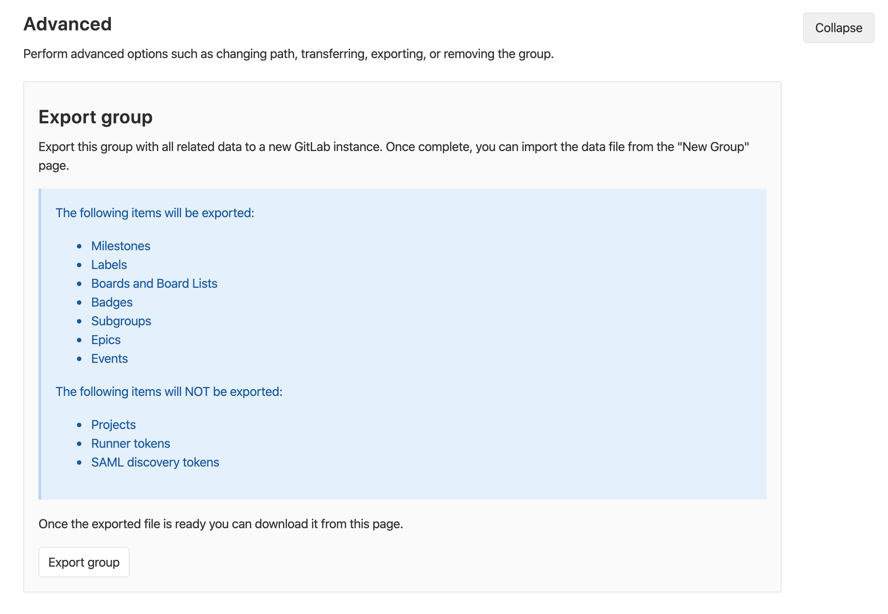
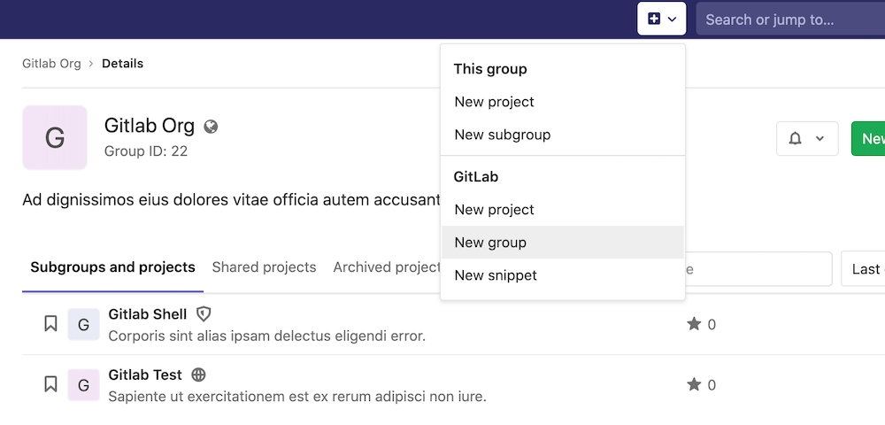

# Group Import/Export

> - [Introduced](https://gitlab.com/groups/gitlab-org/-/epics/2888) in GitLab 13.0 as an experimental feature. May change in future releases.

Existing groups running on any GitLab instance or GitLab.com can be exported with all their related data and moved to a
new GitLab instance.

The **GitLab import/export** button is displayed if the group import option in enabled.

See also:

- [Group Import/Export API](../../../api/group_import_export.md)
- [Project Import/Export](../../project/settings/import_export.md)
- [Project Import/Export API](../../../api/project_import_export.md)

To enable GitLab import/export:

1. Navigate to **Admin Area > Settings > Visibility and access controls**.
1. Scroll to **Import sources**
1. Enable desired **Import sources**

## Important Notes

Note the following:

- Exports are stored in a temporary [shared directory](../../../development/shared_files.md) and are deleted every 24 hours by a specific worker.
- To preserve group-level relationships from imported projects, run the Group Import/Export first, to allow projects to
be imported into the desired group structure.
- Imported groups are given a `private` visibility level, unless imported into a parent group.
- If imported into a parent group, a subgroup inherits the same level of visibility unless otherwise restricted.
- To preserve the member list and their respective permissions on imported groups, review the users in these groups. Make
sure these users exist before importing the desired groups.

### Exported Contents

The following items are exported:

- Milestones
- Labels
- Boards and Board Lists
- Badges
- Subgroups (including all the aforementioned data)
- Epics
- Events

The following items are **not** exported:

- Projects
- Runner tokens
- SAML discovery tokens

NOTE:
For more details on the specific data persisted in a group export, see the
[`import_export.yml`](https://gitlab.com/gitlab-org/gitlab/blob/master/lib/gitlab/import_export/group/import_export.yml) file.

## Exporting a Group

1. Navigate to your group's homepage.

1. Click **Settings** in the sidebar.

1. In the **Advanced** section, click the **Export Group** button.

   

1. Once the export is generated, you should receive an e-mail with a link to the [exported contents](#exported-contents)
   in a compressed tar archive, with contents in JSON format.

1. Alternatively, you can come back to the project settings and download the
   file from there by clicking **Download export**, or generate a new file by clicking **Regenerate export**.

NOTE:
The maximum import file size can be set by the Administrator, default is 50MB.
As an administrator, you can modify the maximum import file size. To do so, use the `max_import_size` option in the [Application settings API](../../../api/settings.md#change-application-settings) or the [Admin UI](../../admin_area/settings/account_and_limit_settings.md).

### Between CE and EE

You can export groups from the [Community Edition to the Enterprise Edition](https://about.gitlab.com/install/ce-or-ee/) and vice versa.

The Enterprise Edition retains some group data that isn't part of the Community Edition. If you're exporting a group from the Enterprise Edition to the Community Edition, you may lose this data. For more information, see [downgrading from EE to CE](../../../README.md).

## Importing the group

1. Navigate to the New Group page, either via the `+` button in the top navigation bar, or the **New subgroup** button
on an existing group's page.

   

1. On the New Group page, select the **Import group** tab.

   

1. Enter your group name.

1. Accept or modify the associated group URL.

1. Click **Choose file**

1. Select the file that you exported in the [exporting a group](#exporting-a-group) section.

1. Click **Import group** to begin importing. Your newly imported group page appears after the operation completes.

## Version history

GitLab can import bundles that were exported from a different GitLab deployment.
This ability is limited to two previous GitLab [minor](../../../policy/maintenance.md#versioning)
releases, which is similar to our process for [Security Releases](../../../policy/maintenance.md#security-releases).

For example:

| Current version | Can import bundles exported from |
|-----------------|----------------------------------|
| 13.0            | 13.0, 12.10, 12.9                |
| 13.1            | 13.1, 13.0, 12.10                |

## Rate Limits

To help avoid abuse, users are rate limited to:

| Request Type     | Limit                                    |
| ---------------- | ---------------------------------------- |
| Export           | 30 groups every 5 minutes                |
| Download export  | 10 downloads per group every 10 minutes  |
| Import           | 30 groups every 5 minutes                |
