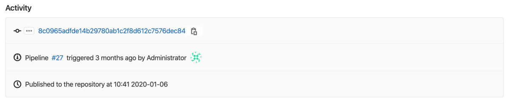

# Infrastructure Registry **(FREE)**

> - [Introduced](https://gitlab.com/groups/gitlab-org/-/epics/3221) in GitLab 13.11.

With the GitLab Infrastructure Registry, you can use GitLab as a private
registry for infrastructure packages. You can create and publish packages from
GitLab CI/CD, which can then be consumed from other private projects.

## View packages

You can view packages for your project or group.

1. Go to the project or group.
1. Go to **Packages & Registries > Infrastructure Registry**.

You can search, sort, and filter packages on this page. You can share your
search results by copying and pasting the URL from your browser.

When you view packages in a group:

- All projects published to the group and its projects are displayed.
- Only the projects you can access are displayed.
- If a project is private, or you are not a member of the project, it is not displayed.

For information on how to create and upload a package, view the GitLab
documentation for your package type.

## Use GitLab CI/CD to build packages

You can use [GitLab CI/CD](../../../ci/README.md) to build packages. And you can
authenticate with GitLab by using the `CI_JOB_TOKEN`.

CI/CD templates, which you can use to get started, are in [this repository](https://gitlab.com/gitlab-org/gitlab/-/tree/master/lib/gitlab/ci/templates).

Learn more about using CI/CD to build:

- [Terraform Modules](../terraform_module_registry/index.md#publish-a-terraform-module-by-using-cicd)

If you use CI/CD to build a package, extended activity information is displayed
when you view the package details:

You can view which pipeline published the package, and the commit and user who triggered it. However, the history is limited to five updates of a given package.

## Download a package

To download a package:

1. Go to **Packages & Registries > Infrastructure Registry**.
1. Select the name of the package you want to download.
1. In the **Activity** section, select the name of the package you want to download.

## Delete a package

You cannot edit a package after you publish it in the Infrastructure Registry. Instead, you
must delete and recreate it.

To delete a package, you must have suitable [permissions](../../permissions.md).

You can delete packages by using [the API](../../../api/packages.md#delete-a-project-package) or the UI.

To delete a package in the UI, from your group or project:

1. Go to **Packages & Registries > Infrastructure Registry**.
1. Find the name of the package you want to delete.
1. Click **Delete**.

The package is permanently deleted.

## Disable the Infrastructure Registry

The Infrastructure Registry is automatically enabled.

If you are using a self-managed instance of GitLab, your administrator can remove
the menu item, **Packages & Registries**, from the GitLab sidebar. For more information,
see the [administration documentation](../../../administration/packages/index.md).

You can also remove the Infrastructure Registry for your project specifically:

1. In your project, go to **Settings > General**.
1. Expand the **Visibility, project features, permissions** section and disable the
   **Packages** feature.
1. Click **Save changes**.

The **Packages & Registries > Infrastructure Registry** entry is removed from the sidebar.
