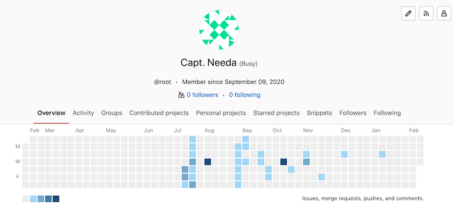
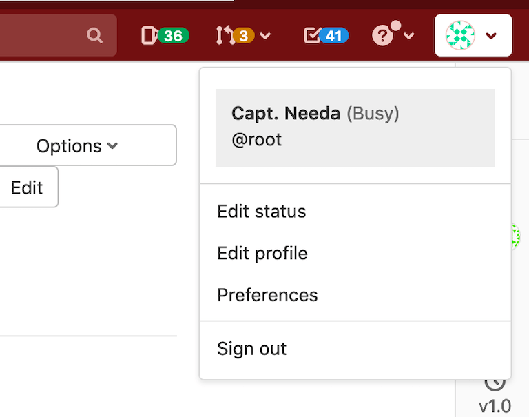
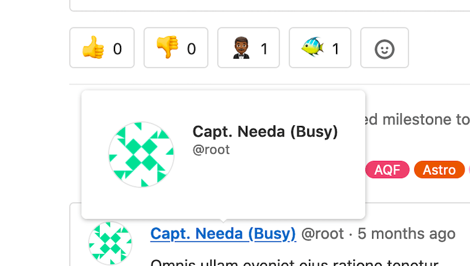
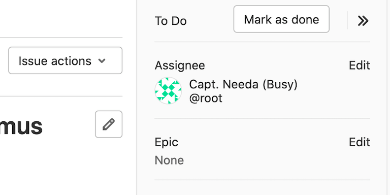
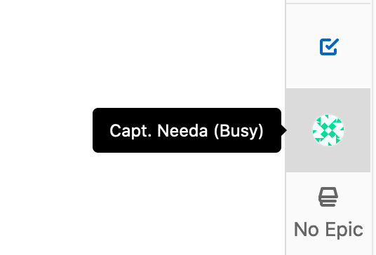
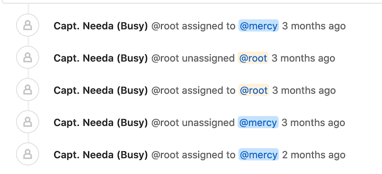

# User account

Each GitLab account has a user profile, and settings. Your [profile](#user-profile)
contains information about you, and your GitLab activity. Your [settings](#user-settings)
allow you to customize some aspects of GitLab to suit yourself.

## Creating users

There are several ways to create users on GitLab. See the [creating users documentation](account/create_accounts.md) for more details.

## Signing in

There are several ways to sign into your GitLab account.
See the [authentication topic](../../topics/authentication/index.md) for more details.

### Unknown sign-in

GitLab notifies you if a sign-in occurs that is from an unknown IP address or device.
See [Unknown Sign-In Notification](unknown_sign_in_notification.md) for more details.

## User profile

To access your profile:

1. In the top-right corner, select your avatar.
1. Select your name or username.

On your profile page, you can see the following information:

- Personal information
- Activity stream: see your activity streamline and the history of your contributions
- Groups: [groups](../group/index.md) you're a member of
- Contributed projects: [projects](../project/index.md) you contributed to
- Personal projects: your personal projects (respecting the project's visibility level)
- Starred projects: projects you starred
- Snippets: your personal code [snippets](../snippets.md#personal-snippets)
- Followers: people [following](../index.md#user-activity) you
- Following: people you are [following](../index.md#user-activity)

Profile page with active Following view:


## User settings

To access your user settings:

1. In the top-right corner, select your avatar.
1. Select **Edit profile**.

From there, you can:

- Update your personal information, including:
  - Full name
  - Primary email, public email, and commit email
  - Social media handles
  - Website URL
  - Location
  - Job title
  - Bio
- Change your [password](#changing-your-password)
- Set a [custom status](#current-status) for your profile
- Manage your [commit email](#commit-email) for your profile
- Manage [2FA](account/two_factor_authentication.md)
- Add details of [external accounts](#add-details-of-external-accounts).
- Change your username and [delete your account](account/delete_account.md)
- Manage applications that can
  [use GitLab as an OAuth provider](../../integration/oauth_provider.md#introduction-to-oauth)
- Manage [personal access tokens](personal_access_tokens.md) to access your account via API and authorized applications
- Add and delete emails linked to your account
- Choose which email to use for [notifications](notifications.md), web-based commits, and display on your public profile
- Manage [SSH keys](../../ssh/README.md) to access your account via SSH
- Manage your [preferences](preferences.md#syntax-highlighting-theme)
  to customize your own GitLab experience
- [View your active sessions](active_sessions.md) and revoke any of them if necessary
- Access your audit events, a security log of important events involving your account

## Changing your password

1. Go to your [user settings](#user-settings).
1. In the left sidebar, select **Password**.
1. Enter your current password in the **Current password** field.
1. Enter your desired new password twice, once in the **New password** field and
   once in the **Password confirmation** field.
1. Select **Save password**.

If you don't know your current password, select the 'I forgot my password' link.


## Changing your username

Your `username` is a unique [`namespace`](../group/index.md#namespaces)
related to your user ID. Changing it can have unintended side effects, read
[how redirects behave](../project/repository/index.md#redirects-when-changing-repository-paths)
before proceeding.

To change your `username`:

1. Navigate to your [user settings](#user-settings).
1. In the left sidebar, select **Account**.
1. Enter a new username under **Change username**.
1. Select **Update username**.

WARNING:
It is not possible to change your username if it contains a
project with [Container Registry](../packages/container_registry/index.md) tags,
because the project cannot be moved.

NOTE:
If you want to retain ownership over the original namespace and
protect the URL redirects, then instead of changing a group's path or renaming a
username, you can create a new group and transfer projects to it.
Alternatively, you can follow [this detailed procedure from the GitLab Team Handbook](https://about.gitlab.com/handbook/tools-and-tips/#how-to-change-your-username-at-gitlabcom)
which also covers the case where you have projects hosted with
[GitLab Pages](../project/pages/index.md).

## Private profile

The following information is hidden from the user profile page (`https://gitlab.example.com/username`) if this feature is enabled:

- Atom feed
- Date when account is created
- Activity tab
- Groups tab
- Contributed projects tab
- Personal projects tab
- Starred projects tab
- Snippets tab

To make your profile private:

1. In the top-right corner, select your avatar.
1. Select **Edit profile**.
1. Select the **Private profile** checkbox.
1. Select **Update profile settings**.

NOTE:
All your profile information can be seen by yourself and GitLab administrators even if
the **Private profile** option is enabled.

## Add details of external accounts

You can add links to certain other external accounts you might have, like Skype and Twitter.
They can help other users connect with you on other platforms.

To add links to other accounts:

1. In the top-right corner, select your avatar.
1. Select **Edit profile**.
1. Edit the desired fields for external accounts:
   - Skype
   - LinkedIn
   - Twitter
1. Select **Update profile settings**.

## Private contributions

> [Introduced](https://gitlab.com/gitlab-org/gitlab-foss/-/issues/14078) in GitLab 11.3.

Enabling private contributions includes contributions to private projects, in the user contribution calendar graph and user recent activity.

To enable private contributions:

1. In the top-right corner, select your avatar.
1. Select **Edit profile**.
1. Select the **Private contributions** checkbox.
1. Select **Update profile settings**.

## Current status

> Introduced in GitLab 11.2.

You can provide a custom status message for your user profile along with an emoji that describes it.
This may be helpful when you are out of office or otherwise not available.
Other users can then take your status into consideration when responding to your issues or assigning work to you.
Please be aware that your status is publicly visible even if your [profile is private](#private-profile).

Status messages are restricted to 100 characters of plain text.
They may however contain emoji codes such as `I'm on vacation :palm_tree:`.

To set your current status:

1. In the top-right corner, select your avatar.
1. Select **Set status**, or **Edit status** if you have already set a status.
1. Set the desired emoji and status message.
1. Select **Set status**. Alternatively, you can select **Remove status** to remove your user status entirely.

or

1. In the top-right corner, select your avatar.
1. Select your name or username.
1. Select the Edit profile icon (**{pencil}**).
1. Enter your status message in the **Your status** text field.
1. Select Add status emoji icon (**{slight-smile}**), and select the desired emoji.
1. Select **Update profile settings**.

You can also set your current status [using the API](../../api/users.md#user-status).

If you previously selected the **Busy** checkbox, remember to deselect it when you become available again.

## Busy status indicator

> - [Introduced](https://gitlab.com/gitlab-org/gitlab/-/issues/259649) in GitLab 13.6.
> - It was [deployed behind a feature flag](../feature_flags.md), disabled by default.
> - [Became enabled by default](https://gitlab.com/gitlab-org/gitlab/-/issues/281073) in GitLab 13.8.
> - It's enabled on GitLab.com.
> - It's not recommended for production use.
> - For GitLab self-managed instances, GitLab administrators can opt to [disable it](#disable-busy-status-feature).

To indicate to others that you are busy, you can set an indicator.


To set the busy status indicator, either:

- Set it directly:

  1. In the top-right corner, select your avatar.
  1. Select **Set status**, or **Edit status** if you have already set a status.
  1. Select the **Busy** checkbox.

- Set it on your profile:

  1. In the top-right corner, select your avatar.
  1. Select **Edit profile**.
  1. Select the **Busy** checkbox.

  Once selected, you can see the busy status in various locations in the user interface.

  Username:

  | Profile page | Settings menu | User popovers |
  | --- | --- | --- |
  |  |  |  |

  Issue and merge request sidebar:

  | Sidebar| Collapsed sidebar |
  | --- | --- |
  |  |  |

  Notes:

  | Notes | Note headers |
  | --- | --- |
  |  |  |

### Disable busy status feature

The busy status feature is deployed behind a feature flag and is **enabled by default**.
[GitLab administrators with access to the GitLab Rails console](../../administration/feature_flags.md) can disable it for your instance from the [rails console](../../administration/feature_flags.md#start-the-gitlab-rails-console).

To disable it:

```ruby
Feature.disable(:set_user_availability_status)
```

To enable it:

```ruby
Feature.enable(:set_user_availability_status)
```

## Commit email

> [Introduced](https://gitlab.com/gitlab-org/gitlab-foss/-/merge_requests/21598) in GitLab 11.4.

A commit email is an email address displayed in every Git-related action carried out through the GitLab interface.

Any of your own verified email addresses can be used as the commit email.

To change your commit email:

1. In the top-right corner, select your avatar.
1. Select **Edit profile**.
1. Select the **Commit email** dropdown.
1. Select any of the verified emails.
1. Select **Update profile settings**.

### Private commit email

> [Introduced](https://gitlab.com/gitlab-org/gitlab-foss/-/merge_requests/22560) in GitLab 11.5.

GitLab provides the user with an automatically generated private commit email option,
which allows the user to keep their email information private.

To enable this option:

1. In the top-right corner, select your avatar.
1. Select **Edit profile**.
1. Select the **Commit email** dropdown.
1. Select **Use a private email** option.
1. Select **Update profile settings**.

After this option is enabled, every Git-related action is performed using the private commit email.

To stay fully anonymous, you can also copy this private commit email
and configure it on your local machine using the following command:

```shell
git config --global user.email <your email address>
```

## Troubleshooting

### Why do I keep getting signed out?

When signing in to the main GitLab application, a `_gitlab_session` cookie is
set. `_gitlab_session` is cleared client-side when you close your browser
and expires after "Application settings -> Session duration (minutes)"/`session_expire_delay`
(defaults to `10080` minutes = 7 days) of no activity.

When signing in to the main GitLab application, you can also check the
**Remember me** option which sets the `remember_user_token`
cookie (via [`devise`](https://github.com/heartcombo/devise)).
`remember_user_token` expires after
`config/initializers/devise.rb` -> `config.remember_for` (defaults to 2 weeks).

When the `_gitlab_session` expires or isn't available, GitLab uses the `remember_user_token`
to get you a new `_gitlab_session` and keep you signed in through browser restarts.

After your `remember_user_token` expires and your `_gitlab_session` is cleared/expired,
you are asked to sign in again to verify your identity for security reasons.

NOTE:
When any session is signed out, or when a session is revoked
via [Active Sessions](active_sessions.md), all **Remember me** tokens are revoked.
While other sessions remain active, the **Remember me** feature doesn't restore
a session if the browser is closed or the existing session expires.

### Increased sign-in time

> [Introduced](https://gitlab.com/gitlab-org/gitlab/-/issues/20340) in GitLab 13.1.

The `remember_user_token` lifetime of a cookie can now extend beyond the deadline set by `config.remember_for`, as the `config.extend_remember_period` flag is now set to true.

GitLab uses both session and persistent cookies:

- Session cookie: Session cookies are normally removed at the end of the browser session when
  the browser is closed. The `_gitlab_session` cookie has no fixed expiration date. However,
  it expires based on its [`session_expire_delay`](#why-do-i-keep-getting-signed-out).
- Persistent cookie: The `remember_user_token` is a cookie with an expiration date of two weeks.
  GitLab activates this cookie if you select **Remember Me** when you sign in.

By default, the server sets a time-to-live (TTL) of 1-week on any session that is used.

When you close a browser, the session cookie may still remain. For example, Chrome has the "Continue where you left off" option that restores session cookies.
In other words, as long as you access GitLab at least once every 2 weeks, you could remain signed in with GitLab, as long as your browser tab is open.
The server continues to reset the TTL for that session, independent of whether 2FA is installed,
If you close your browser and open it up again, the `remember_user_token` cookie allows your user to reauthenticate itself.

Without the `config.extend_remember_period` flag, you would be forced to sign in again after two weeks.
