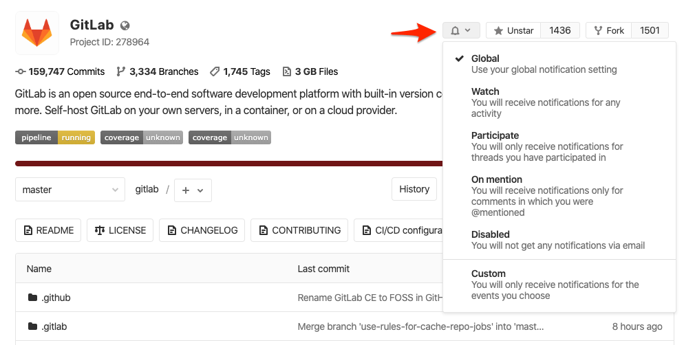
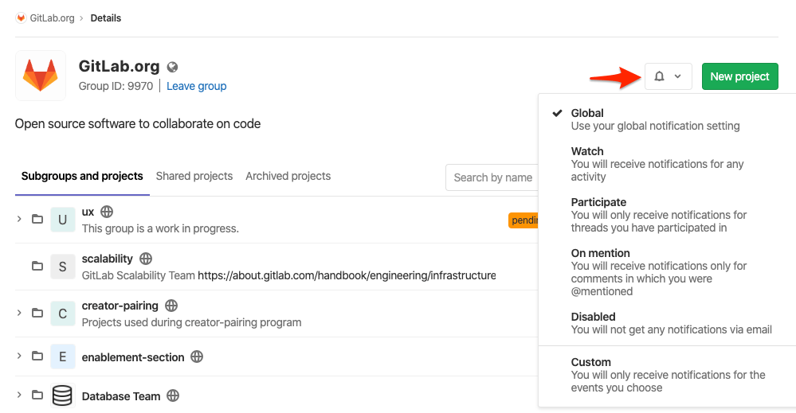

# GitLab Notification Emails

GitLab Notifications allow you to stay informed about what's happening in GitLab. With notifications enabled, you can receive updates about activity in issues, merge requests, and epics. Notifications are sent via email.

## Receiving notifications

You will receive notifications for one of the following reasons:

- You participate in an issue, merge request, or epic. In this context, _participate_ means comment, or edit.
- You enable notifications in an issue, merge request, or epic. To enable notifications, click the **Notifications** toggle in the sidebar to _on_.

While notifications are enabled, you will receive notification of actions occurring in that issue, merge request, or epic.

NOTE:
Notifications can be blocked by an admin, preventing them from being sent.

## Tuning your notifications

The quantity of notifications can be overwhelming. GitLab allows you to tune the notifications you receive. For example, you may want to be notified about all activity in a specific project, but for others, only be notified when you are mentioned by name.

You can tune the notifications you receive by combining your notification settings:

- [Global notification settings](#global-notification-settings)
- [Notification scope](#notification-scope)
- [Notification levels](#notification-levels)

### Editing notification settings

To edit your notification settings:

1. Click on your profile picture and select **Settings**.
1. Click **Notifications** in the left sidebar.
1. Edit the desired notification settings. Edited settings are automatically saved and enabled.

These notification settings apply only to you. They do not affect the notifications received by anyone else in the same project or group.

## Global notification settings

Your **Global notification settings** are the default settings unless you select different values for a project or a group.

- Notification email
  - This is the email address your notifications will be sent to.
- Global notification level
  - This is the default [notification level](#notification-levels) which applies to all your notifications.
- Receive notifications about your own activity.
  - Check this checkbox if you want to receive notification about your own activity. Default: Not checked.

### Notification scope

You can tune the scope of your notifications by selecting different notification levels for each project and group.

Notification scope is applied in order of precedence (highest to lowest):

- Project
  - For each project, you can select a notification level. Your project setting overrides the group setting.
- Group
  - For each group, you can select a notification level. Your group setting overrides your default setting.
- Global (default)
  - Your global, or _default_, notification level applies if you have not selected a notification level for the project or group in which the activity occurred.

#### Project notifications

You can select a notification level for each project. This can be useful if you need to closely monitor activity in select projects.

To select a notification level for a project, use either of these methods:

1. Click on your profile picture and select **Settings**.
1. Click **Notifications** in the left sidebar.
1. Locate the project in the **Projects** section.
1. Select the desired [notification level](#notification-levels).

Or:

1. Navigate to the project's page.
1. Click the notification dropdown, marked with a bell icon.
1. Select the desired [notification level](#notification-levels).

<i class="fa fa-youtube-play youtube" aria-hidden="true"></i>
For a demonstration of how to be notified when a new release is available, see [Notification for releases](https://www.youtube.com/watch?v=qyeNkGgqmH4).

#### Group notifications

You can select a notification level and email address for each group.

##### Group notification level

To select a notification level for a group, use either of these methods:

1. Click on your profile picture and select **Settings**.
1. Click **Notifications** in the left sidebar.
1. Locate the project in the **Groups** section.
1. Select the desired [notification level](#notification-levels).

---

1. Navigate to the group's page.
1. Click the notification dropdown, marked with a bell icon.
1. Select the desired [notification level](#notification-levels).

##### Group notification email address

> Introduced in GitLab 12.0

You can select an email address to receive notifications for each group you belong to. This could be useful, for example, if you work freelance, and want to keep email about clients' projects separate.

1. Click on your profile picture and select **Settings**.
1. Click **Notifications** in the left sidebar.
1. Locate the project in the **Groups** section.
1. Select the desired email address.

### Notification levels

For each project and group you can select one of the following levels:

| Level       | Description |
|:------------|:------------|
| Global      | Your global settings apply. |
| Watch       | Receive notifications for any activity. |
| On mention  | Receive notifications when `@mentioned` in comments. |
| Participate | Receive notifications for threads you have participated in. |
| Disabled    | Turns off notifications. |
| Custom      | Receive notifications for custom selected events. |

## Notification events

Users will be notified of the following events:

| Event                        | Sent to             | Settings level               |
|------------------------------|---------------------|------------------------------|
| New SSH key added            | User                | Security email, always sent. |
| New email added              | User                | Security email, always sent. |
| Email changed                | User                | Security email, always sent. |
| Password changed             | User                | Security email, always sent when user changes their own password |
| Password changed by administrator | User | Security email, always sent when an administrator changes the password of another user |
| Two-factor authentication disabled | User          | Security email, always sent. |
| New user created             | User                | Sent on user creation, except for OmniAuth (LDAP)|
| User added to project        | User                | Sent when user is added to project |
| Project access level changed | User                | Sent when user project access level is changed |
| User added to group          | User                | Sent when user is added to group |
| Group access level changed   | User                | Sent when user group access level is changed |
| Project moved                | Project members (1) | (1) not disabled             |
| New release                  | Project members     | Custom notification          |

## Issue / Epics / Merge request events

In most of the below cases, the notification will be sent to:

- Participants:
  - the author and assignee of the issue/merge request
  - authors of comments on the issue/merge request
  - anyone mentioned by `@username` in the title or description of the issue, merge request or epic **(ULTIMATE)**
  - anyone with notification level "Participating" or higher that is mentioned by `@username` in any of the comments on the issue, merge request, or epic **(ULTIMATE)**
- Watchers: users with notification level "Watch"
- Subscribers: anyone who manually subscribed to the issue, merge request, or epic **(ULTIMATE)**
- Custom: Users with notification level "custom" who turned on notifications for any of the events present in the table below

NOTE:
To minimize the number of notifications that do not require any action, from [GitLab 12.9 onwards](https://gitlab.com/gitlab-org/gitlab/-/issues/616), eligible approvers are no longer notified for all the activities in their projects. To receive them they have to change their user notification settings to **Watch** instead.

| Event                  | Sent to |
|------------------------|---------|
| New issue              |         |
| Close issue            |         |
| Reassign issue         | The above, plus the old assignee |
| Reopen issue           |         |
| Due issue              | Participants and Custom notification level with this event selected |
| Change milestone issue | Subscribers, participants mentioned, and Custom notification level with this event selected |
| Remove milestone issue | Subscribers, participants mentioned, and Custom notification level with this event selected |
| New merge request      |         |
| Push to merge request  | Participants and Custom notification level with this event selected |
| Reassign merge request | The above, plus the old assignee |
| Close merge request    |         |
| Reopen merge request   |         |
| Merge merge request    |         |
| Merge when pipeline succeeds ([Introduced](https://gitlab.com/gitlab-org/gitlab/-/issues/211961) in GitLab 13.4) |     |
| Change milestone merge request | Subscribers, participants mentioned, and Custom notification level with this event selected |
| Remove milestone merge request | Subscribers, participants mentioned, and Custom notification level with this event selected |
| New comment            | The above, plus anyone mentioned by `@username` in the comment, with notification level "Mention" or higher |
| Failed pipeline        | The author of the pipeline |
| Fixed pipeline    | The author of the pipeline. Enabled by default. [Introduced](https://gitlab.com/gitlab-org/gitlab/-/issues/24309) in GitLab 13.1. |
| Successful pipeline    | The author of the pipeline, if they have the custom notification setting for successful pipelines set. If the pipeline failed previously, a `Fixed pipeline` message will be sent for the first successful pipeline after the failure, then a `Successful pipeline` message for any further successful pipelines. |
| New epic **(ULTIMATE)** |        |
| Close epic **(ULTIMATE)** |      |
| Reopen epic **(ULTIMATE)** |     |

In addition, if the title or description of an Issue or Merge Request is
changed, notifications will be sent to any **new** mentions by `@username` as
if they had been mentioned in the original text.

You won't receive notifications for Issues, Merge Requests or Milestones created
by yourself (except when an issue is due). You will only receive automatic
notifications when somebody else comments or adds changes to the ones that
you've created or mentions you.

If an open merge request becomes unmergeable due to conflict, its author will be notified about the cause.
If a user has also set the merge request to automatically merge once pipeline succeeds,
then that user will also be notified.

## Filtering email

Notification email messages include GitLab-specific headers. You can filter the notification emails based on the content of these headers to better manage your notifications. For example, you could filter all emails for a specific project where you are being assigned either a merge request or issue.

The following table lists all GitLab-specific email headers:

| Header                      | Description                                                             |
|------------------------------------|-------------------------------------------------------------------------|
| `X-GitLab-Group-Id` **(PREMIUM)**    | The group's ID. Only present on notification emails for epics.         |
| `X-GitLab-Group-Path` **(PREMIUM)**  | The group's path. Only present on notification emails for epics.       |
| `X-GitLab-Project`                   | The name of the project the notification belongs to.                     |
| `X-GitLab-Project-Id`                | The project's ID.                                                   |
| `X-GitLab-Project-Path`              | The project's path.                                                 |
| `X-GitLab-(Resource)-ID`             | The ID of the resource the notification is for. The resource, for example, can be `Issue`, `MergeRequest`, `Commit`, or another such resource. |
| `X-GitLab-Discussion-ID`             | The ID of the thread the comment belongs to, in notification emails for comments.    |
| `X-GitLab-Pipeline-Id`               | The ID of the pipeline the notification is for, in notification emails for pipelines. |
| `X-GitLab-Reply-Key`                 | A unique token to support reply by email.                                |
| `X-GitLab-NotificationReason`        | The reason for the notification. This can be `mentioned`, `assigned`, or `own_activity`. |
| `List-Id`                            | The path of the project in an RFC 2919 mailing list identifier. This is useful for email organization with filters, for example. |

### X-GitLab-NotificationReason

The `X-GitLab-NotificationReason` header contains the reason for the notification. The value is one of the following, in order of priority:

- `own_activity`
- `assigned`
- `mentioned`

The reason for the notification is also included in the footer of the notification email. For example an email with the
reason `assigned` will have this sentence in the footer:

- `You are receiving this email because you have been assigned an item on <configured GitLab hostname>.`

NOTE:
Notification of other events is being considered for inclusion in the `X-GitLab-NotificationReason` header. For details, see this [related issue](https://gitlab.com/gitlab-org/gitlab/-/issues/20689).
