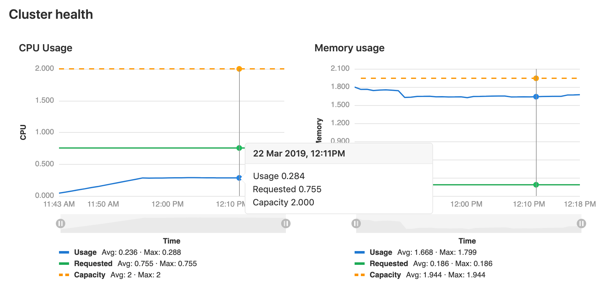

# Infrastructure management

> - Kubernetes clusters were [introduced](https://gitlab.com/gitlab-org/gitlab-foss/-/issues/35954) in GitLab 10.1 for projects.
> - Kubernetes clusters for [groups](../../group/clusters/index.md) were [introduced](https://gitlab.com/gitlab-org/gitlab-foss/-/issues/34758) in GitLab 11.6.
> - Kubernetes clusters for [instances](../../instance/clusters/index.md) were [introduced](https://gitlab.com/gitlab-org/gitlab-foss/-/issues/39840) in GitLab 11.11.

GitLab supports infrastructure management tasks for generic infrastructure using its Terraform integrations, and for Kubernetes using its extensive integration options.

## Generic infrastructure management **(FREE)**

Using [GitLab for Terraform integrations](../../infrastructure) you can:

- Coordinate infrastructure changes using the [Terraform merge request widget](../../infrastructure/mr_integration.md).
- Ignore the state file management aspects of Terraform using the [GitLab Managed Terraform states](../../infrastructure/terraform_state.md).

## Kubernetes integrations

The recommended way to connect a Kubernetes cluster with GitLab is using the GitLab Kubernetes Agent. Traditionally, integrating GitLab with Kubernetes was enabled by connecting a cluster to GitLab using cluster certificates and opening the Kube API to be accessible by GitLab. The GitLab Kubernetes Agent is our new direction to enable experienced Kubernetes users as well to leverage our Kubernetes integration features.

As we roll out support for more features under the GitLab Kubernetes Agent, there is a disparitiy of features supported between these two approaches.

The following table summarizes the supported GitLab features with the integration methods.

Feature | GitLab Kubernetes Agent **(PREMIUM)** | Certificate-based connection **(FREE)**
--------|-------------------------|------------------------------
Auto DevOps | Partial [support planned](https://gitlab.com/groups/gitlab-org/-/epics/5528) | [Supported](#auto-devops)
Pull based deployments | [Supported](../../clusters/agent/) | Not supported
Network security alerts | [Supported](../../clusters/agent/#kubernetes-network-security-alerts) | Not supported
Review apps | [Planned](https://gitlab.com/gitlab-org/gitlab/-/issues/273656) | [Supported](../../../ci/review_apps/index.md)
Push based deployments | [Planned](https://gitlab.com/groups/gitlab-org/-/epics/5528) | [Supported](../../../ci/pipelines/index.md)
Group level clusters | [Planned](https://gitlab.com/groups/gitlab-org/-/epics/5784) | [Supported](../../group/clusters/index.md)
Instance level clusters | Not planned | [Supported](../../instance/clusters/index.md)
GitLab integrated applications | [Planned](https://gitlab.com/groups/gitlab-org/-/epics/5528) | [Supported](#installing-applications)
Kubernetes monitoring | Not supported | [Supported](#monitoring-your-kubernetes-cluster)
Log explorer | Not supported | [Supported](#viewing-pod-logs)
Web terminals | [Planned](https://gitlab.com/groups/gitlab-org/-/epics/6097) | [Supported](#web-terminals)
Deploy boards | Partial [support planned](https://gitlab.com/groups/gitlab-org/-/epics/5528) | [Supported](#deploy-boards)
Canary Deployments **(PREMIUM)** | [Planned](https://gitlab.com/groups/gitlab-org/-/epics/5528) | [Supported](#canary-deployments)
[Deployment variables](#deployment-variables) | [Planned](https://gitlab.com/gitlab-org/gitlab/-/issues/324275) | Supported
Role or attribute based access controls | Supported | [Supported](add_remove_clusters.md#access-controls)

To administer your project or group level connected Kubernetes clusters, navigate to **Operations > Kubernetes**. 
On this page, you can [add a new cluster](#adding-and-removing-clusters) and view information about your existing clusters, such as:

- Nodes count.
- Rough estimates of memory and CPU usage.

### Supported cluster versions

GitLab is committed to support at least two production-ready Kubernetes minor
versions at any given time. We regularly review the versions we support, and
provide a three-month deprecation period before we remove support of a specific
version. The range of supported versions is based on the evaluation of:

- The versions supported by major managed Kubernetes providers.
- The versions [supported by the Kubernetes community](https://kubernetes.io/docs/setup/release/version-skew-policy/#supported-versions).

GitLab supports the following Kubernetes versions, and you can upgrade your
Kubernetes version to any supported version at any time:

- 1.19 (support ends on February 22, 2022)
- 1.18 (support ends on November 22, 2021)
- 1.17 (support ends on September 22, 2021)
- 1.16 (support ends on July 22, 2021)
- 1.15 (support ends on May 22, 2021)

Some GitLab features may support versions outside the range provided here.

NOTE:
[GKE Cluster creation](add_remove_clusters.md#create-new-cluster) by GitLab is currently not supported for Kubernetes 1.19+. For these versions you can create the cluster through GCP, then [Add existing cluster](add_remove_clusters.md#add-existing-cluster). See [the related issue](https://gitlab.com/gitlab-org/gitlab/-/issues/331922) for more information.

### Adding and removing clusters

The recommended way to connect a Kubernetes cluster with GitLab is using the [GitLab Kubernetes Agent](../../clusters/agent/).

For connecting to a cluster with certificates, see [Adding and removing Kubernetes clusters](add_remove_clusters.md) on how
to:

- Add an integration to an existing cluster from any Kubernetes platform.
- Create a cluster in Google Cloud Platform (GCP) or Amazon Elastic Kubernetes Service
  (EKS) using the GitLab UI.

### Installing applications

Attach a [Cluster management project](../../clusters/management_project.md)
to your cluster to manage shared resources requiring `cluster-admin` privileges for
installation, such as an Ingress controller.

### Auto DevOps

Auto DevOps automatically detects, builds, tests, deploys, and monitors your
applications.

To make full use of Auto DevOps (Auto Deploy, Auto Review Apps, and
Auto Monitoring) the Kubernetes project integration must be enabled. However,
Kubernetes clusters can be used without Auto DevOps.

[Read more about Auto DevOps](../../../topics/autodevops/index.md).

### Deploying to a Kubernetes cluster

A Kubernetes cluster can be the destination for a deployment job. If

- The cluster is integrated with GitLab, special
  [deployment variables](#deployment-variables) are made available to your job
  and configuration is not required. You can immediately begin interacting with
  the cluster from your jobs using tools such as `kubectl` or `helm`.
- You don't use the GitLab cluster integration, you can still deploy to your
  cluster. However, you must configure Kubernetes tools yourself
  using [CI/CD variables](../../../ci/variables/README.md#custom-cicd-variables)
  before you can interact with the cluster from your jobs.

#### Deployment variables

Deployment variables require a valid [Deploy Token](../deploy_tokens/index.md) named
[`gitlab-deploy-token`](../deploy_tokens/index.md#gitlab-deploy-token), and the
following command in your deployment job script, for Kubernetes to access the registry:

- Using Kubernetes 1.18+:

  ```shell
  kubectl create secret docker-registry gitlab-registry --docker-server="$CI_REGISTRY" --docker-username="$CI_DEPLOY_USER" --docker-password="$CI_DEPLOY_PASSWORD" --docker-email="$GITLAB_USER_EMAIL" -o yaml --dry-run=client | kubectl apply -f -
  ```

- Using Kubernetes <1.18:

  ```shell
  kubectl create secret docker-registry gitlab-registry --docker-server="$CI_REGISTRY" --docker-username="$CI_DEPLOY_USER" --docker-password="$CI_DEPLOY_PASSWORD" --docker-email="$GITLAB_USER_EMAIL" -o yaml --dry-run | kubectl apply -f -
  ```

The Kubernetes cluster integration exposes these
[deployment variables](../../../ci/variables/README.md#deployment-variables) in the
GitLab CI/CD build environment to deployment jobs. Deployment jobs have
[defined a target environment](../../../ci/environments/index.md).

| Deployment Variable        | Description |
|----------------------------|-------------|
| `KUBE_URL`                 | Equal to the API URL. |
| `KUBE_TOKEN`               | The Kubernetes token of the [environment service account](add_remove_clusters.md#access-controls). Prior to GitLab 11.5, `KUBE_TOKEN` was the Kubernetes token of the main service account of the cluster integration. |
| `KUBE_NAMESPACE`           | The namespace associated with the project's deployment service account. In the format `<project_name>-<project_id>-<environment>`. For GitLab-managed clusters, a matching namespace is automatically created by GitLab in the cluster. If your cluster was created before GitLab 12.2, the default `KUBE_NAMESPACE` is set to `<project_name>-<project_id>`. |
| `KUBE_CA_PEM_FILE`         | Path to a file containing PEM data. Only present if a custom CA bundle was specified. |
| `KUBE_CA_PEM`              | (**deprecated**) Raw PEM data. Only if a custom CA bundle was specified. |
| `KUBECONFIG`               | Path to a file containing `kubeconfig` for this deployment. CA bundle would be embedded if specified. This configuration also embeds the same token defined in `KUBE_TOKEN` so you likely need only this variable. This variable name is also automatically picked up by `kubectl` so you don't need to reference it explicitly if using `kubectl`. |
| `KUBE_INGRESS_BASE_DOMAIN` | From GitLab 11.8, this variable can be used to set a domain per cluster. See [cluster domains](add_remove_clusters.md#base-domain) for more information. |

### Custom namespace

> - [Introduced](https://gitlab.com/gitlab-org/gitlab/-/issues/27630) in GitLab 12.6.
> - An option to use project-wide namespaces [was added](https://gitlab.com/gitlab-org/gitlab/-/issues/38054) in GitLab 13.5.

The certificate based Kubernetes integration provides a `KUBECONFIG` with an auto-generated namespace
to deployment jobs. It defaults to using project-environment specific namespaces
of the form `<prefix>-<environment>`, where `<prefix>` is of the form
`<project_name>-<project_id>`. To learn more, read [Deployment variables](#deployment-variables).

You can customize the deployment namespace in a few ways:

- You can choose between a **namespace per [environment](../../../ci/environments/index.md)**
  or a **namespace per project**. A namespace per environment is the default and recommended
  setting, as it prevents the mixing of resources between production and non-production environments.
- When using a project-level cluster, you can additionally customize the namespace prefix.
  When using namespace-per-environment, the deployment namespace is `<prefix>-<environment>`,
  but otherwise just `<prefix>`.
- For **non-managed** clusters, the auto-generated namespace is set in the `KUBECONFIG`,
  but the user is responsible for ensuring its existence. You can fully customize
  this value using
  [`environment:kubernetes:namespace`](../../../ci/environments/index.md#configure-kubernetes-deployments)
  in `.gitlab-ci.yml`.

When you customize the namespace, existing environments remain linked to their current
namespaces until you [clear the cluster cache](add_remove_clusters.md#clearing-the-cluster-cache).

#### Protecting credentials

By default, anyone who can create a deployment job can access any CI/CD variable in
an environment's deployment job. This includes `KUBECONFIG`, which gives access to
any secret available to the associated service account in your cluster.
To keep your production credentials safe, consider using
[protected environments](../../../ci/environments/protected_environments.md),
combined with *one* of the following:

- A GitLab-managed cluster and namespace per environment.
- An environment-scoped cluster per protected environment. The same cluster
  can be added multiple times with multiple restricted service accounts.

NOTE:
User and CI job scoped `KUBECONFIG` is [planned with the GitLab Kubernetes Agent](https://gitlab.com/groups/gitlab-org/-/epics/5528).

### Integrations

#### Canary Deployments

Leverage [Kubernetes' Canary deployments](https://kubernetes.io/docs/concepts/cluster-administration/manage-deployment/#canary-deployments)
and visualize your canary deployments right inside the Deploy Board, without
the need to leave GitLab.

[Read more about Canary Deployments](../canary_deployments.md)

#### Deploy Boards

GitLab Deploy Boards offer a consolidated view of the current health and
status of each CI [environment](../../../ci/environments/index.md) running on Kubernetes.
They display the status of the pods in the deployment. Developers and other
teammates can view the progress and status of a rollout, pod by pod, in the
workflow they already use without any need to access Kubernetes.

[Read more about Deploy Boards](../deploy_boards.md)

#### Viewing pod logs

GitLab enables you to view the logs of running pods in connected Kubernetes
clusters. By displaying the logs directly in GitLab, developers can avoid having
to manage console tools or jump to a different interface.

[Read more about Kubernetes logs](kubernetes_pod_logs.md)

#### Web terminals

> Introduced in GitLab 8.15.

When enabled, the certificate based Kubernetes integration adds [web terminal](../../../ci/environments/index.md#web-terminals)
support to your [environments](../../../ci/environments/index.md). This is based
on the `exec` functionality found in Docker and Kubernetes, so you get a new
shell session in your existing containers. To use this integration, you
should deploy to Kubernetes using the deployment variables above, ensuring any
deployments, replica sets, and pods are annotated with:

- `app.gitlab.com/env: $CI_ENVIRONMENT_SLUG`
- `app.gitlab.com/app: $CI_PROJECT_PATH_SLUG`

`$CI_ENVIRONMENT_SLUG` and `$CI_PROJECT_PATH_SLUG` are the values of
the CI/CD variables.

You must be the project owner or have `maintainer` permissions to use terminals.
Support is limited to the first container in the first pod of your environment.

## Monitoring your Kubernetes cluster

Automatically detect and monitor Kubernetes metrics. Automatic monitoring of
[NGINX Ingress](../integrations/prometheus_library/nginx.md) is also supported.

[Read more about Kubernetes monitoring](../integrations/prometheus_library/kubernetes.md)

### Visualizing cluster health

> - [Introduced](https://gitlab.com/gitlab-org/gitlab/-/merge_requests/4701) in [GitLab Ultimate](https://about.gitlab.com/pricing/) 10.6.
> - [Moved](https://gitlab.com/gitlab-org/gitlab/-/issues/208224) to GitLab Free in 13.2.

When [the Prometheus cluster integration is enabled](../../clusters/integrations.md#prometheus-cluster-integration), GitLab monitors the cluster's health. At the top of the cluster settings page, CPU and Memory utilization is displayed, along with the total amount available. Keeping an eye on cluster resources can be important, if the cluster runs out of memory pods may be shutdown or fail to start.


