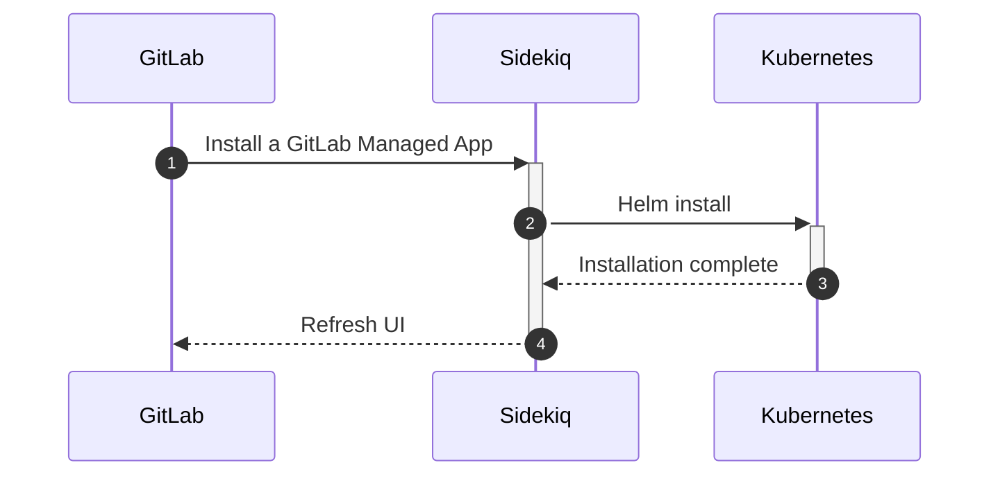
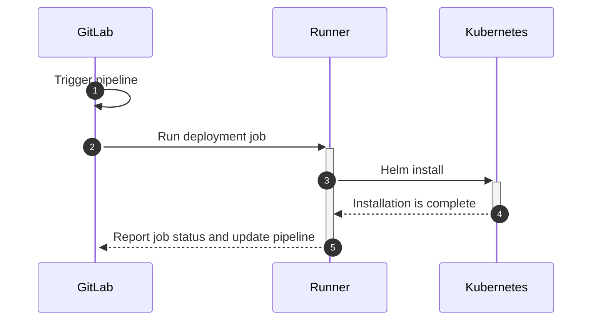

# Getting started with GitLab's Container Network Security

The following installation steps are the recommended way of installing GitLab's Protect capabilities.  Although some capabilities can be installed through GMAv1, it is [recommended and preferred]() to install applications through GMAv2 exclusively when using Container Network Security.

## Installation steps

The following steps are recommended to install and use Container Network Security through GitLab:

1. [Install and connect at least one runner to GitLab](https://docs.gitlab.com/runner/)
1. [Create a group](https://docs.gitlab.com/ee/user/group/#create-a-new-group)
1. [Connect a Kubernetes cluster to the group](https://docs.gitlab.com/ee/user/project/clusters/add_remove_clusters.html)
1. [Create a cluster management project and associate it with the Kubernetes cluster](https://docs.gitlab.com/ee/user/clusters/management_project.html)
1. Install and configure an Ingress node
  1. [Install the Ingress node via CI/CD (GMAv2)](https://docs.gitlab.com/ee/user/clusters/applications.html#install-ingress-using-gitlab-cicd)
  1. [Determine the external endpoint via the manual method](https://docs.gitlab.com/ee/user/clusters/applications.html#determining-the-external-endpoint-manually)
  1. Navigate to the Kubernetes page and enter the [DNS address for the external endpoint](https://docs.gitlab.com/ee/user/project/clusters/#base-domain) into the **Base domain** field on the Details tab.  Save the changes to the Kubernetes cluster.
1. [Install and configure Cilium](https://docs.gitlab.com/ee/user/clusters/applications.html#install-cilium-using-gitlab-cicd)
1. Be sure to restart all pods that were running before Cilium was installed by running `kubectl get pods --all-namespaces -o custom-columns=NAMESPACE:.metadata.namespace,NAME:.metadata.name,HOSTNETWORK:.spec.hostNetwork --no-headers=true | grep '<none>' | awk '{print "-n "$1" "$2}' | xargs -L 1 -r kubectl delete pod` in your cluster

It is possible to install and manage Cilium in other ways, such as by installing Cilium manually into a Kubernetes cluster via GitLab's Helm chart and then connecting it back to GitLab. These methods are not currently documented or officially supported.

## Managing Network Policies

Managing NetworkPolicies through GitLab is advantageous over managing the policies in Kubernetes directly as Kubernetes does not provide a GUI editor, a change control process, or a revision history. Network Policies can be managed through GitLab in one of two ways:

1. Management through a yaml file in each application's project (for projects using Auto DevOps) - [documentation](https://docs.gitlab.com/ee/topics/autodevops/stages.html#network-policy)
1. Management through GitLab's Policy management UI (for projects not using Auto DevOps) - [documentation](https://docs.gitlab.com/ee/user/application_security/threat_monitoring/#container-network-policy-management) (Ultimate/Gold only)

Each method comes with its own sets of Pros and Cons:

| | yaml method | UI method (Ultimate/Gold only) |
| Pros | A change control process is possible by requiring [MR Approvals](https://docs.gitlab.com/ee/user/project/merge_requests/merge_request_approvals.html). All changes are fully tracked and audited in the same way that Git tracks the history of any file in its repository. | The UI provides a simple rules editor for users who are less familiar with the yaml syntax of NetworkPolicies. This view is a live representation of the policies currently deployed in the Kubernetes cluster. The UI also allows for multiple network policies to be created per environment. |
| Cons | Only one network policy can be deployed per environment (although that policy can be as detailed as is needed).  Additionally, the contents of the yaml file will not represent the actual state of policies that are deployed in Kubernetes if changes were made in Kubernetes directly rather than via the auto-deploy-values.yaml file. | Policy changes are not currently audited and a change control process is not currently available. |

Users are encouraged to choose one of the two methods to manage their policies. If users attempt to use both methods simultaneously, when the application project pipeline is run, the contents of the NetworkPolicy in the auto-deploy-values.yaml file may override policies that are configured via the UI editor.

## Monitoring throughput

To view statistics for Container Network Security, you must have followed the installation steps above and also configured GitLab's integration with Prometheus. Additionally, if you are using custom Helm values for Cilium, you must enable Hubble with flow metrics for each namespace by adding the following lines to
your [Cilium values](../../../../clusters/applications.md#install-cilium-using-gitlab-cicd):

```yaml
global:
  hubble:
    enabled: true
    metrics:
      enabled:
        - 'flow:sourceContext=namespace;destinationContext=namespace'
```

Additional information about the statistics page is available in the [documentation that describes the Threat Management UI](https://docs.gitlab.com/ee/user/application_security/threat_monitoring/#container-network-policy).

## Forwarding logs to a SIEM

Cilium logs can be forwarded to a SIEM or an external logging system via syslog protocol by installing and configuring Fluentd.  Fluentd can be installed through GitLab in two ways: via the [GMAv1 method](https://docs.gitlab.com/ee/user/clusters/applications.html#fluentd) and via the [GMAv2 method](https://docs.gitlab.com/ee/user/clusters/applications.html#install-fluentd-using-gitlab-cicd). GitLab strongly encourages using only the [GMAv2 method](https://docs.gitlab.com/ee/user/clusters/applications.html#install-fluentd-using-gitlab-cicd) to install Fluentd.

## Viewing the logs

Cilium logs can be viewed by running the following command in your Kubernetes cluster:

```
kubectl -n gitlab-managed-apps logs -l k8s-app=cilium -c cilium-monitor
```

## Troubleshooting

### Trouble connecting to the cluster

Occasionally your CI/CD pipeline may fail or have trouble connecting to the cluster.  Below are some initial troubleshooting steps that resolve the most common problems:

1. [Clear the cluster cache](https://docs.gitlab.com/ee/user/project/clusters/#clearing-the-cluster-cache)
1. If things still aren't working, a more assertive set of actions may help get things back into a good state:
  1. Stop and [delete the problematic environment](https://docs.gitlab.com/ee/ci/environments/#delete-environments-through-the-ui) in GitLab
  1. Delete the relevant namespace in Kubernetes by running `kubectl delete namespaces <insert-some-namespace-name>` in your Kubernetes cluster
  1. Re-run the application project pipeline to re-deploy the application

### Using GMAv1 with GMAv2

When users use GMAv1 and GMAv2 together on the same cluster, they may experience problems with applications being uninstalled or removed from the cluster.  This is due to the fact that GMAv2 actively uninstalls applications that are installed via GMAv1 and not configured to be installed via GMAv2. It is possible to use a mixture of applications installed via GMAv1 and GMAv2 by ensuring that the GMAv1 applications are installed **after** the GMAv2 cluster management project pipeline runs.  GMAv1 applications will need to be re-installed after each run of that pipeline.  This approach is not recommended as it is error prone and can lead to downtime as applications are uninstalled and later re-installed.  The preferred and recommended path is to install all necessary components via GMAv2 and the cluster management project when using Container Network Security.

NOTE: **Note:**
These diagrams use the term _Kubernetes_ for simplicity. In practice, Sidekiq connects to a Helm
Tiller daemon running in a pod in the cluster.

#### GitLab Managed Apps v1 (GMAv1)

GitLab Managed Apps v1 (GMAv1) allows you to install capabilities into your Kubernetes cluster from the GitLab web interface with a one-click setup process. GitLab
uses Sidekiq (a background processing service) to facilitate this.



Although this installation method is easier because it's a point-and-click action in the user
interface, it's inflexible and harder to debug. If something goes wrong, you can't see the
deployment logs, and your deployment may be removed or overwritten if you deploy any applications through GMAv2.

#### GitLab Managed Apps v2 (GMAv2)

However, the next generation of GitLab Managed Apps V2 ([CI/CD-based GitLab Managed Apps](https://gitlab.com/groups/gitlab-org/-/epics/2103))
don't use Sidekiq to deploy. All the applications are deployed using a GitLab CI/CD pipeline and
therefore, by runners.



Debugging is easier because you have access to the raw logs of these jobs (the Helm Tiller output is
available as an artifact in case of failure), and the flexibility is much better. Since these
deployments are only triggered when a pipeline is running (most likely when there's a new commit in
the cluster management repository), every action has a paper trail and follows the classic merge
request workflow (approvals, merge, deploy). The Network Policy (Cilium) Managed App, and Container
Host Security (Falco) are deployed with this model.
