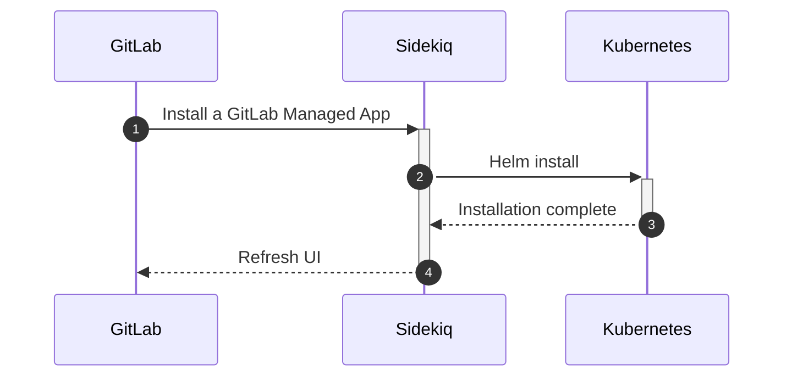
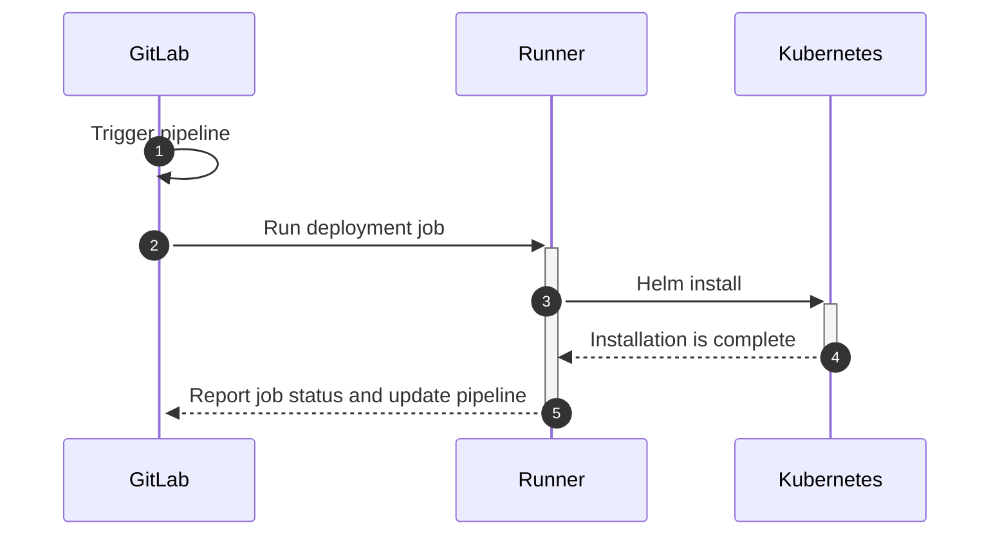

# Protecting your deployed applications

GitLab makes it easy to protect applications deployed in [connected Kubernetes clusters](index.md).  GitLab's protections are available in both the Kubernetes network layer, and in the container itself.

At the network layer, GitLab's Container Network Security capabilities provide basic firewalling functionality by leveraging Cilium NetworkPolicies to filter traffic going in and out of the cluster as well as traffic between pods inside the cluster.

Inside the container, GitLab's Container Host Security provides Intrusion Detection and Prevention capabilities that can monitor and block activity inside the containers themselves.

## Capabilities

The following capabilities are available to protect deployed applications in Kubernetes:

- Web Application Firewall - [overview]() - [installation guide]()
- Container Network Security - [overview]() - [installation guide]()
- Container Host Security - [overview]() - [installation guide]()

### Understanding how GitLab Managed Apps are installed

NOTE: **Note:**
These diagrams use the term _Kubernetes_ for simplicity. In practice, Sidekiq connects to a Helm
Tiller daemon running in a pod in the cluster.

Although some Kubernetes cluster protection capabilities can be installed through GMAv1, it is recommended and preferred to install only through GMAv2.

#### GitLab Managed Apps v1 (GMAv1)

GitLab Managed Apps v1 (GMAv1) allows you to install capabilities into your Kubernetes cluster from the GitLab web interface with a one-click setup process. GitLab
uses Sidekiq (a background processing service) to facilitate this.

Although this installation method is easier because it's a point-and-click action in the user
interface, it's inflexible and harder to debug. If something goes wrong, you can't see the
deployment logs, and your deployment may be removed or overwritten if you deploy any applications through GMAv2.

#### GitLab Managed Apps v2 (GMAv2)

However, the next generation of GitLab Managed Apps V2 ([CI/CD-based GitLab Managed Apps](https://gitlab.com/groups/gitlab-org/-/epics/2103))
don't use Sidekiq to deploy. All the applications are deployed using a GitLab CI/CD pipeline and
therefore, by runners.

Debugging is easier because you have access to the raw logs of these jobs (the Helm Tiller output is
available as an artifact in case of failure), and the flexibility is much better. Since these
deployments are only triggered when a pipeline is running (most likely when there's a new commit in
the cluster management repository), every action has a paper trail and follows the classic merge
request workflow (approvals, merge, deploy). The Network Policy (Cilium) Managed App, and Container
Host Security (Falco) are deployed with this model.
