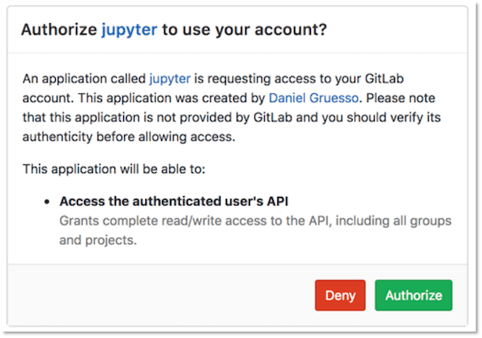
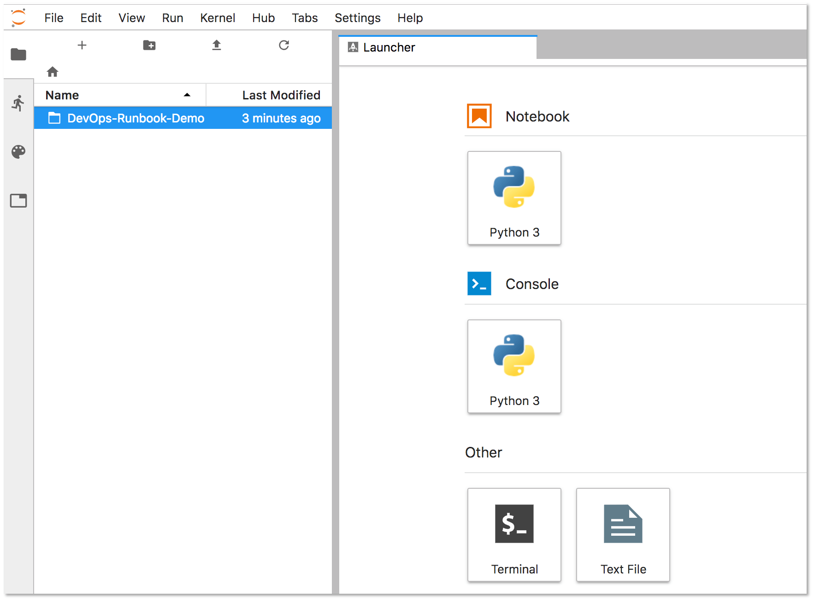
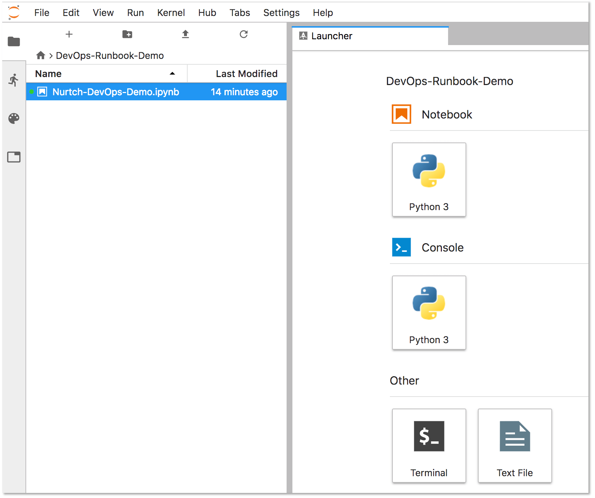
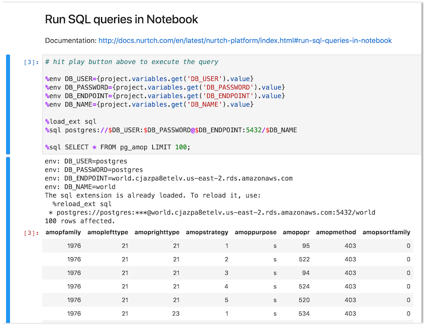

# Runbooks

Runbooks are a collection of documented procedures that explain how to 
carry out a particular process, be it starting, stopping, debugging, 
or troubleshooting a particular system.

## Overview

Historically, runbooks took the form of a decision tree or a detailed 
step-by-step guide depending on the condition or system. 

Modern implementations have introduced the concept of an "executable 
runbooks", where along with a well define process, operators can execute 
code blocks or database queries against a given environment.

## Nurtch Executable Runbooks

> [Introduced](https://gitlab.com/gitlab-org/gitlab-ce/issues/45912) in GitLab 11.4.

The JupyterHub app offered via GitLab’s Kubernetes integration now ships 
with Nurtch’s Rubix library, providing a simple way to create DevOps 
runbooks. A sample runbook is provided, showcasing common operations.

**<i class="fa fa-youtube-play youtube" aria-hidden="true"></i>
Watch this [video](https://www.youtube.com/watch?v=Q_OqHIIUPjE)
for an overview of how this is acomplished in GitLab!**

## Requirements

To create an executable runbook, you will need:

1. **Kubernetes** - A Kubernetes cluster is required to deploy the rest of the applications. 
    The simplest way to get started is to add a cluster using [GitLab's GKE integration](https://docs.gitlab.com/ee/user/project/clusters/#adding-and-creating-a-new-gke-cluster-via-gitlab).
1. **Helm Tiller** - Helm is a package manager for Kubernetes and is required to install 
    all the other applications. It is installed in its own pod inside the cluster which 
    can run the helm CLI in a safe environment.
1. **Ingress** - Ingress can provide load balancing, SSL termination, and name-based 
    virtual hosting. It acts as a web proxy for your applications.
1. **JupyterHub** - JupyterHub is a multi-user service for managing notebooks across 
    a team. Jupyter Notebooks provide a web-based interactive programming environment 
    used for data analysis, visualization, and machine learning.

## Nurtch

Nurtch is the company behind the [Rubix library](https://github.com/Nurtch/rubix). Rubix is 
an open-source python library that makes it easy to perform common DevOps tasks inside Jupyter Notebooks. 
Tasks such as plotting Cloudwatch metrics and rolling your ECS/Kubernetes app are simplified 
down to a couple of lines of code. Check the [Nurtch Documentation](http://docs.nurtch.com/en/latest) 
for more information.

## Configure an executable runbook with GitLab

Follow this step-by-step guide to configure an executable runbook in GitLab using 
the components outlined above and the preloaded demo runbook.

### 1. Add a Kubernetes cluster

Follow the steps outlined in [Adding and creating a new GKE cluster via GitLab](https://docs.gitlab.com/ee/user/project/clusters/#adding-and-creating-a-new-gke-cluster-via-gitlab) 
to add a Kubernetes cluster to your project.

### 2. Install Helm Tiller, Ingress, and JupyterHub

Once the cluster has been provisioned in GKE, click the **"Install"** button next to the "Helm Tiller" app.


Once Tiller has been installed successfully, click the **"Install"** button next to the "Ingress" app.


Once Ingress has been installed successfully, click the **"Install"** button next to the "JupyterHub" app.


### 3. Login to JupyterHub and start the server

Once JupyterHub has been installed successfully, navigate to the "Jupyter Hostname" url presented and click 
**"Sign in with GitLab"**. Authentication is automatically enabled for any user of GitLab server via OAuth2. This 
will redirect to GitLab in order to authorize JupyterHub to use your GitLab account. Click **"Authorize"**.



Once the application has been authorized you will taken back to the JupyterHub application. Click **"Start My Server"**


The server will take a couple of seconds to start.

### 4. Configure access

In order for the runbook to access your GitLab project, you will need to enter a [GitLab Access Token](https://docs.gitlab.com/ee/user/profile/personal_access_tokens.html) as well as your Project ID in the "Setup" 
section of the demo runbook.

Double-click on the "DevOps-Runbook-Demo" folder located on the left panel.



Double-click on the "Nurtch-DevOps-Demo.ipynb" runbook



The contents on the runbook will be displayed on the right side of the screen. Under the "Setup" section, you will find 
entries for both your `PRIVATE_TOKEN` and your `PROJECT_ID`. Enter both these values, conserving the single quotes as follows:

```sql
PRIVATE_TOKEN = 'abcdef123456'
PROJECT_ID = '1234567'
```

Update the `VARIABLE_NAME` on the last line of this section to match the name of the variable you are using for you 
access token. In this example our variable name is `PRIVATE_TOKEN`.

```sql
VARIABLE_VALUE = project.variables.get('PRIVATE_TOKEN').value
```

### 5. Configure an operation

For this example we'll use the "**Run SQL queries in Notebook**" section in the sample runbook to query 
a postgres database. The first 4 lines of the section define the variables that are required for this query to function. 

```sql
%env DB_USER={project.variables.get('DB_USER').value}
%env DB_PASSWORD={project.variables.get('DB_PASSWORD').value}
%env DB_ENDPOINT={project.variables.get('DB_ENDPOINT').value}
%env DB_NAME={project.variables.get('DB_NAME').value}
```

Create the matching variables in your project's **Settings >> CI/CD >> Variables**


Back in Jupyter, click the "Run SQL queries in Notebook" heading and the click the "run" button. The results will be 
displayed in-line as follows:



You can try other operations such as running shell scripts or interacting with a kubernetes cluster. Visit the 
[Nurtch Documentation](http://docs.nurtch.com/) for more information.
