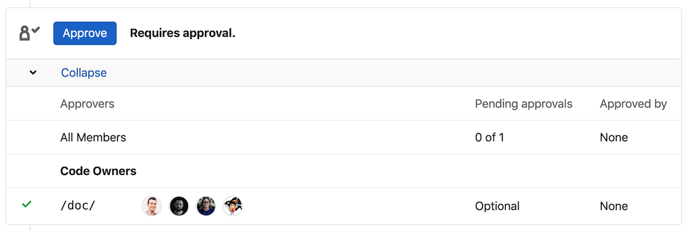

# Code Owners **(STARTER)**

> - [Introduced](https://gitlab.com/gitlab-org/gitlab/-/merge_requests/6916)
in [GitLab Starter](https://about.gitlab.com/pricing/) 11.3.
> - [Support for group namespaces](https://gitlab.com/gitlab-org/gitlab-foss/issues/53182) added in GitLab Starter 12.1.
> - Code Owners for Merge Request approvals was [introduced](https://gitlab.com/gitlab-org/gitlab/issues/4418) in [GitLab Premium](https://about.gitlab.com/pricing/) 11.9.

You can use a `CODEOWNERS` file to specify users or
[shared groups](members/share_project_with_groups.md)
that are responsible for certain files in a repository.

You can choose and add the `CODEOWNERS` file in three places:

- To the root directory of the repository
- Inside the `.gitlab/` directory
- Inside the `docs/` directory

The `CODEOWNERS` file is scoped to a branch, which means that with the
introduction of new files, the person adding the new content can
specify themselves as a code owner, all before the new changes
get merged to the default branch.

When a file matches multiple entries in the `CODEOWNERS` file,
the users from all entries are displayed on the blob page of
the given file.

## Approvals by Code Owners

Once you've set Code Owners to a project, you can configure it to
receive approvals:

- As [merge request eligible approvers](merge_requests/merge_request_approvals.md#code-owners-as-eligible-approvers).
- As required approvers for [protected branches](protected_branches.md#protected-branches-approval-by-code-owners-premium). **(PREMIUM)**

Once set, Code Owners are displayed in merge requests widgets:



## The syntax of Code Owners files

Files can be specified using the same kind of patterns you would use
in the `.gitignore` file followed by the `@username` or email of one
or more users or by the `@name` of one or more groups that should
be owners of the file.

The order in which the paths are defined is significant: the last
pattern that matches a given path will be used to find the code
owners.

Starting a line with a `#` indicates a comment. This needs to be
escaped using `\#` to address files for which the name starts with a
`#`.

Example `CODEOWNERS` file:

```
# This is an example code owners file, lines starting with a `#` will
# be ignored.

# app/ @commented-rule

# We can specify a default match using wildcards:
* @default-codeowner

# Rules defined later in the file take precedence over the rules
# defined before.
# This will match all files for which the file name ends in `.rb`
*.rb @ruby-owner

# Files with a `#` can still be accesssed by escaping the pound sign
\#file_with_pound.rb @owner-file-with-pound

# Multiple codeowners can be specified, separated by spaces or tabs
CODEOWNERS @multiple @code @owners

# Both usernames or email addresses can be used to match
# users. Everything else will be ignored. For example this will
# specify `@legal` and a user with email `janedoe@gitlab.com` as the
# owner for the LICENSE file
LICENSE @legal this_does_not_match janedoe@gitlab.com

# Group names can be used to match groups and nested groups to specify
# them as owners for a file
README @group @group/with-nested/subgroup

# Ending a path in a `/` will specify the code owners for every file
# nested in that directory, on any level
/docs/ @all-docs

# Ending a path in `/*` will specify code owners for every file in
# that directory, but not nested deeper. This will match
# `docs/index.md` but not `docs/projects/index.md`
/docs/* @root-docs

# This will make a `lib` directory nested anywhere in the repository
# match
lib/ @lib-owner

# This will only match a `config` directory in the root of the
# repository
/config/ @config-owner

# If the path contains spaces, these need to be escaped like this:
path\ with\ spaces/ @space-owner
```
