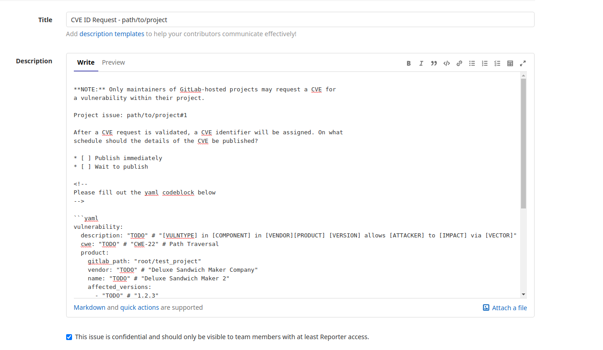
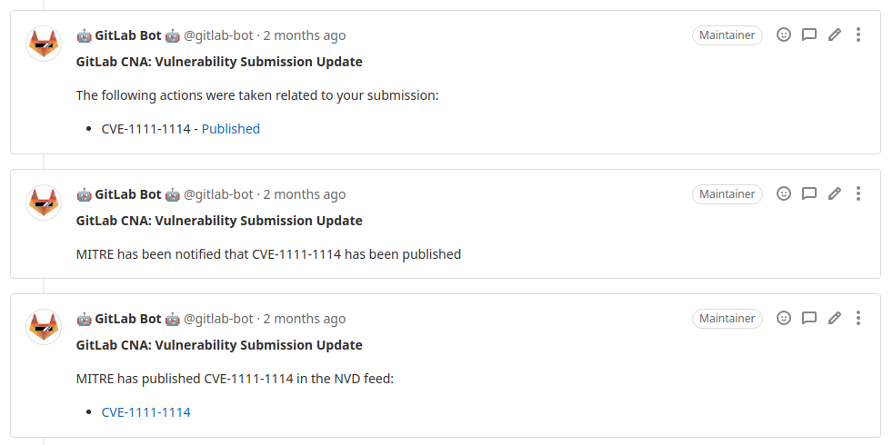

# CVE ID Requests

> Introduced in GitLab 13.4, only available on GitLab.com

As part of [GitLab's role as a CVE Numbering Authority](https://about.gitlab.com/security/cve)
([CNA](https://cve.mitre.org/cve/cna.html)), you may request
[CVE](https://cve.mitre.org/index.html) identifiers from GitLab to track
vulnerabilities found within your project.

## Overview

CVE identifiers track specific vulnerabilities within projects. Having a
CVE assigned to a vulnerability in your project will help
your users stay secure and informed. For example,
[dependency scanning tools](../application_security/dependency_scanning/index.md)
will be able to detect when vulnerable versions of your project are used as a
dependency.

## Conditions

If the following conditions are met, a _Request CVE ID_ button will appear in
your issue sidebar:

- The project is hosted in GitLab.com
- The project is public
- You are a maintainer of the project
- The issue is confidential

## Submitting a CVE ID Request

Clicking the _Request CVE ID_ button in the issue sidebar will take you to the
new issue page for [GitLab's CVE project](https://gitlab.com/gitlab-org/cves)

Creating the confidential issue starts the CVE request process.

You will be required to fill in the issue description, which includes:

- a description of the vulnerability
- the vendor and name of the project
- impacted versions
- fixed versions
- the type of the vulnerability (a [CWE](https://cwe.mitre.org/data/index.html) identifier)
- a [CVSS v3 vector](https://nvd.nist.gov/vuln-metrics/cvss/v3-calculator)

## CVE Assignment

GitLab will triage your submitted CVE ID request and will communicate with you
throughout the CVE validation and assignment process.

Once a CVE identifier has been assigned, you may use and reference the assigned
identifier as you see fit.

Details of the vulnerability that were submitted in the CVE ID request are
published according to your schedule. It is common to request a CVE for an
unpatched vulnerability, reference the assigned CVE identifier in release
notes, and later publish the details of the vulnerability after the fix has been
released.

Separate communication will notify you when different stages of the publication
process are completed.

