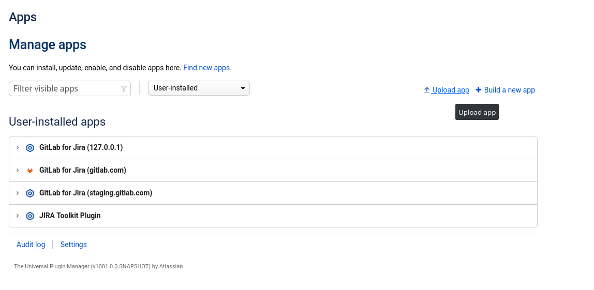

# Jira integrations **(FREE)**

GitLab can be integrated with [Jira](https://www.atlassian.com/software/jira).

[Issues](../issues/index.md) are a tool for discussing ideas, and planning and tracking work.
However, your organization may already use Jira for these purposes, with extensive, established data
and business processes they rely on.

Although you can [migrate](../../../user/project/import/jira.md) your Jira issues and work
exclusively in GitLab, you can also continue to use Jira by using the GitLab Jira integrations.

## Integration types

There are two different Jira integrations that allow different types of cross-referencing between
GitLab activity and Jira issues, with additional features:

- [Jira integration](jira.md), built in to GitLab. In a given GitLab project, it can be configured
  to connect to any Jira instance, either hosted by you or hosted in
  [Atlassian cloud](https://www.atlassian.com/cloud).
- [Jira development panel integration](../../../integration/jira_development_panel.md). Connects all
  GitLab projects under a specified group or personal namespace.

Jira development panel integration configuration depends on whether you are
using Jira on [Atlassian cloud](https://www.atlassian.com/cloud) or on your own server.

| You use Jira on: | For the Jira development panel integration, GitLab.com customers need:                                                                                                                                                          | For the Jira development panel integration, GitLab self-managed customers need:                                                                                                                                                                                      |
|------------------|---------------------------------------------------------------------------------------------------------------------------------------------------------------------------------------------------------------------------------|----------------------------------------------------------------------------------------------------------------------------------------------------------------------------------------------------------------------------------------------------------------------|
| Atlassian cloud  | The [GitLab.com for Jira Cloud](https://marketplace.atlassian.com/apps/1221011/gitlab-com-for-jira-cloud?hosting=cloud&tab=overview) application installed from the [Atlassian Marketplace](https://marketplace.atlassian.com). | The [GitLab.com for Jira Cloud](https://marketplace.atlassian.com/apps/1221011/gitlab-com-for-jira-cloud?hosting=cloud&tab=overview), using a workaround process. See a [relevant issue](https://gitlab.com/gitlab-org/gitlab/-/issues/268278) for more information. |
| Your own server  | The [Jira DVCS connector](../../../integration/jira_development_panel.md).                                                                                                                                                      | The [Jira DVCS connector](../../../integration/jira_development_panel.md).                                                                                                                                                                                           |

If you run your own GitLab self-managed instance, you will need to follow some
extra steps to get the GitLab Jira Cloud application installed:

### Installing the GitLab Jira Cloud application for self-managed instances

Each Jira Cloud application needs to be installed from a single location. That
location is a URL from which Jira fetches a [manifest file](https://developer.atlassian.com/cloud/jira/platform/connect-app-descriptor/) describing the
application to the system. To support self-managed GitLab instances with
Jira Cloud, there are two options:

#### Option 1: Install the application manually

You can set your Atlassian Cloud instance to allow installation of applications
from outside the marketplace. This requires putting your instance into
[development mode](https://developer.atlassian.com/cloud/jira/platform/getting-started-with-connect/#step-2--enable-development-mode).

Once you have done this, you can install the GitLab application from your
self-managed GitLab instance (see: [Atlassian developer guides](https://developer.atlassian.com/cloud/jira/platform/getting-started-with-connect/#step-3--install-and-test-your-app))

Under **Apps > Manage Apps** you will see an option to `"Upload app"`:

'Upload' in this sense means providing the URL of an application manifest file,
which will be downloaded by Jira Cloud to install the application for you.

1. Enter the location of your manifest file.
   Your manifest file is located at: `https://your.domain/your-path/-/jira_connect/app_descriptor.json`
1. Click **Upload**.
1. If the install was successful, you should see the **GitLab for Jira** app under **Manage apps**.
   You can also click **Getting Started** to open the configuration page rendered from your GitLab instance.

Note that any changes to the application descriptor requires you to un-install then reinstall the
application.

#### Option 2: Create a Marketplace listing

You are welcome to create your own Marketplace listing for your instance, to
enable it to be installed from the normal Marketplace, without having to use
development mode.

NOTE:
Since public applications can be viewed and installed by
any user, you probably want to list your application as `private`.

See the Atlassian [guide to creating a marketplace listing](https://developer.atlassian.com/platform/marketplace/installing-cloud-apps/#creating-the-marketplace-listing).

The key steps are:

1. Registering as a Marketplace vendor
1. Listing the application, using the application descriptor URL.
   Your manifest file is located at: `https://your.domain/your-path/-/jira_connect/app_descriptor.json`
1. Generating test license tokens for your application.

Please see the official Atlassian documentation for details.

NOTE:
DVCS means distributed version control system.

## Feature comparison

The integration to use depends on the capabilities your require. You can install both at the same
time.

| Capability                                                                  | Jira integration                                                                                                                                              | Jira Development Panel integration                                                                                     |
|:----------------------------------------------------------------------------|:--------------------------------------------------------------------------------------------------------------------------------------------------------------|:-----------------------------------------------------------------------------------------------------------------------|
| Mention of Jira issue ID in GitLab is automatically linked to that issue    | Yes                                                                                                                                                           | No                                                                                                                     |
| Mention of Jira issue ID in GitLab issue/MR is reflected in the Jira issue  | Yes, as a Jira comment with the GitLab issue/MR title and a link back to it. Its first mention also adds the GitLab page to the Jira issue under “Web links”. | Yes, in the issue’s Development panel                                                                                  |
| Mention of Jira issue ID in GitLab commit message is reflected in the issue | Yes. The entire commit message is added to the Jira issue as a comment and under “Web links”, each with a link back to the commit in GitLab.                  | Yes, in the issue’s Development panel and optionally with a custom comment on the Jira issue using Jira Smart Commits. |
| Mention of Jira issue ID in GitLab branch names is reflected in Jira issue  | No                                                                                                                                                            | Yes, in the issue’s Development panel                                                                                  |
| Record Jira time tracking information against an issue                      | No                                                                                                                                                            | Yes. Time can be specified via Jira Smart Commits.                                                                     |
| Transition or close a Jira issue with a Git commit or merge request         | Yes. Only a single transition type, typically configured to close the issue by setting it to Done.                                                            | Yes. Transition to any state using Jira Smart Commits.                                                                 |
| Display a list of Jira issues                                               | Yes **(PREMIUM)**                                                                                                                                             | No                                                                                                                     |
| Create a Jira issue from a vulnerability or finding **(ULTIMATE)**          | Yes                                    | No                     |
