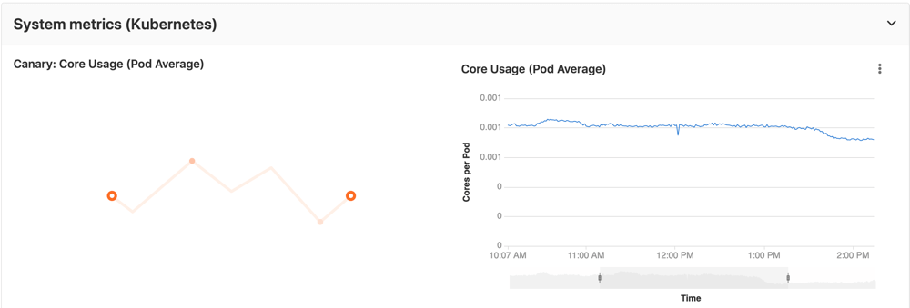
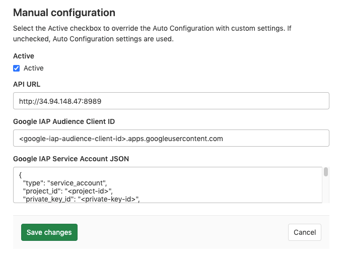

# Prometheus integration

> [Introduced](https://gitlab.com/gitlab-org/gitlab-foss/-/merge_requests/8935) in GitLab 9.0.

GitLab offers powerful integration with [Prometheus](https://prometheus.io) for monitoring key metrics of your apps, directly within GitLab.
Metrics for each environment are retrieved from Prometheus, and then displayed
within the GitLab interface.

There are two ways to set up Prometheus integration, depending on where your apps are running:

- For deployments on Kubernetes, GitLab can automatically [deploy and manage Prometheus](#managed-prometheus-on-kubernetes).
- For other deployment targets, simply [specify the Prometheus server](#manual-configuration-of-prometheus).

Once enabled, GitLab will automatically detect metrics from known services in the [metric library](prometheus_library/index.md). You can also [add your own metrics](../../../operations/metrics/index.md#adding-custom-metrics) and create
[custom dashboards](../../../operations/metrics/dashboards/index.md).

## Enabling Prometheus Integration

### Managed Prometheus on Kubernetes

> [Introduced](https://gitlab.com/gitlab-org/gitlab-foss/-/issues/28916) in GitLab 10.5.

GitLab can seamlessly deploy and manage Prometheus on a [connected Kubernetes cluster](../clusters/index.md), making monitoring of your apps easy.

#### Requirements

- A [connected Kubernetes cluster](../clusters/index.md)

#### Getting started

Once you have a connected Kubernetes cluster, deploying a managed Prometheus is as easy as a single click.

1. Go to the **Operations > Kubernetes** page to view your connected clusters
1. Select the cluster you would like to deploy Prometheus to
1. Click the **Install** button to deploy Prometheus to the cluster

#### About managed Prometheus deployments

Prometheus is deployed into the `gitlab-managed-apps` namespace, using the [official Helm chart](https://github.com/helm/charts/tree/master/stable/prometheus). Prometheus is only accessible within the cluster, with GitLab communicating through the [Kubernetes API](https://kubernetes.io/docs/concepts/overview/kubernetes-api/).

The Prometheus server will [automatically detect and monitor](https://prometheus.io/docs/prometheus/latest/configuration/configuration/#kubernetes_sd_config) nodes, pods, and endpoints. To configure a resource to be monitored by Prometheus, simply set the following [Kubernetes annotations](https://kubernetes.io/docs/concepts/overview/working-with-objects/annotations/):

- `prometheus.io/scrape` to `true` to enable monitoring of the resource.
- `prometheus.io/port` to define the port of the metrics endpoint.
- `prometheus.io/path` to define the path of the metrics endpoint. Defaults to `/metrics`.

CPU and Memory consumption is monitored, but requires [naming conventions](prometheus_library/kubernetes.md#specifying-the-environment) in order to determine the environment. If you are using [Auto DevOps](../../../topics/autodevops/index.md), this is handled automatically.

The [NGINX Ingress](../clusters/index.md#installing-applications) that is deployed by GitLab to clusters, is automatically annotated for monitoring providing key response metrics: latency, throughput, and error rates.

### Manual configuration of Prometheus

#### Requirements

Integration with Prometheus requires the following:

1. GitLab 9.0 or higher
1. Prometheus must be configured to collect one of the [supported metrics](prometheus_library/index.md)
1. Each metric must be have a label to indicate the environment
1. GitLab must have network connectivity to the Prometheus server

#### Getting started

Installing and configuring Prometheus to monitor applications is fairly straightforward.

1. [Install Prometheus](https://prometheus.io/docs/prometheus/latest/installation/)
1. Set up one of the [supported monitoring targets](prometheus_library/index.md)
1. Configure the Prometheus server to [collect their metrics](https://prometheus.io/docs/prometheus/latest/configuration/configuration/#scrape_config)

#### Configuration in GitLab

The actual configuration of Prometheus integration within GitLab is very simple.
All you will need is the domain name or IP address of the Prometheus server you'd like
to integrate with. If the Prometheus resource is secured with Google's Identity-Aware Proxy (IAP),
additional information like Client ID and Service Account credentials can be passed which
GitLab can use to access the resource. More information about authentication from a
service account can be found at Google's documentation for
[Authenticating from a service account](https://cloud.google.com/iap/docs/authentication-howto#authenticating_from_a_service_account).

1. Navigate to the [Integrations page](overview.md#accessing-integrations) at
   **{settings}** **Settings > Integrations**.
1. Click the **Prometheus** service.
1. For **API URL**, provide the domain name or IP address of your server, such as
   `http://prometheus.example.com/` or `http://192.0.2.1/`.
1. (Optional) In **Google IAP Audience Client ID**, provide the Client ID of the
   Prometheus OAuth Client secured with Google IAP.
1. (Optional) In **Google IAP Service Account JSON**, provide the contents of the
   Service Account credentials file that is authorized to access the Prometheus resource.
1. Click **Save changes**.

#### Thanos configuration in GitLab

You can configure [Thanos](https://thanos.io/) as a drop-in replacement for Prometheus
with GitLab. You will need the domain name or IP address of the Thanos server you'd like
to integrate with.

1. Navigate to the [Integrations page](overview.md#accessing-integrations).
1. Click the **Prometheus** service.
1. Provide the domain name or IP address of your server, for example `http://thanos.example.com/` or `http://192.0.2.1/`.
1. Click **Save changes**.

### Precedence with multiple Prometheus configurations

Although you can enable both a [manual configuration](#manual-configuration-of-prometheus)
and [auto configuration](#managed-prometheus-on-kubernetes) of Prometheus, only
one of them will be used:

- If you have enabled a
  [Prometheus manual configuration](#manual-configuration-of-prometheus)
  and a [managed Prometheus on Kubernetes](#managed-prometheus-on-kubernetes),
  the manual configuration takes precedence and is used to run queries from
  [custom dashboards](../../../operations/metrics/dashboards/index.md) and
  [custom metrics](../../../operations/metrics/index.md#adding-custom-metrics).
- If you have managed Prometheus applications installed on Kubernetes clusters
  at **different** levels (project, group, instance), the order of precedence is described in
  [Cluster precedence](../../instance/clusters/index.md#cluster-precedence).
- If you have managed Prometheus applications installed on multiple Kubernetes
  clusters at the **same** level, the Prometheus application of a cluster with a
  matching [environment scope](../../../ci/environments/index.md#scoping-environments-with-specs) is used.

## Determining the performance impact of a merge

> - [Introduced](https://gitlab.com/gitlab-org/gitlab-foss/-/merge_requests/10408) in GitLab 9.2.
> - GitLab 9.3 added the [numeric comparison](https://gitlab.com/gitlab-org/gitlab-foss/-/issues/27439) of the 30 minute averages.

Developers can view the performance impact of their changes within the merge
request workflow.

NOTE: **Note:**
Requires [Kubernetes](prometheus_library/kubernetes.md) metrics.

When a source branch has been deployed to an environment, a sparkline and
numeric comparison of the average memory consumption will appear. On the
sparkline, a dot indicates when the current changes were deployed, with up to 30 minutes of
performance data displayed before and after. The comparison shows the difference
between the 30 minute average before and after the deployment. This information
is updated after each commit has been deployed.

Once merged and the target branch has been redeployed, the metrics will switch
to show the new environments this revision has been deployed to.

Performance data will be available for the duration it is persisted on the
Prometheus server.

