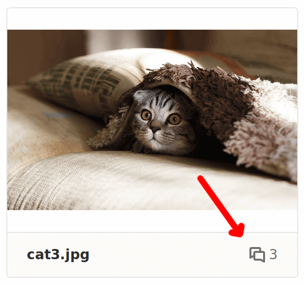
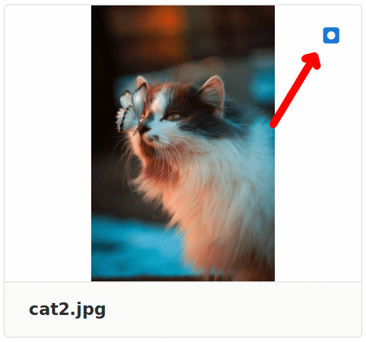
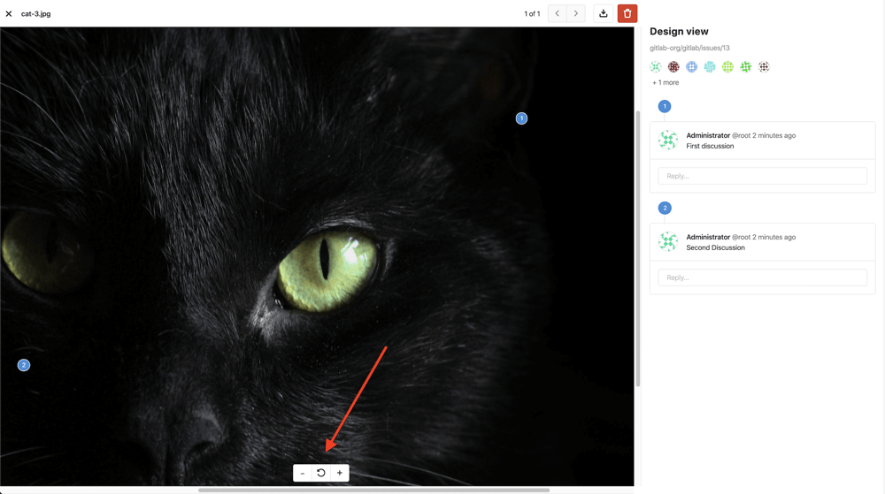
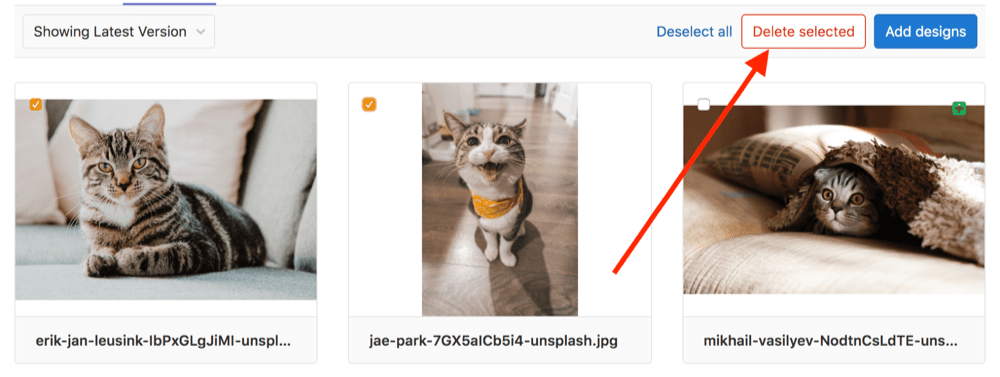
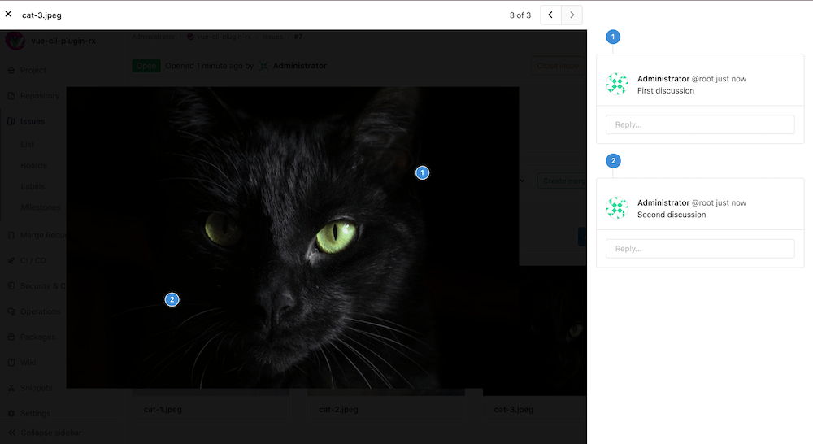
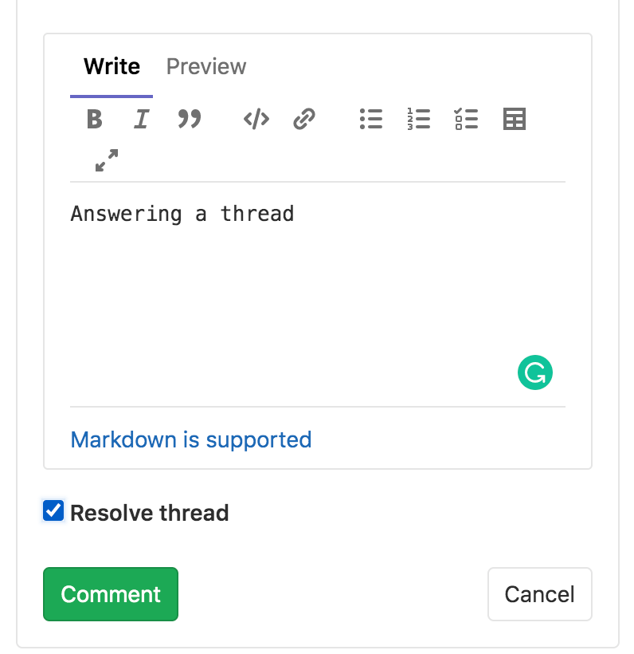

# Design Management

> - [Introduced](https://gitlab.com/groups/gitlab-org/-/epics/660) in [GitLab Premium](https://about.gitlab.com/pricing/) 12.2.
> - [Moved](https://gitlab.com/gitlab-org/gitlab/-/issues/212566) to GitLab Core in 13.0.

## Overview

Design Management allows you to upload design assets (wireframes, mockups, etc.)
to GitLab issues and keep them stored in one single place, accessed by the Design
Management's page within an issue, giving product designers, product managers, and engineers a
way to collaborate on designs over one single source of truth.

You can easily share mock-ups of designs with your team, or visual regressions can be easily
viewed and addressed.

<i class="fa fa-youtube-play youtube" aria-hidden="true"></i>
For an overview, see the video [Design Management (GitLab 12.2)](https://www.youtube.com/watch?v=CCMtCqdK_aM).

## Requirements

Design Management requires
[Large File Storage (LFS)](../../../topics/git/lfs/index.md)
to be enabled:

- For GitLab.com, LFS is already enabled.
- For self-managed instances, a GitLab administrator must have
  [enabled LFS globally](../../../administration/lfs/index.md).
- For both GitLab.com and self-managed instances: LFS must be enabled for the project itself.
  If enabled globally, LFS will be enabled by default to all projects. To enable LFS on the
  project level, navigate to your project's **Settings > General**, expand **Visibility, project features, permissions**
  and enable **Git Large File Storage**.

Design Management also requires that projects are using
[hashed storage](../../../administration/raketasks/storage.md#migrate-to-hashed-storage). Since
 GitLab 10.0, newly created projects use hashed storage by default. A GitLab admin can verify the storage type of a
project by navigating to **Admin Area > Projects** and then selecting the project in question.
A project can be identified as hashed-stored if its *Gitaly relative path* contains `@hashed`.

If the requirements are not met, the **Designs** tab displays a message to the user.

## Supported files

Files uploaded must have a file extension of either `png`, `jpg`, `jpeg`,
`gif`, `bmp`, `tiff` or `ico`.

Support for [SVG files](https://gitlab.com/gitlab-org/gitlab/-/issues/12771)
and [PDFs](https://gitlab.com/gitlab-org/gitlab/-/issues/32811) is planned for a future release.

## Limitations

- Design uploads are limited to 10 files at a time.
- From GitLab 13.1, Design filenames are limited to 255 characters.
- Design Management data
  [isn't deleted when a project is destroyed](https://gitlab.com/gitlab-org/gitlab/-/issues/13429) yet.
- Design Management data [won't be moved](https://gitlab.com/gitlab-org/gitlab/-/issues/13426)
  when an issue is moved, nor [deleted](https://gitlab.com/gitlab-org/gitlab/-/issues/13427)
  when an issue is deleted.
- From GitLab 12.7, Design Management data [can be replicated](../../../administration/geo/replication/datatypes.md#limitations-on-replicationverification)
  by Geo but [not verified](https://gitlab.com/gitlab-org/gitlab/-/issues/32467).
- Only the latest version of the designs can be deleted.
- Deleted designs cannot be recovered but you can see them on previous designs versions.

## The Design Management page

Navigate to the **Design Management** page from any issue by clicking the **Designs** tab:


## Adding designs

To upload design images, click the **Upload Designs** button and select images to upload.

[Introduced](https://gitlab.com/gitlab-org/gitlab/-/issues/34353) in [GitLab Premium](https://about.gitlab.com/pricing/) 12.9,
you can drag and drop designs onto the dedicated drop zone to upload them.


[Introduced](https://gitlab.com/gitlab-org/gitlab/-/issues/202634)
in GitLab 12.10, you can also copy images from your file system and
paste them directly on GitLab's Design page as a new design.

On macOS you can also take a screenshot and immediately copy it to
the clipboard by simultaneously clicking <kbd>Control</kbd> + <kbd>Command</kbd> + <kbd>Shift</kbd> + <kbd>3</kbd>, and then paste it as a design.

Copy-and-pasting has some limitations:

- You can paste only one image at a time. When copy/pasting multiple files, only the first one will be uploaded.
- All images will be converted to `png` format under the hood, so when you want to copy/paste `gif` file, it will result in broken animation.
- If you are pasting a screenshot from the clipboard, it will be renamed to `design_<timestamp>.png`
- Copy/pasting designs is not supported on Internet Explorer.

Designs with the same filename as an existing uploaded design will create a new version
of the design, and will replace the previous version. [Introduced](https://gitlab.com/gitlab-org/gitlab/-/issues/34353) in [GitLab Premium](https://about.gitlab.com/pricing/) 12.9, dropping a design on an existing uploaded design will also create a new version,
provided the filenames are the same.

Designs cannot be added if the issue has been moved, or its
[discussion is locked](../../discussions/#lock-discussions).

### Skipped designs

Designs with the same filename as an existing uploaded design _and_ whose content has not changed will be skipped.
This means that no new version of the design will be created. When designs are skipped, you will be made aware via a warning
message on the Issue.

## Viewing designs

Images on the Design Management page can be enlarged by clicking on them.
You can navigate through designs by clicking on the navigation buttons on the
top-right corner or with <kbd>Left</kbd>/<kbd>Right</kbd> keyboard buttons.

The number of discussions on a design — if any — is listed to the right
of the design filename. Clicking on this number enlarges the design
just like clicking anywhere else on the design.
When a design is added or modified, an icon is displayed on the item
to help summarize changes between versions.

| Indicator | Example |
| --------- | ------- |
| Discussions |  |
| Modified (in the selected version) |  |
| Added (in the selected version) |  |

### Exploring designs by zooming

> [Introduced](https://gitlab.com/gitlab-org/gitlab/-/issues/13217) in [GitLab Premium](https://about.gitlab.com/pricing/) 12.7.

Designs can be explored in greater detail by zooming in and out of the image.
Control the amount of zoom with the `+` and `-` buttons at the bottom of the image.
While zoomed, you can still [start new discussions](#starting-discussions-on-designs) on the image, and see any existing ones.
[Introduced](https://gitlab.com/gitlab-org/gitlab/-/issues/197324) in GitLab 12.10, while zoomed in,
you can click-and-drag on the image to move around it.



## Deleting designs

> [Introduced](https://gitlab.com/gitlab-org/gitlab/-/issues/11089) in [GitLab Premium](https://about.gitlab.com/pricing/) 12.4.

There are two ways to delete designs: manually delete them
individually, or select a few of them to delete at once,
as shown below.

To delete a single design, click it to view it enlarged,
then click the trash icon on the top right corner and confirm
the deletion by clicking the **Delete** button on the modal window:


To delete multiple designs at once, on the design's list view,
first select the designs you want to delete:


Once selected, click the **Delete selected** button to confirm the deletion:



**Note:**
Only the latest version of the designs can be deleted.
Deleted designs are not permanently lost; they can be
viewed by browsing previous versions.

## Starting discussions on designs

When a design is uploaded, you can start a discussion by clicking on
the image on the exact location you would like the discussion to be focused on.
A pin is added to the image, identifying the discussion's location.


[Introduced](https://gitlab.com/gitlab-org/gitlab/-/issues/34353) in [GitLab Premium](https://about.gitlab.com/pricing/) 12.8,
you can adjust a pin's position by dragging it around the image. This is useful
for when your design layout has changed between revisions, or if you need to move an
existing pin to add a new one in its place.

Different discussions have different pin numbers:



From GitLab 12.5 on, new discussions will be outputted to the issue activity,
so that everyone involved can participate in the discussion.

## Resolve Design threads

> [Introduced](https://gitlab.com/gitlab-org/gitlab/-/issues/13049) in GitLab 13.1.

Discussion threads can be resolved on Designs. You can mark a thread as resolved
or unresolved by clicking the **Resolve thread** icon at the first comment of the
discussion.


Pinned comments can also be resolved or unresolved in their threads.
When replying to a comment, you will see a checkbox that you can click in order to resolve or unresolve
the thread once published.



## Referring to designs in Markdown

> - [Introduced](https://gitlab.com/gitlab-org/gitlab/-/issues/217160) in **GitLab 13.1**.
> - It is deployed behind a feature flag, disabled by default.
> - It is disabled on GitLab.com.
> - It is not recommended for production use.
> - To use it in GitLab self-managed instances, ask a GitLab administrator to [enable it](#enable-or-disable-design-references-core-only). **(CORE ONLY)**

We support referring to designs in [Markdown](../../markdown.md), which is available
throughout the application, including in merge request and issue descriptions, in discussions and comments, and in wiki pages.

At present, full URL references are supported. For example, if we refer to a design
somewhere with:

```markdown
See https://gitlab.com/your-group/your-project/-/issues/123/designs/homescreen.png
```

This will be rendered as:

> See [#123[homescreen.png]](https://gitlab.com/your-group/your-project/-/issues/123/designs/homescreen.png)

### Enable or disable design references **(CORE ONLY)**

Design reference parsing is under development and not ready for production use. It is
deployed behind a feature flag that is **disabled by default**.
[GitLab administrators with access to the GitLab Rails console](../../../administration/feature_flags.md)
can enable it for your instance.

To enable it:

```ruby
Feature.enable(:design_management_reference_filter_gfm_pipeline)
```

To disable it:

```ruby
Feature.disable(:design_management_reference_filter_gfm_pipeline)
```
