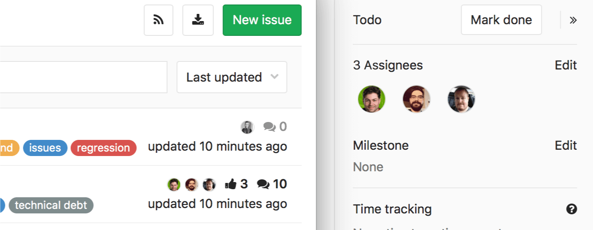

# Multiple Assignees for Issues **(PREMIUM)**

> - [Introduced](https://gitlab.com/gitlab-org/gitlab/-/issues/1904) in [GitLab Starter 9.2](https://about.gitlab.com/releases/2017/05/22/gitlab-9-2-released/#multiple-assignees-for-issues).
> - [Moved](https://about.gitlab.com/blog/2021/01/26/new-gitlab-product-subscription-model/) to GitLab [Premium](https://about.gitlab.com/pricing/) in 13.9.

In large teams, where there is shared ownership of an issue, it can be difficult
to track who is working on it, who already completed their contributions, who
didn't even start yet.

In [GitLab Enterprise Edition](https://about.gitlab.com/pricing/),
you can also select multiple assignees to an issue, making it easier to
track, and making clearer who is accountable for it.

## Use cases

Consider a team formed by frontend developers, backend developers,
UX designers, QA testers, and a product manager working together to bring an idea to
market.

Multiple Assignees for Issues makes collaboration smoother,
and allows shared responsibilities to be clearly displayed.
All assignees are shown across your team's workflows and receive notifications (as they
would as single assignees), simplifying communication and ownership.

Once an assignee had their work completed, they would remove themselves as assignees, making
it clear that their role is complete.

## How it works

From an opened issue, expand the right sidebar, locate the assignees entry,
and click on **Edit**. From the dropdown menu, select as many users as you want
to assign the issue to.

To remove an assignee, deselect them from the same dropdown menu.
