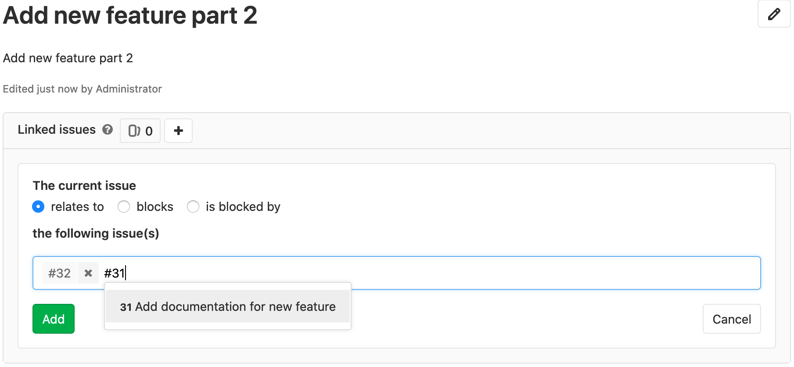
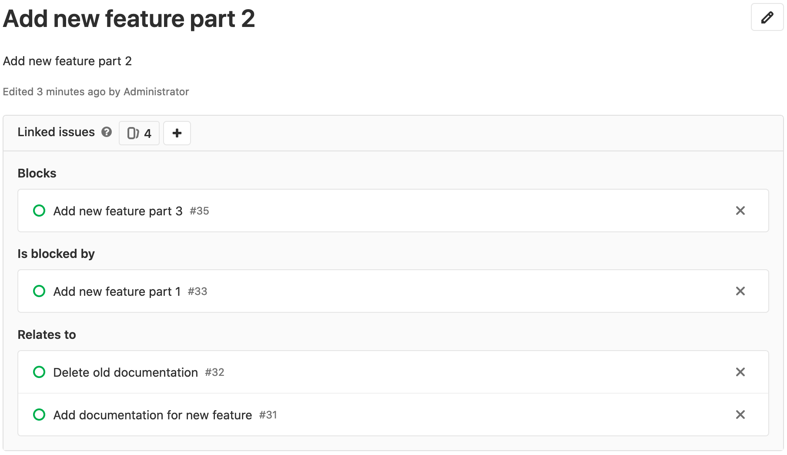

# Related issues **(FREE)**

> - [Introduced](https://gitlab.com/gitlab-org/gitlab/-/merge_requests/1797) in [GitLab Starter](https://about.gitlab.com/pricing/) 9.4.
> - The simple "relates to" relationship [moved](https://gitlab.com/gitlab-org/gitlab/-/issues/212329) to [GitLab Free](https://about.gitlab.com/pricing/) in 13.4.

Related issues are a bi-directional relationship between any two issues
and appear in a block below the issue description. Issues can be across groups
and projects.

You can set any issue as:

- Related to another issue
- Blocking another issue **(STARTER)**
- Blocked by another issue **(STARTER)**

The relationship only shows up in the UI if the user can see both issues.

When you try to close an issue that has open blockers, a warning is displayed.

NOTE:
To manage related issues through our API, visit the [issue links API documentation](../../../api/issue_links.md).

## Adding a related issue

> - [Introduced](https://gitlab.com/gitlab-org/gitlab/-/issues/2035) in [GitLab Starter](https://about.gitlab.com/pricing/) 12.8.
> - [Improved](https://gitlab.com/gitlab-org/gitlab/-/issues/34239) to warn when attempting to close an issue that is blocked by others in [GitLab Starter](https://about.gitlab.com/pricing/) 13.0.
>   When you try to close an issue with open blockers, you see a warning that you can dismiss.

1. Relate one issue to another by clicking the related issues "+" button
in the header of the related issue block.

1. Input the issue reference number or paste in the full URL of the issue.

1. **(STARTER)** Select whether the current issue relates to, blocks, or is blocked by the issues being entered.

    

    Issues of the same project can be specified just by the reference number.
    Issues from a different project require additional information like the
    group and the project name. For example:

    - same project: `#44`
    - same group: `project#44`
    - different group: `group/project#44`

    Valid references are added to a temporary list that you can review.

1. When you have added all the related issues, click **Add** to submit.

When you have finished adding all related issues, you can see
them categorized so their relationships can be better understood visually.

## Removing a related issue

In the related issues block, click the "x" icon on the right-side of each issue
token that you wish to remove.

Due to the bi-directional relationship, it no longer appears in either issue.

Please access our [permissions](../../permissions.md) page for more information.
