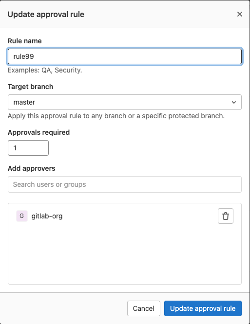
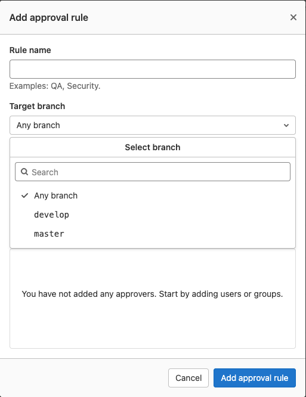

# Merge request approval rules

Approval rules define how many approvals a merge request must receive before it can
be merged, and optionally which users should do the approving. Approvals can be defined:

- [As project defaults](#adding--editing-a-default-approval-rule).
- [Per merge request](#editing--overriding-approval-rules-per-merge-request).

If no approval rules are defined, any user can approve a merge request. However, the default
minimum number of required approvers can still be set in the
[settings for merge request approvals](#approval-settings).

You can opt to define one single rule to approve a merge request among the available rules
or choose more than one with [multiple approval rules](#multiple-approval-rules).

NOTE:
On GitLab.com, you can add a group as an approver if you're a member of that group or the
group is public.

## Eligible Approvers

> [Introduced](https://gitlab.com/gitlab-org/gitlab/-/issues/10294) in GitLab 13.3, when an eligible approver comments on a merge request, it appears in the **Commented by** column of the Approvals widget.

The following users can approve merge requests:

- Users who have been added as approvers at the project or merge request levels with
  developer or higher [permissions](../../permissions.md).
- [Code owners](#code-owners-as-eligible-approvers) of the files changed by the merge request
  that have developer or higher [permissions](../../permissions.md).

An individual user can be added as an approver for a project if they are a member of:

- The project.
- The project's immediate parent group.
- A group that has access to the project via a [share](../members/share_project_with_groups.md).

A group of users can also be added as approvers, though they only count as approvers if
they have direct membership to the group. In the future, group approvers may be
[restricted to only groups with share access to the project](https://gitlab.com/gitlab-org/gitlab/-/issues/2048).

If a user is added as an individual approver and is also part of a group approver,
then that user is just counted once. The merge request author, and users who have committed
to the merge request, do not count as eligible approvers,
if [**Prevent author approval**](#allowing-merge-request-authors-to-approve-their-own-merge-requests) (enabled by default)
and [**Prevent committers approval**](#prevent-approval-of-merge-requests-by-their-committers) (disabled by default)
are enabled on the project settings.

When an eligible approver comments on a merge request, it displays in the
**Commented by** column of the Approvals widget. It indicates who participated in
the merge request review. Authors and reviewers can also identify who they should reach out
to if they have any questions about the content of the merge request.

### Implicit Approvers

If the number of required approvals is greater than the number of assigned approvers,
approvals from other users counts towards meeting the requirement. These would be
users with developer [permissions](../../permissions.md) or higher in the project who
were not explicitly listed in the approval rules.

### Code Owners as eligible approvers

> - [Introduced](https://gitlab.com/gitlab-org/gitlab/-/merge_requests/7933) in GitLab 11.5.
> - Moved to GitLab Premium in 13.9.

If you add [Code Owners](../code_owners.md) to your repository, the owners to the
corresponding files become eligible approvers, together with members with Developer
or higher [permissions](../../permissions.md).

To enable this merge request approval rule:

1. Navigate to your project's **Settings > General** and expand
   **Merge request (MR) approvals**.
1. Locate **Any eligible user** and choose the number of approvals required.

Once set, merge requests can only be merged once approved by the
number of approvals you've set. GitLab accepts approvals from
users with Developer or higher permissions, as well as by Code Owners,
indistinguishably.

Alternatively, you can **require**
[Code Owner's approvals for protected branches](../protected_branches.md#protected-branches-approval-by-code-owners). **(PREMIUM)**

## Merge Request approval segregation of duties

> - [Introduced](https://gitlab.com/gitlab-org/gitlab/-/merge_requests/40491) in GitLab 13.4.
> - Moved to Premium in 13.9.

Managers or operators with [Reporter permissions](../../permissions.md#project-members-permissions)
to a project sometimes need to be required approvers of a merge request,
before a merge to a protected branch begins. These approvers aren't allowed
to push or merge code to any branches.

To enable this access:

1. [Create a new group](../../group/index.md#create-a-group), and then
   [add the user to the group](../../group/index.md#add-users-to-a-group),
   ensuring you select the Reporter role for the user.
1. [Share the project with your group](../members/share_project_with_groups.md#sharing-a-project-with-a-group-of-users),
   based on the Reporter role.
1. Navigate to your project's **Settings > General**, and in the
   **Merge request (MR) approvals** section, click **Expand**.
1. Select **Add approval rule** or **Update approval rule**.
1. [Add the group](../../group/index.md#create-a-group) to the permission list.

## Adding / editing a default approval rule

To add or edit the default merge request approval rule:

1. Navigate to your project's **Settings > General** and expand **Merge request (MR) approvals**.

1. Click **Add approval rule**, or **Edit**.
   - Add or change the **Rule name**.
   - Set the number of required approvals in **Approvals required**. The minimum value is `0`.
   - (Optional) Search for users or groups that are [eligible to approve](#eligible-approvers)
     merge requests and click the **Add** button to add them as approvers. Before typing
     in the search field, approvers are suggested based on the previous authors of
     the files being changed by the merge request.
   - (Optional) Click the **{remove}** **Remove** button next to a group or user to delete it from
     the rule.
1. Click **Add approval rule** or **Update approval rule**.

When [approval rule overrides](#prevent-overriding-default-approvals) are allowed,
changes to these default rules are not applied to existing merge
requests, except for changes to the [target branch](#scoped-to-protected-branch) of
the rule.

When approval rule overrides are not allowed, all changes to these default rules
are applied to existing merge requests. Any approval rules that had previously been
manually [overridden](#editing--overriding-approval-rules-per-merge-request) during a
period when approval rule overrides where allowed, are not modified.

NOTE:
If a merge request targets a different project, such as from a fork to the upstream project,
the default approval rules are taken from the target (upstream) project, not the
source (fork).

### Editing / overriding approval rules per merge request

> Introduced in GitLab Enterprise Edition 9.4.

By default, the merge request approval rule listed in each merge request (MR) can be
edited by the MR author or a user with sufficient [permissions](../../permissions.md).
This ability can be disabled in the [merge request approvals settings](#prevent-overriding-default-approvals).

One possible scenario would be to add more approvers than were defined in the default
settings.

When creating or editing a merge request, find the **Approval rules** section, then follow
the same steps as [Adding / editing a default approval rule](#adding--editing-a-default-approval-rule).

## Set up an optional approval rule

MR approvals can be configured to be optional, which can help if you're working
on a team where approvals are appreciated, but not required.

To configure an approval to be optional, set the number of required approvals in **Approvals required** to `0`.

You can also set an optional approval rule through the [Merge requests approvals API](../../../api/merge_request_approvals.md#update-merge-request-level-rule), by setting the `approvals_required` attribute to `0`.

## Multiple approval rules **(PREMIUM)**

> [Introduced](https://gitlab.com/gitlab-org/gitlab/-/issues/1979) in [GitLab Premium](https://about.gitlab.com/pricing/) 11.10.

In GitLab Premium, it is possible to have multiple approval rules per merge request,
as well as multiple default approval rules per project.

Adding or editing multiple default rules is identical to
[adding or editing a single default approval rule](#adding--editing-a-default-approval-rule),
except the **Add approval rule** button is available to add more rules, even after
a rule is already defined.

Similarly, editing or overriding multiple approval rules per merge request is identical
to [editing or overriding approval rules per merge request](#editing--overriding-approval-rules-per-merge-request),
except the **Add approval rule** button is available to add more rules, even after
a rule is already defined.

When an [eligible approver](#eligible-approvers) approves a merge request, it
reduces the number of approvals left for all rules that the approver belongs to.

## Scoped to protected branch **(PREMIUM)**

> [Introduced](https://gitlab.com/gitlab-org/gitlab/-/issues/460) in [GitLab Premium](https://about.gitlab.com/pricing/) 12.8.

Approval rules are often only relevant to specific branches, like `master`.
When configuring [**Default Approval Rules**](#adding--editing-a-default-approval-rule)
these can be scoped to all the protected branches at once by navigating to your project's
**Settings**, expanding **Merge request (MR) approvals**, and selecting **Any branch** from
the **Target branch** dropdown.

Alternatively, you can select a very specific protected branch from the **Target branch** dropdown:

To enable this configuration, see [Code Owner's approvals for protected branches](../protected_branches.md#protected-branches-approval-by-code-owners).