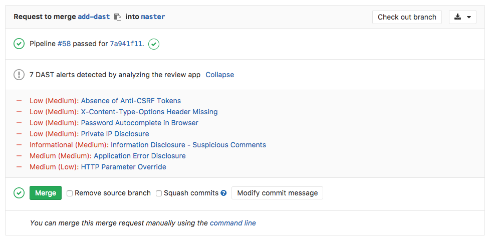
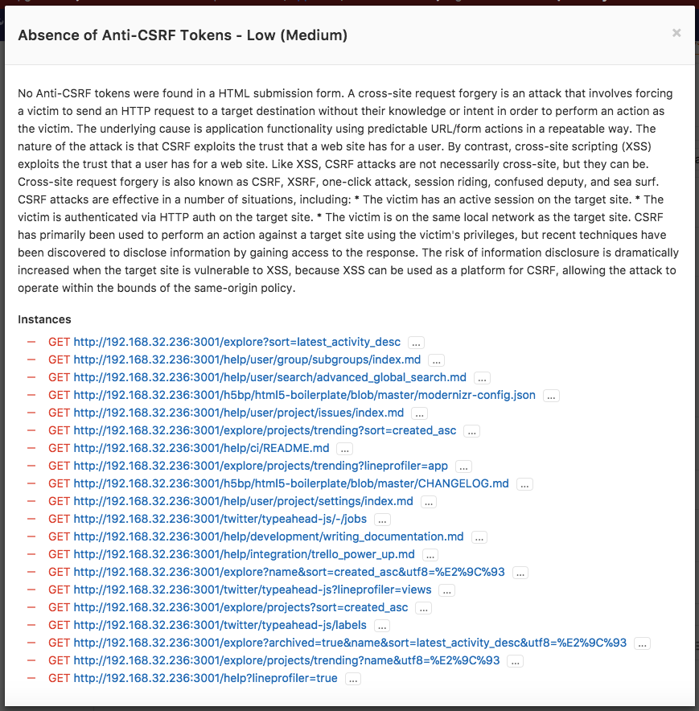

# Dynamic Application Security Testing (DAST) **[ULTIMATE]**

> [Introduced](https://gitlab.com/gitlab-org/gitlab-ee/issues/4348)
in [GitLab Ultimate](https://about.gitlab.com/pricing/) 10.4.

## Overview

Running [static checks](sast.md) on your code is the first step to detect
vulnerabilities that can put the security of your code at risk. Yet, once
deployed, your application is exposed to a new category of possible attacks,
such as cross-site scripting or broken authentication flaws. This is where
Dynamic Application Security Testing (DAST) comes into place.

If you are using [GitLab CI/CD](../../../ci/README.md), you can analyze your running web application(s)
for known vulnerabilities using Dynamic Application Security Testing (DAST).

You can take advantage of DAST by either [including the CI job](../../../ci/examples/dast.md) in
your existing `.gitlab-ci.yml` file or by implicitly using
[Auto DAST](../../../topics/autodevops/index.md#auto-dast-ultimate)
that is provided by [Auto DevOps](../../../topics/autodevops/index.md).

Going a step further, GitLab can show the vulnerability list right in the merge
request widget area.

## Use cases

It helps you automatically find security vulnerabilities in your running web
applications while you are developing and testing your applications.

## How it works

First of all, you need to define a job in your `.gitlab-ci.yml` file that generates the
[DAST report artifact](../../../ci/yaml/README.md#artifactsreportsdast).
For more information on how the DAST job should look like, check the
example on [Dynamic Application Security Testing with GitLab CI/CD](../../../ci/examples/dast.md).

GitLab then checks this report, compares the found vulnerabilities between the source and target
branches, and shows the information right on the merge request.

By clicking on one of the detected linked vulnerabilities, you will be able to
see the details and the URL(s) affected.

