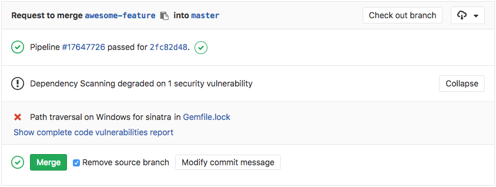

# Dependency Scanning **[ULTIMATE]**

> [Introduced][ee-5105] in [GitLab Ultimate][ee] 10.7.

## Overview

If you are using [GitLab CI/CD][ci], you can analyze your dependencies for known
vulnerabilities using Dependency Scanning, either by
including the CI job in your [existing `.gitlab-ci.yml` file][cc-docs] or
by implicitly using [Auto Dependency Scanning](../../../topics/autodevops/index.md#auto-dependency-scanning)
that is provided by [Auto DevOps](../../../topics/autodevops/index.md).

Going a step further, GitLab can show the vulnerability list right in the merge
request widget area.

## Use cases

It helps you automatically find security vulnerabilities in your dependencies
while you are developing and testing your applications. E.g. your application
is using an external (open source) library which is known to be vulnerable.

## Supported languages and dependency managers

The following languages and dependency managers are supported.

| Language (package managers)                                                 | Scan tool                                                                                                                         |
|-----------------------------------------------------------------------------|-----------------------------------------------------------------------------------------------------------------------------------|
| JavaScript ([npm](https://www.npmjs.com/), [yarn](https://yarnpkg.com/en/)) | [gemnasium](https://gitlab.com/gitlab-org/security-products/gemnasium/general), [Retire.js](https://retirejs.github.io/retire.js)         |
| Python ([pip](https://pip.pypa.io/en/stable/))                              | [gemnasium](https://gitlab.com/gitlab-org/security-products/gemnasium/general)                                                            |
| Ruby ([gem](https://rubygems.org/))                                         | [gemnasium](https://gitlab.com/gitlab-org/security-products/gemnasium/general), [bundler-audit](https://github.com/rubysec/bundler-audit) |
| Java ([Maven](https://maven.apache.org/))                                   | [gemnasium](https://gitlab.com/gitlab-org/security-products/gemnasium/general)                                                            |
| PHP ([Composer](https://getcomposer.org/))                                  | [gemnasium](https://gitlab.com/gitlab-org/security-products/gemnasium/general)                                                            |

Some scanners require to send a list of project dependencies to GitLab central servers to check for vulnerabilities. To learn more about this or to disable it please
check [GitLab Dependency Scanning documentation](https://gitlab.com/gitlab-org/security-products/dependency-scanning#remote-checks).

## How it works

First of all, you need to define a job named `dependency_scanning` in your
`.gitlab-ci.yml` file. [Check how the `dependency_scanning` job should look like][cc-docs].

In order for the report to show in the merge request, there are two
prerequisites:

- the specified job **must** be named `dependency_scanning`
- the resulting report **must** be named `gl-dependency-scanning-report.json`
  and uploaded as an artifact

The `dependency_scanning` job will perform an analysis on the application
dependencies, the resulting JSON file will be uploaded as an artifact, and
GitLab will then check this file and show the information inside the merge
request.

[ee-4682]: https://gitlab.com/gitlab-org/gitlab-ee/issues/4682
[ee-5105]: https://gitlab.com/gitlab-org/gitlab-ee/issues/5105
[ee]: https://about.gitlab.com/pricing/
[ci]: ../../../ci/README.md
[cc-docs]: ../../../ci/examples/dependency_scanning.md
