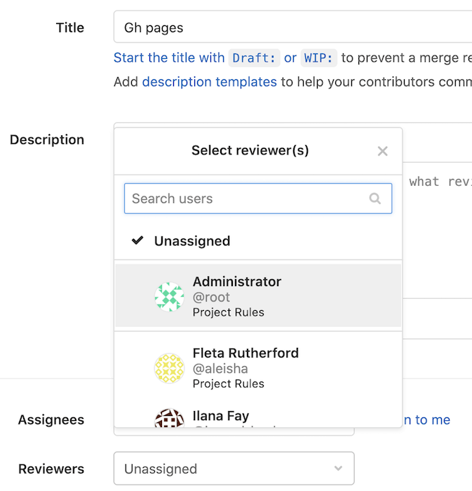
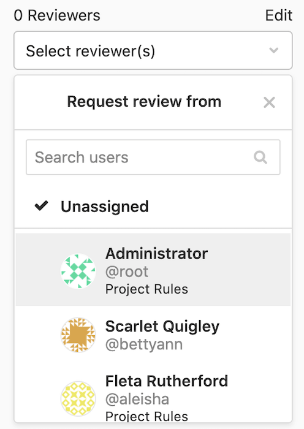

# Getting started with Merge Requests **(FREE)**

A Merge Request (**MR**) is the basis of GitLab as a code
collaboration and version control.

When working in a Git-based platform, you can use branching
strategies to collaborate on code.

A repository is composed by its _default branch_, which contains
the major version of the codebase, from which you create minor
branches, also called _feature branches_, to propose changes to
the codebase without introducing them directly into the major
version of the codebase.

Branching is especially important when collaborating with others,
avoiding changes to be pushed directly to the default branch
without prior reviews, tests, and approvals.

When you create a new feature branch, change the files, and push
it to GitLab, you have the option to create a **Merge Request**,
which is essentially a _request_ to merge one branch into another.

The branch you added your changes into is called _source branch_
while the branch you request to merge your changes into is
called _target branch_.

The target branch can be the default or any other branch, depending
on the branching strategies you choose.

In a merge request, beyond visualizing the differences between the
original content and your proposed changes, you can execute a
[significant number of tasks](#what-you-can-do-with-merge-requests)
before concluding your work and merging the merge request.

You can watch our [GitLab Flow video](https://www.youtube.com/watch?v=InKNIvky2KE) for
a quick overview of working with merge requests.

## How to create a merge request

Learn the various ways to [create a merge request](creating_merge_requests.md).

## What you can do with merge requests

When you start a new merge request, you can immediately include the following
options, or add them later by clicking the **Edit** button on the merge
request's page at the top-right side:

- [Assign](#assignee) the merge request to a colleague for review. With [multiple assignees](#multiple-assignees), you can assign it to more than one person at a time.
- Set a [milestone](../milestones/index.md) to track time-sensitive changes.
- Add [labels](../labels.md) to help contextualize and filter your merge requests over time.
- Require [approval](merge_request_approvals.md) from your team. **(PREMIUM)**
- [Close issues automatically](#merge-requests-to-close-issues) when they are merged.
- Enable the [delete source branch when merge request is accepted](#deleting-the-source-branch) option to keep your repository clean.
- Enable the [squash commits when merge request is accepted](squash_and_merge.md) option to combine all the commits into one before merging, thus keep a clean commit history in your repository.
- Set the merge request as a [**Draft**](work_in_progress_merge_requests.md) to avoid accidental merges before it is ready.

After you have created the merge request, you can also:

- [Discuss](../../discussions/index.md) your implementation with your team in the merge request thread.
- [Perform inline code reviews](reviewing_and_managing_merge_requests.md#perform-inline-code-reviews).
- Add [merge request dependencies](merge_request_dependencies.md) to restrict it to be merged only when other merge requests have been merged. **(PREMIUM)**
- Preview continuous integration [pipelines on the merge request widget](reviewing_and_managing_merge_requests.md#pipeline-status-in-merge-requests-widgets).
- Preview how your changes look directly on your deployed application with [Review Apps](reviewing_and_managing_merge_requests.md#live-preview-with-review-apps).
- [Allow collaboration on merge requests across forks](allow_collaboration.md).
- Perform a [Review](../../discussions/index.md#merge-request-reviews) to create multiple comments on a diff and publish them when you're ready.
- Add [code suggestions](../../discussions/index.md#suggest-changes) to change the content of merge requests directly into merge request threads, and easily apply them to the codebase directly from the UI.
- Add a time estimation and the time spent with that merge request with [Time Tracking](../time_tracking.md#time-tracking).

Many of these can be set when pushing changes from the command line,
with [Git push options](../push_options.md).

See also other [features associated to merge requests](reviewing_and_managing_merge_requests.md#associated-features).

### Assignee

Choose an assignee to designate someone as the person responsible
for the first [review of the merge request](reviewing_and_managing_merge_requests.md).
Open the drop down box to search for the user you wish to assign,
and the merge request will be added to their
[assigned merge request list](../../search/index.md#issues-and-merge-requests).

#### Multiple assignees **(PREMIUM)**

> - [Introduced](https://gitlab.com/gitlab-org/gitlab/-/issues/2004) in GitLab 11.11.
> - Moved to GitLab Premium in 13.9

Multiple people often review merge requests at the same time.
GitLab allows you to have multiple assignees for merge requests
to indicate everyone that is reviewing or accountable for it.


To assign multiple assignees to a merge request:

1. From a merge request, expand the right sidebar and locate the **Assignees** section.
1. Click on **Edit** and from the dropdown menu, select as many users as you want
   to assign the merge request to.

Similarly, assignees are removed by deselecting them from the same
dropdown menu.

It is also possible to manage multiple assignees:

- When creating a merge request.
- Using [quick actions](../quick_actions.md#quick-actions-for-issues-merge-requests-and-epics).

### Reviewer

> - [Introduced](https://gitlab.com/gitlab-org/gitlab/-/issues/216054) in GitLab 13.5.
> - [Feature flag removed](https://gitlab.com/gitlab-org/gitlab/-/issues/245190) in GitLab 13.9.

WARNING:
Requesting a code review is an important part of contributing code. However, deciding who should review
your code and asking for a review are no easy tasks. Using the "assignee" field for both authors and
reviewers makes it hard for others to determine who's doing what on a merge request.

GitLab Merge Request Reviewers easily allow authors to request a review as well as see the status of the
review. By selecting one or more users from the **Reviewers** field in the merge request's right-hand
sidebar, the assigned reviewers will receive a notification of the request to review the merge request.

This makes it easy to determine the relevant roles for the users involved in the merge request, as well as formally requesting a review from a peer.

To request it, open the **Reviewers** drop-down box to search for the user you wish to get a review from.

#### Approval Rule information for Reviewers **(PREMIUM)**

> - [Introduced](https://gitlab.com/gitlab-org/gitlab/-/issues/233736) in GitLab 13.8. For this version only, GitLab administrators can opt to [enable it](#enable-or-disable-approval-rule-information).
> - [Feature flag removed](https://gitlab.com/gitlab-org/gitlab/-/issues/293742) in GitLab 13.9.

When editing the **Reviewers** field in a new or existing merge request, GitLab
displays the name of the matching [approval rule](merge_request_approvals.md#approval-rules)
below the name of each suggested reviewer. [Code Owners](../code_owners.md) are displayed as `Codeowner` without group detail.

This example shows reviewers and approval rules when creating a new merge request:



This example shows reviewers and approval rules in a merge request sidebar:



#### Requesting a new review

> [Introduced](https://gitlab.com/gitlab-org/gitlab/-/issues/293933) in GitLab 13.9.

After a reviewer completes their [merge request reviews](../../discussions/index.md),
the author of the merge request can request a new review from the reviewer:

1. If the right sidebar in the merge request is collapsed, click the
   **{chevron-double-lg-left}** **Expand Sidebar** icon to expand it.
1. In the **Reviewers** section, click the **Re-request a review** icon (**{redo}**)
   next to the reviewer's name.

GitLab creates a new [to-do item](../../todos.md) for the reviewer, and sends
them a notification email.

### Merge requests to close issues

If the merge request is being created to resolve an issue, you can
add a note in the description which sets it to
[automatically close the issue](../issues/managing_issues.md#closing-issues-automatically)
when merged.

If the issue is [confidential](../issues/confidential_issues.md),
you may want to use a different workflow for
[merge requests for confidential issues](../issues/confidential_issues.md#merge-requests-for-confidential-issues)
to prevent confidential information from being exposed.

### Deleting the source branch

When creating a merge request, select the
**Delete source branch when merge request accepted** option, and the source
branch is deleted when the merge request is merged. To make this option
enabled by default for all new merge requests, enable it in the
[project's settings](../settings/index.md#merge-request-settings).

This option is also visible in an existing merge request next to
the merge request button and can be selected or deselected before merging.
It is only visible to users with [Maintainer permissions](../../permissions.md)
in the source project.

If the user viewing the merge request does not have the correct
permissions to delete the source branch and the source branch
is set for deletion, the merge request widget displays the
**Deletes source branch** text.


## Recommendations and best practices for Merge Requests

- When working locally in your branch, add multiple commits and only push when
  you're done, so GitLab runs only one pipeline for all the commits pushed
  at once. By doing so, you save pipeline minutes.
- Delete feature branches on merge or after merging them to keep your repository clean.
- Take one thing at a time and ship the smallest changes possible. By doing so,
  reviews are faster and your changes are less prone to errors.
- Do not use capital letters nor special chars in branch names.

## Enable or disable Approval Rule information **(PREMIUM SELF)**

> - [Feature flag removed](https://gitlab.com/gitlab-org/gitlab/-/issues/293742) in GitLab 13.9.

Merge Request Reviewers is under development and ready for production use.
It is deployed behind a feature flag that is **enabled by default**.
[GitLab administrators with access to the GitLab Rails console](../../../administration/feature_flags.md)
can opt to disable it.

To enable it:

```ruby
# For the instance
Feature.enable(:reviewer_approval_rules)
# For a single project
Feature.enable(:reviewer_approval_rules, Project.find(<project id>))
```

To disable it:

```ruby
# For the instance
Feature.disable(:reviewer_approval_rules)
# For a single project
Feature.disable(:reviewer_approval_rules, Project.find(<project id>))
```
