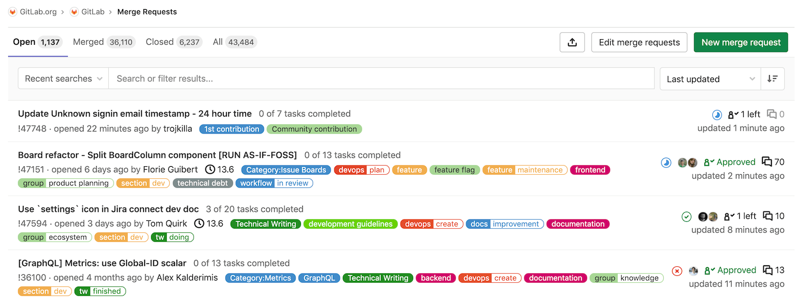

# Merge requests **(FREE)**

Merge requests (MRs) are the way you check source code changes into a branch.
When you open a merge request, you can visualize and collaborate on the code changes before merge.
Merge requests include:

- A description of the request.
- Code changes and inline code reviews.
- Information about CI/CD pipelines.
- A comment section for discussion threads.
- The list of commits.

To get started, read the [introduction to merge requests](getting_started.md).

## Merge request tabs

Merge requests contain tabs at the top of the page to help you navigate to
important parts of the merge request:

- **Overview**: Contains the description, notifications from pipelines, and a
  discussion area for [comment threads](../../discussions/index.md#resolvable-comments-and-threads)
  and [code suggestions](reviews/suggestions.md). The right sidebar provides fields
  to add assignees, reviewers, labels, and a milestone to your work, and the
  [merge request widgets area](widgets.md) reports results from pipelines and tests.
- **Commits**: Contains a list of commits added to this merge request. For more
  information, read [Commits tab in merge requests](commits.md).
- **Pipelines**: If configured, contains a list of recent [GitLab CI/CD](../../../ci/README.md)
  pipelines and their status.
- **Changes**: Contains the diffs of files changed by this merge request. You can
  [configure the display](changes.md).

## View merge requests

You can view merge requests for a specific project, or for all projects in a group:

- **Specific project**: Go to your project and select **Merge requests**.
- **All projects in a group**: Go to your group and select **Merge requests**.
  If your group contains subgroups, this view also displays merge requests from the subgroup projects.
  GitLab displays a count of open merge requests in the left sidebar, but
  [caches the value](reviews/index.md#cached-merge-request-count) for groups with a large number of
  open merge requests.

GitLab displays open merge requests, with tabs to filter the list by open and closed status:

You can [search and filter](../../search/index.md#filtering-issue-and-merge-request-lists),
the results, or select a merge request to begin a review.

## Merge request sidebar

The **Overview** tab of a merge request displays a sidebar. In this sidebar, you
can assign, categorize, and track progress on a merge request:

- [**Assignee**](getting_started.md#assignee): Designate the directly responsible
  individual (DRI) for a merge request. With
  [multiple assignees](getting_started.md#multiple-assignees), you can assign a
  merge request to more than one person at a time.
- [**Reviewer**](reviews/index.md): Designate a team member to review a merge request.
  Higher tiers can assign multiple reviewers, and [require approvals](approvals/index.md)
  from these reviewers.
- [**Milestone**](../milestones/index.md): Track time-sensitive changes.
- [**Time tracking**](../time_tracking.md): Time spent on a merge request.
- [**Labels**](../labels.md): Categorize a merge request and display it on
  appropriate [issue boards](../issue_board.md).
- **Participants**: A list of users participating or watching a merge request.
- [**Notifications**](../../profile/notifications.md): A toggle to select whether
  or not to receive notifications for updates to a merge request.

## Close a merge request

When a merge request is merged, it closes, but you can still view it, and the
pipelines associated with it. If you decide to permanently stop work on a merge request,
GitLab recommends you close the merge request, rather than
[delete it](#delete-a-merge-request). To close a merge request:

1. Go to the merge request you want to close.
1. Scroll to the comment box, at the bottom of the page.
1. Below the comment box, select **Close merge request**.

GitLab closes the merge request, but preserves records of the merge request,
its comments, and any associated pipelines.

### Delete a merge request

GitLab recommends you close, rather than delete, merge requests. Delete a merge request
only in extraordinary circumstances, when you need to completely remove all traces of a
merge request. When you delete a merge request, GitLab also deletes all comments,
pipelines, and uploaded assets attached to the merge request. You cannot undo this action.

To delete a merge request:

1. Sign in to GitLab as a user with the project [Owner](../../permissions.md) role.
   Only users with this role can delete merge requests in a project.
1. Go to the merge request you want to delete, and select **Edit**.
1. Scroll to the bottom of the page, and select **Delete merge request**.

## Merge request workflows

For a software developer working in a team:

1. You checkout a new branch, and submit your changes through a merge request.
1. You gather feedback from your team.
1. You work on the implementation optimizing code with [Code Quality reports](code_quality.md).
1. You verify your changes with [Unit test reports](../../../ci/unit_test_reports.md) in GitLab CI/CD.
1. You avoid using dependencies whose license is not compatible with your project with [License Compliance reports](../../compliance/license_compliance/index.md).
1. You request the [approval](approvals/index.md) from your manager.
1. Your manager:
   1. Pushes a commit with their final review.
   1. [Approves the merge request](approvals/index.md).
   1. Sets it to [merge when pipeline succeeds](merge_when_pipeline_succeeds.md).
1. Your changes get deployed to production with [manual actions](../../../ci/yaml/README.md#whenmanual) for GitLab CI/CD.
1. Your implementations were successfully shipped to your customer.

For a web developer writing a webpage for your company's website:

1. You checkout a new branch and submit a new page through a merge request.
1. You gather feedback from your reviewers.
1. You preview your changes with [Review Apps](../../../ci/review_apps/index.md).
1. You request your web designers for their implementation.
1. You request the [approval](approvals/index.md) from your manager.
1. Once approved, your merge request is [squashed and merged](squash_and_merge.md), and [deployed to staging with GitLab Pages](https://about.gitlab.com/blog/2021/02/05/ci-deployment-and-environments/).
1. Your production team [cherry picks](cherry_pick_changes.md) the merge commit into production.

## Related topics

- [Create a merge request](creating_merge_requests.md)
- [Review and manage merge requests](reviews/index.md)
- [Authorization for merge requests](authorization_for_merge_requests.md)
- [Testing and reports](testing_and_reports_in_merge_requests.md)
