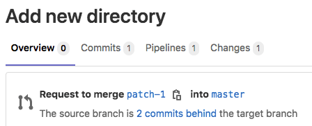

# Merge requests **(FREE)**

Merge requests (MRs) are the way you check source code changes into a branch.

When you open a merge request, you can visualize and collaborate on the code changes before merge.
Merge requests include:

- A description of the request.
- Code changes and inline code reviews.
- Information about CI/CD pipelines.
- A comment section for discussion threads.
- The list of commits.

To get started, read the [introduction to merge requests](getting_started.md).

## Merge request workflows

For a software developer working in a team:

1. You checkout a new branch, and submit your changes through a merge request.
1. You gather feedback from your team.
1. You work on the implementation optimizing code with [Code Quality reports](code_quality.md).
1. You verify your changes with [Unit test reports](../../../ci/unit_test_reports.md) in GitLab CI/CD.
1. You avoid using dependencies whose license is not compatible with your project with [License Compliance reports](../../compliance/license_compliance/index.md).
1. You request the [approval](merge_request_approvals.md) from your manager.
1. Your manager:
   1. Pushes a commit with their final review.
   1. [Approves the merge request](merge_request_approvals.md).
   1. Sets it to [merge when pipeline succeeds](merge_when_pipeline_succeeds.md).
1. Your changes get deployed to production with [manual actions](../../../ci/yaml/README.md#whenmanual) for GitLab CI/CD.
1. Your implementations were successfully shipped to your customer.

For a web developer writing a webpage for your company's website:

1. You checkout a new branch and submit a new page through a merge request.
1. You gather feedback from your reviewers.
1. You preview your changes with [Review Apps](../../../ci/review_apps/index.md).
1. You request your web designers for their implementation.
1. You request the [approval](merge_request_approvals.md) from your manager.
1. Once approved, your merge request is [squashed and merged](squash_and_merge.md), and [deployed to staging with GitLab Pages](https://about.gitlab.com/blog/2021/02/05/ci-deployment-and-environments/).
1. Your production team [cherry picks](cherry_pick_changes.md) the merge commit into production.

## Merge request navigation tabs at the top

> [Introduced](https://gitlab.com/gitlab-org/gitlab/-/issues/33813) in GitLab 12.6. This positioning is experimental.

In GitLab 12.5 and earlier, navigation tabs in merge requests (**Discussion**,
**Commits**, **Pipelines**, and **Changes**) were located after the merge request
widget.

To facilitate navigation without scrolling, and based on user feedback, the tabs are
now located at the top of the merge request tab. A new **Overview** tab was added,
and next to **Overview** are **Commits**, **Pipelines**, and **Changes**.



This change is behind a feature flag that is enabled by default. For
self-managed instances, it can be disabled through the Rails console by a GitLab
administrator with the following command:

```ruby
Feature.disable(:mr_tabs_position)
```

## Related topics

- [Create a merge request](creating_merge_requests.md)
- [Review and manage merge requests](reviewing_and_managing_merge_requests.md)
- [Authorization for merge requests](authorization_for_merge_requests.md)
- [Testing and reports](testing_and_reports_in_merge_requests.md)
