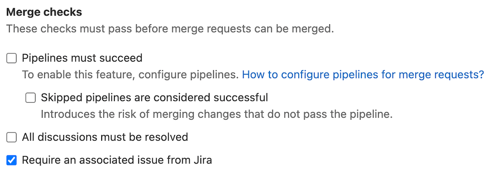

# Only allow merge requests to be merged if there is an associated Jira issue **(ULTIMATE)**

> [Introduced](https://gitlab.com/gitlab-org/gitlab/-/issues/280766) in [GitLab Premium](https://about.gitlab.com/pricing/) 13.12 behind a feature flag, enabled by default.

You can prevent merge requests from being merged if it does not [refer to a Jira issue](../../../integration/jira/development_panel.md#use-the-integration).

To enforce this, navigate to your project's setting page, and select the **Require an associated issue from Jira** check box and click **Save** for the changes to take effect.

Once enabled, you won't be able to merge until the merge request has an associated Jira issue.

