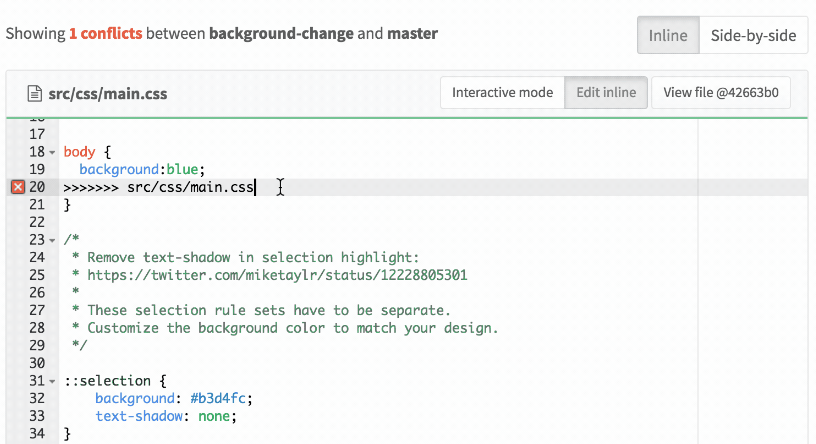

# Merge request conflict resolution

Merge conflicts occur when two branches have different changes that cannot be
merged automatically.

Git is able to automatically merge changes between branches in most cases, but
there are situations where Git will require your assistance to resolve the
conflicts manually. Typically, this is necessary when people change the same
parts of the same files.

GitLab will prevent merge requests from being merged until all conflicts are
resolved. Conflicts can be resolved locally, or in many cases within GitLab
(see [conflicts available for resolution](#conflicts-available-for-resolution)
for information on when this is available).

NOTE:
GitLab resolves conflicts by creating a merge commit in the source branch that
is not automatically merged into the target branch. This allows the merge
commit to be reviewed and tested before the changes are merged, preventing
unintended changes entering the target branch without review or breaking the
build.

## Resolve conflicts: interactive mode

> [Introduced](https://gitlab.com/gitlab-org/gitlab-foss/-/merge_requests/5479) in GitLab 8.11.

Clicking this will show a list of files with conflicts, with conflict sections
highlighted:

Once all conflicts have been marked as using 'ours' or 'theirs', the conflict
can be resolved. This will perform a merge of the target branch of the merge
request into the source branch, resolving the conflicts using the options
chosen. If the source branch is `feature` and the target branch is `master`,
this is similar to performing `git checkout feature; git merge master` locally.

## Resolve conflicts: inline editor

> [Introduced](https://gitlab.com/gitlab-org/gitlab-foss/-/merge_requests/6374) in GitLab 8.13.

The merge conflict resolution editor allows for more complex merge conflicts,
which require the user to manually modify a file in order to resolve a conflict,
to be solved right form the GitLab interface. Use the **Edit inline** button
to open the editor. Once you're sure about your changes, hit the
**Commit to source branch** button.

## Conflicts available for resolution

GitLab allows resolving conflicts in a file where all of the below are true:

- The file is text, not binary
- The file is in a UTF-8 compatible encoding
- The file does not already contain conflict markers
- The file, with conflict markers added, is not over 200 KB in size
- The file exists under the same path in both branches

If any file with conflicts in that merge request does not meet all of these
criteria, the conflicts for that merge request cannot be resolved in the UI.

Additionally, GitLab does not detect conflicts in renames away from a path. For
example, this will not create a conflict: on branch `a`, doing `git mv file1
file2`; on branch `b`, doing `git mv file1 file3`. Instead, both files will be
present in the branch after the merge request is merged.

<!-- ## Troubleshooting

Include any troubleshooting steps that you can foresee. If you know beforehand what issues
one might have when setting this up, or when something is changed, or on upgrading, it's
important to describe those, too. Think of things that may go wrong and include them here.
This is important to minimize requests for support, and to avoid doc comments with
questions that you know someone might ask.

Each scenario can be a third-level heading, e.g. `### Getting error message X`.
If you have none to add when creating a doc, leave this section in place
but commented out to help encourage others to add to it in the future. -->
