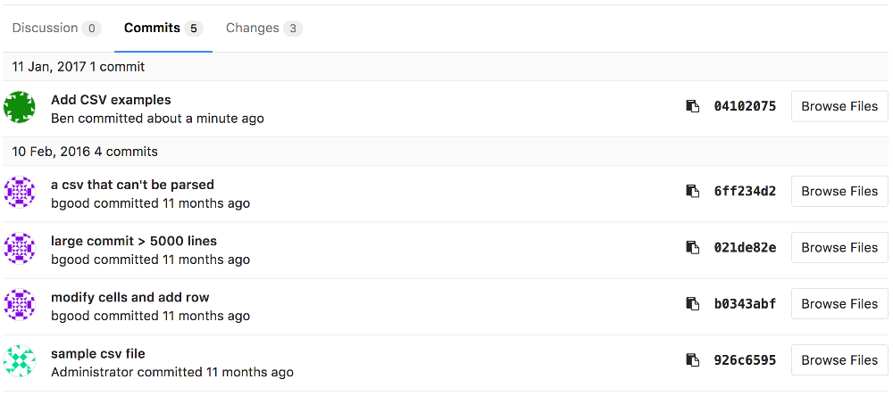
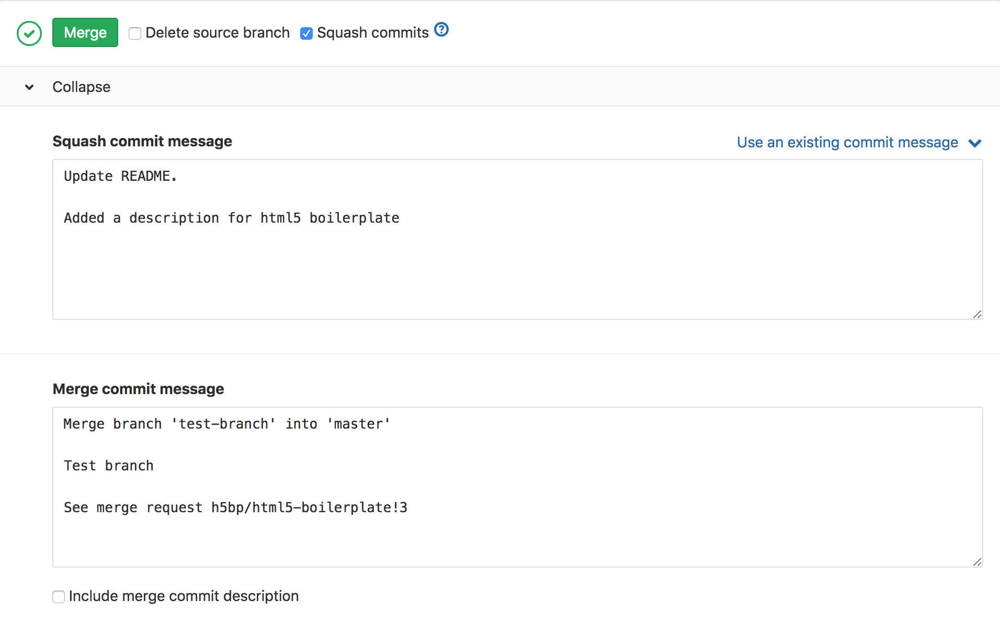

# Squash and merge

> - [Introduced](https://gitlab.com/gitlab-org/gitlab/-/merge_requests/1024) in [GitLab Starter](https://about.gitlab.com/pricing/) 8.17.
> - [Ported](https://gitlab.com/gitlab-org/gitlab-foss/-/merge_requests/18956) to GitLab Core 11.0.

With squash and merge you can combine all your merge request's commits into one
and retain a clean history.

## Overview

Squashing lets you tidy up the commit history of a branch when accepting a merge
request. It applies all of the changes in the merge request as a single commit,
and then merges that commit using the merge method set for the project.

In other words, squashing a merge request turns a long list of commits:



Into a single commit on merge:


NOTE: **Note:**
The squashed commit in this example is followed by a merge commit, because the merge method for this repository uses a merge commit. You can disable merge commits in
**Project Settings > General > Merge requests > Merge method > Fast-forward merge**.

The squashed commit's commit message will be either:

- Taken from the first multi-line commit message in the merge.
- The merge request's title if no multi-line commit message is found.

NOTE: **Note:**
This only takes effect if there are at least 2 commits. As there is nothing to squash, the commit message does not change if there is only 1 commit.

It can be customized before merging a merge request.



Squashing also works with the fast-forward merge strategy, see [squashing and fast-forward merge](#squash-and-fast-forward-merge) for more details.

## Use cases

When working on a feature branch, you sometimes want to commit your current
progress, but don't really care about the commit messages. Those 'work in
progress commits' don't necessarily contain important information and as such
you'd rather not include them in your target branch.

With squash and merge, when the merge request is ready to be merged,
all you have to do is enable squashing before you press merge to join
the commits in the merge request into a single commit.

This way, the history of your base branch remains clean with
meaningful commit messages and:

- It's simpler to [revert](revert_changes.md) if necessary.
- The merged branch will retain the full commit history.

## Enabling squash for a merge request

Anyone who can create or edit a merge request can choose for it to be squashed
on the merge request form. Users can select or unselect the checkbox at the moment
they are creating the merge request:


After the merge request is submitted, Squash and Merge can still be enabled or disabled
by editing the merge request description:

1. Scroll to the top of the merge request page and click **Edit**.
1. Scroll down to the end of the merge request form and select the checkbox
**Squash commits when merge request is accepted**.

This setting can then be overridden at the time of accepting the merge request.
At the end of the merge request widget, next to the **Merge** button, the **Squash commits** checkbox
can be either selected or unselected:


Note that Squash and Merge might not be available depending on the project's configuration
for [Squash Commit Options](#squash-commits-options).

## Commit metadata for squashed commits

The squashed commit has the following metadata:

- Message: the message of the squash commit, or a customized message.
- Author: the author of the merge request.
- Committer: the user who initiated the squash.

## Squash and fast-forward merge

When a project has the [fast-forward merge setting enabled](fast_forward_merge.md#enabling-fast-forward-merges), the merge
request must be able to be fast-forwarded without squashing in order to squash
it. This is because squashing is only available when accepting a merge request,
so a merge request may need to be rebased before squashing, even though
squashing can itself be considered equivalent to rebasing.

## Squash Commits Options

> - [Introduced](https://gitlab.com/gitlab-org/gitlab/-/issues/17613) in GitLab 13.2.
> - It was deployed behind a feature flag, disabled by default.
> - [Became enabled by default](https://gitlab.com/gitlab-org/gitlab/-/merge_requests/39382) on GitLab 13.3.
> - It's enabled on GitLab.com.
> - It can be enabled per project.
> - It's recommended for production use.
> - For GitLab self-managed instances, GitLab administrators can opt to [disable it](#enable-or-disable-squash-commit-options-core-only). **(CORE ONLY)**

With Squash Commits Options you can configure the behavior of Squash and Merge for your project.
To set it up, navigate to your project's **Settings > General** and expand **Merge requests**.
You will find the following options to choose, which will affect existing and new merge requests
submitted to your project:

- **Do not allow**: users cannot use Squash and Merge to squash all the commits immediately before
  merging. The checkbox to enable or disable it will be unchecked and hidden from the users.
- **Allow**: users will have the option to enable Squash and Merge on a merge request basis.
  The checkbox will be unchecked (disabled) by default, but and the user is allowed to enable it.
- **Encourage**: users will have the option to enable Squash and Merge on a merge request basis.
  The checkbox will be checked (enabled) by default to encourage its use, but the user is allowed to
  disable it.
- **Require**: Squash and Merge is enabled for all merge requests, so it will always be performed.
  The checkbox to enable or disable it will be checked and hidden from the users.

The Squash and Merge checkbox is displayed when you create a merge request and when you edit the description of an existing one, except when Squash Commit Options is set to **Do not allow** or **Require**.

NOTE: **Note:**
If your project is set to **Do not allow** Squash and Merge, the users still have the option to
squash commits locally through the command line and force-push to their remote branch before merging.

### Enable or disable Squash Commit Options **(CORE ONLY)**

Squash Commit Options is under development but ready for production use. It is
deployed behind a feature flag that is **enabled by default**.
[GitLab administrators with access to the GitLab Rails console](../../../administration/feature_flags.md)
can opt to disable it.

To enable it:

```ruby
# Instance-wide
Feature.enable(:squash_options)
# or by project
Feature.enable(:squash_options, Project.find(<project ID>))
```

To disable it:

```ruby
# Instance-wide
Feature.disable(:squash_options)
# or by project
Feature.disable(:squash_options, Project.find(<project ID>))
```

<!-- ## Troubleshooting

Include any troubleshooting steps that you can foresee. If you know beforehand what issues
one might have when setting this up, or when something is changed, or on upgrading, it's
important to describe those, too. Think of things that may go wrong and include them here.
This is important to minimize requests for support, and to avoid doc comments with
questions that you know someone might ask.

Each scenario can be a third-level heading, e.g. `### Getting error message X`.
If you have none to add when creating a doc, leave this section in place
but commented out to help encourage others to add to it in the future. -->
