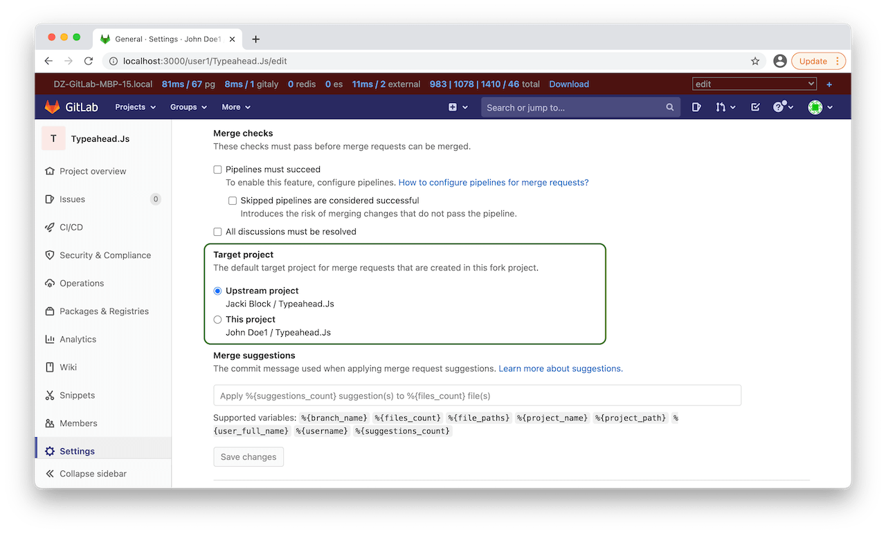

# Target project for merge requests coming from forks **(FREE)**

The merge request has a source and a target projects. A source is the project where changes are coming from.
The target it the project where we wish for changes to be merged in. A source and a target projects 
are the same unless forking involed. When you fork the project you have 2 common scenarios. When you
create a new merge request you either target upstream project (the project you forked). Or you target your own fork. 

When you create a new merge request, GitLab often pre-fill the target project for you. 
By default it uses an upstream project as a target for a new merge request. 
But if you need to create merge requests from your fork to your fork this can be inconvenient.

To prevent users throught going extra clicks every time they create a merge request from their fork
to their fork, we introduced a target project option. You can find it under project Settings > General > Merge requests. 

