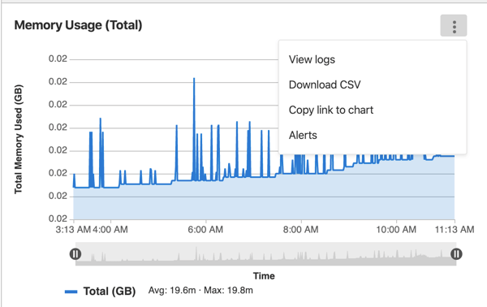
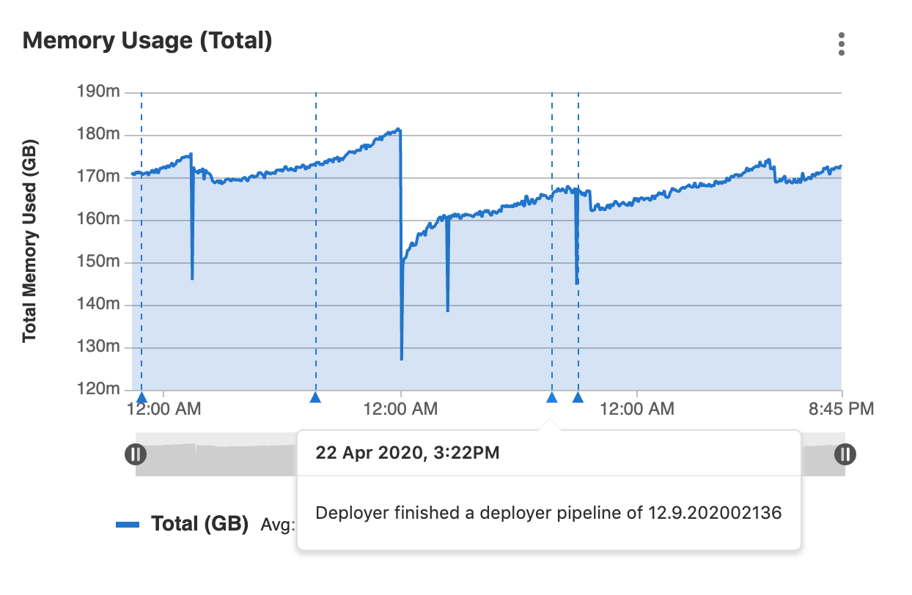

# Actions that can be performed on dashboards

## View and edit the source file of a custom dashboard

> [Introduced](https://gitlab.com/gitlab-org/gitlab/issues/34779) in GitLab 12.5.

When viewing a custom dashboard of a project, you can view the original
`.yml` file by clicking on the **Edit dashboard** button.

## Chart Context Menu

From each of the panels in the dashboard, you can access the context menu by clicking the **{ellipsis_v}** **More actions** dropdown box above the upper right corner of the panel to take actions related to the chart's data.

The options are:

- [View logs](#view-logs-ultimate)
- [Download CSV](#downloading-data-as-csv)
- [Copy link to chart](#embedding-gitlab-managed-kubernetes-metrics)
- [Alerts](#setting-up-alerts-for-prometheus-metrics)

## Dashboard Annotations

> - [Introduced](https://gitlab.com/gitlab-org/gitlab/issues/211330) in GitLab 12.10 (enabled by feature flag `metrics_dashboard_annotations`).
> - [Feature flag removed](https://gitlab.com/gitlab-org/gitlab/-/issues/215224) in GitLab 13.0.

You can use **Metrics Dashboard Annotations** to mark any important events on
every metrics dashboard by adding annotations to it. While viewing a dashboard,
annotation entries assigned to the selected time range will be automatically
fetched and displayed on every chart within that dashboard. On mouse hover, each
annotation presents additional details, including the exact time of an event and
its description.

You can create annotations by making requests to the
[Metrics dashboard annotations API](../../../api/metrics_dashboard_annotations.md)

## View Logs **(ULTIMATE)**

> [Introduced](https://gitlab.com/gitlab-org/gitlab/issues/122013) in GitLab 12.8.

If you have [Logs](../clusters/kubernetes_pod_logs.md) enabled,
you can navigate from the charts in the dashboard to view Logs by
clicking on the context menu in the upper-right corner.

If you use the **Timeline zoom** function at the bottom of the chart, logs will narrow down to the time range you selected.

## Timeline zoom and URL sharing

> [Introduced](https://gitlab.com/gitlab-org/gitlab/-/issues/198910) in GitLab 12.8.

You can use the **Timeline zoom** function at the bottom of a chart to zoom in
on a date and time of your choice. When you click and drag the sliders to select
a different beginning or end date of data to display, GitLab adds your selected start
and end times to the URL, enabling you to share specific timeframes more easily.

## Downloading data as CSV

Data from Prometheus charts on the metrics dashboard can be downloaded as CSV.

## Setting up alerts for Prometheus metrics

### Managed Prometheus instances

> [Introduced](https://gitlab.com/gitlab-org/gitlab/-/merge_requests/6590) in [GitLab Ultimate](https://about.gitlab.com/pricing/) 11.2 for [custom metrics](../integrations/prometheus.md#adding-custom-metrics), and 11.3 for [library metrics](../integrations/prometheus_library/index.md).

For managed Prometheus instances using auto configuration, alerts for metrics [can be configured](../integrations/prometheus.md#adding-custom-metrics) directly in the performance dashboard.

To set an alert:

1. Click on the ellipsis icon in the top right corner of the metric you want to create the alert for.
1. Choose **Alerts**
1. Set threshold and operator.
1. Click **Add** to save and activate the alert.

To remove the alert, click back on the alert icon for the desired metric, and click **Delete**.

## Editing custom metrics from the dashboard

> [Introduced](https://gitlab.com/gitlab-org/gitlab/issues/208976) in GitLab 12.9.

You can edit existing custom metrics by clicking the **{ellipsis_v}** **More actions** dropdown and selecting **Edit metric**.

