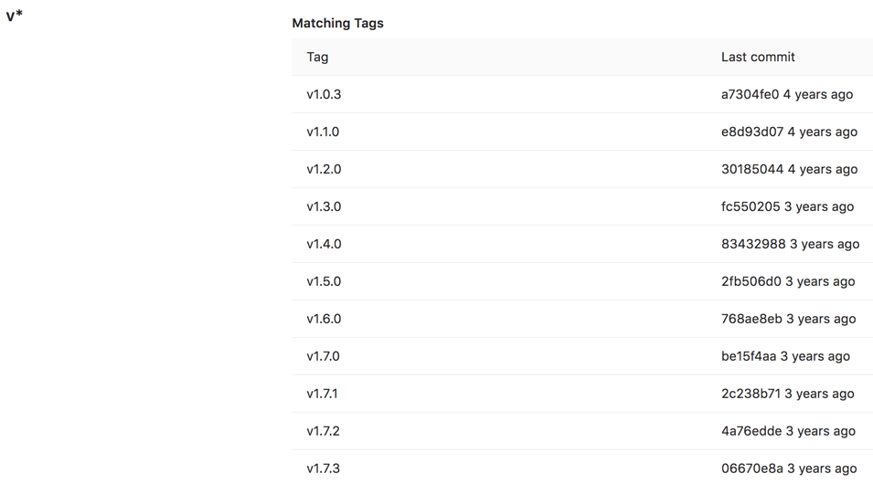

# Protected Tags

> [Introduced][ce-10356] in GitLab 9.1.

Protected Tags allow control over who has permission to create tags as well as preventing accidental update or deletion once created. Each rule allows you to match either an individual tag name, or use wildcards to control multiple tags at once.

This feature evolved out of [Protected Branches](protected_branches.md)

## Overview

Protected tags will prevent anyone from updating or deleting the tag, as and will prevent creation of matching tags based on the permissions you have selected. By default, anyone without Maintainer permission will be prevented from creating tags.

## Configuring protected tags

To protect a tag, you need to have at least Maintainer permission level.

1. Navigate to the project's **Settings > Repository**:

    

1. From the **Tag** dropdown menu, select the tag you want to protect or type and click **Create wildcard**. In the screenshot below, we chose to protect all tags matching `v*`:

    

1. From the **Allowed to create** dropdown, select who will have permission to create matching tags and then click **Protect**:

    

1. Once done, the protected tag will appear in the **Protected tags** list:

    

## Wildcard protected tags

You can specify a wildcard protected tag, which will protect all tags
matching the wildcard. For example:

| Wildcard Protected Tag | Matching Tags                 |
|------------------------|-------------------------------|
| `v*`                   | `v1.0.0`, `version-9.1`       |
| `*-deploy`             | `march-deploy`, `1.0-deploy`  |
| `*gitlab*`             | `gitlab`, `gitlab/v1`         |
| `*`                    | `v1.0.1rc2`, `accidental-tag` |

Two different wildcards can potentially match the same tag. For example,
`*-stable` and `production-*` would both match a `production-stable` tag.
In that case, if _any_ of these protected tags have a setting like
**Allowed to create**, then `production-stable` will also inherit this setting.

If you click on a protected tag's name, you will be presented with a list of
all matching tags:

<!-- ## Troubleshooting

Include any troubleshooting steps that you can foresee. If you know beforehand what issues
one might have when setting this up, or when something is changed, or on upgrading, it's
important to describe those, too. Think of things that may go wrong and include them here.
This is important to minimize requests for support, and to avoid doc comments with
questions that you know someone might ask.

Each scenario can be a third-level heading, e.g. `### Getting error message X`.
If you have none to add when creating a doc, leave this section in place
but commented out to help encourage others to add to it in the future. -->

[ce-10356]: https://gitlab.com/gitlab-org/gitlab-ce/merge_requests/10356 "Protected Tags"
