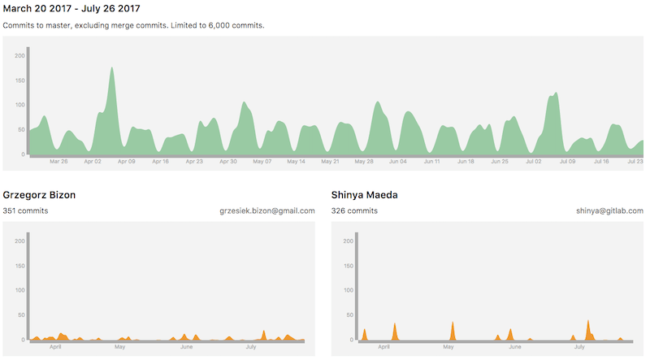
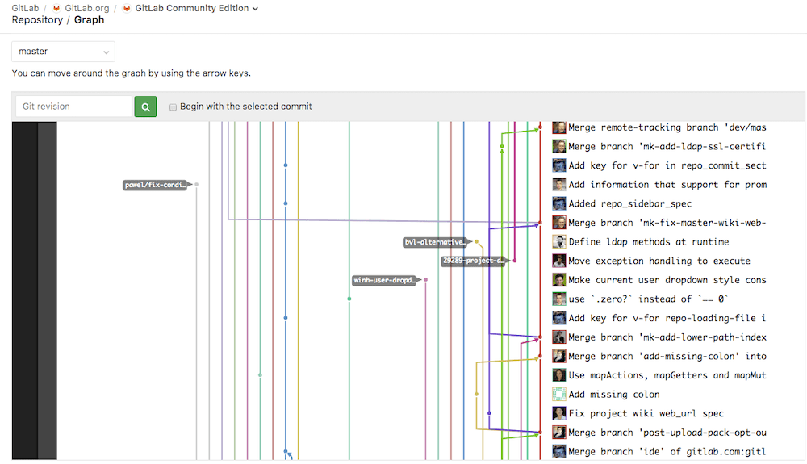
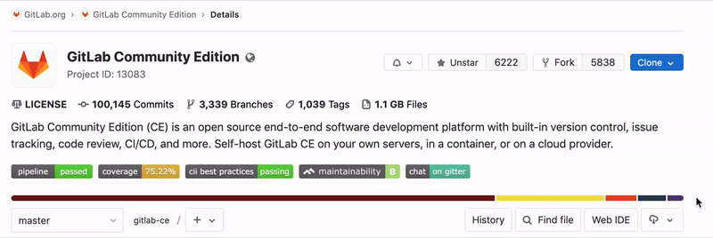

# Repository

A [repository](https://git-scm.com/book/en/v2/Git-Basics-Getting-a-Git-Repository)
is what you use to store your codebase in GitLab and change it with version control.
A repository is part of a [project](../index.md), which has a lot of other features.

## Create a repository

To create a new repository, all you need to do is
[create a new project](../../../gitlab-basics/create-project.md) or
[fork an existing project](forking_workflow.md).

Once you create a new project, you can add new files via UI
(read the section below) or via command line.
To add files from the command line, follow the instructions that will
be presented on the screen when you create a new project, or read
through them in the [command line basics](../../../gitlab-basics/start-using-git.md)
documentation.

> **Important:**
For security reasons, when using the command line, we strongly recommend
that you [connect with GitLab via SSH](../../../ssh/README.md).

## Files

### Create and edit files

Host your codebase in GitLab repositories by pushing your files to GitLab.
You can either use the user interface (UI), or connect your local computer
with GitLab [through the command line](../../../gitlab-basics/command-line-commands.md#start-working-on-your-project).

To configure [GitLab CI/CD](../../../ci/README.md) to build, test, and deploy
your code, add a file called [`.gitlab-ci.yml`](../../../ci/quick_start/README.md)
to your repository's root.

**From the user interface:**

GitLab's UI allows you to perform lots of Git commands without having to
touch the command line. Even if you use the command line regularly, sometimes
it's easier to do so [via GitLab UI](web_editor.md):

- [Create a file](web_editor.md#create-a-file)
- [Upload a file](web_editor.md#upload-a-file)
- [File templates](web_editor.md#template-dropdowns)
- [Create a directory](web_editor.md#create-a-directory)
- [Start a merge request](web_editor.md#tips)
- [Find file history](git_history.md)
- [Identify changes by line (Git blame)](git_blame.md)

**From the command line:**

To get started with the command line, please read through the
[command line basics documentation](../../../gitlab-basics/command-line-commands.md).

### Find files

Use GitLab's [file finder](file_finder.md) to search for files in a repository.

### Supported markup languages and extensions

GitLab supports a number of markup languages (sometimes called [lightweight
markup languages](https://en.wikipedia.org/wiki/Lightweight_markup_language))
that you can use for the content of your files in a repository. They are mostly
used for documentation purposes.

Just pick the right extension for your files and GitLab will render them
according to the markup language.

| Markup language | Extensions |
| --------------- | ---------- |
| Plain text | `txt` |
| [Markdown](../../markdown.md) | `mdown`, `mkd`, `mkdn`, `md`, `markdown` |
| [reStructuredText](http://docutils.sourceforge.net/rst.html) | `rst` |
| [AsciiDoc](../../asciidoc.md) | `adoc`, `ad`, `asciidoc` |
| [Textile](https://textile-lang.com/) | `textile` |
| [rdoc](http://rdoc.sourceforge.net/doc/index.html)  | `rdoc` |
| [Orgmode](https://orgmode.org/) | `org` |
| [creole](http://www.wikicreole.org/) | `creole` |
| [Mediawiki](https://www.mediawiki.org/wiki/MediaWiki) | `wiki`, `mediawiki` |

### Repository README and index files

When a `README` or `index` file is present in a repository, its contents will be
automatically pre-rendered by GitLab without opening it.

They can either be plain text or have an extension of a
[supported markup language](#supported-markup-languages-and-extensions):

Some things to note about precedence:

1. When both a `README` and an `index` file are present, the `README` will always
   take precedence.
1. When more than one file is present with different extensions, they are
   ordered alphabetically, with the exception of a file without an extension
   which will always be last in precedence. For example, `README.adoc` will take
   precedence over `README.md`, and `README.rst` will take precedence over
   `README`.

### Jupyter Notebook files

[Jupyter](https://jupyter.org/) Notebook (previously IPython Notebook) files are used for
interactive computing in many fields and contain a complete record of the
user's sessions and include code, narrative text, equations and rich output.

[Read how to use Jupyter notebooks with GitLab.](jupyter_notebooks/index.md)

### OpenAPI viewer

> [Introduced](https://gitlab.com/gitlab-org/gitlab/issues/19515) in GitLab 12.6.

GitLab can render OpenAPI specification files with its file viewer, provided
their filenames include `openapi` or `swagger` and their extension is `yaml`,
`yml`, or `json`. The following examples are all correct:

- `openapi.yml`
- `openapi.yaml`
- `openapi.json`
- `swagger.yml`
- `swagger.yaml`
- `swagger.json`
- `gitlab_swagger.yml`
- `openapi_gitlab.yml`
- `OpenAPI.YML`
- `openapi.Yaml`
- `openapi.JSON`
- `openapi.gitlab.yml`
- `gitlab.openapi.yml`

Then, to render them:

1. Navigate to the OpenAPI file in your repository in GitLab's UI.
1. Click the "Display OpenAPI" button which is located between the "Display source"
   and "Edit" buttons (when an OpenAPI file is found, it replaces the
   "Display rendered file" button).

## Branches

For details, see [Branches](branches/index.md).

## Commits

When you [commit your changes](https://git-scm.com/book/en/v2/Git-Basics-Recording-Changes-to-the-Repository),
you are introducing those changes to your branch.
Via command line, you can commit multiple times before pushing.

- **Commit message:**
  A commit message is important to identity what is being changed and,
  more importantly, why. In GitLab, you can add keywords to the commit
  message that will perform one of the actions below:
  - **Trigger a GitLab CI/CD pipeline:**
  If you have your project configured with [GitLab CI/CD](../../../ci/README.md),
  you will trigger a pipeline per push, not per commit.
  - **Skip pipelines:**
  You can add to you commit message the keyword
  [`[ci skip]`](../../../ci/yaml/README.md#skipping-jobs)
  and GitLab CI will skip that pipeline.
  - **Cross-link issues and merge requests:**
  [Cross-linking](../issues/crosslinking_issues.md#from-commit-messages)
  is great to keep track of what's is somehow related in your workflow.
  If you mention an issue or a merge request in a commit message, they will be shown
  on their respective thread.
- **Cherry-pick a commit:**
  In GitLab, you can
  [cherry-pick a commit](../merge_requests/cherry_pick_changes.md#cherry-picking-a-commit)
  right from the UI.
- **Revert a commit:**
  Easily [revert a commit](../merge_requests/revert_changes.md#reverting-a-commit)
  from the UI to a selected branch.
- **Sign a commit:**
  Use GPG to [sign your commits](gpg_signed_commits/index.md).

## Project and repository size

A project's size is reported on the project's **Details** page. The reported size is
updated every 15 minutes at most, so may not reflect recent activity. The displayed files size includes repository files, artifacts, and LFS.

The project size may differ slightly from one instance to another due to compression, housekeeping, and other factors.

[Repository size limit](../../admin_area/settings/account_and_limit_settings.md) may be set by admins. GitLab.com's repository size limit [is set by GitLab](../../gitlab_com/index.md#repository-size-limit).

## Contributors

All the contributors to your codebase are displayed under your project's **Settings > Contributors**.

They are ordered from the collaborator with the greatest number
of commits to the fewest, and displayed on a nice graph:

## Repository graph

The repository graph displays visually the Git flow strategy used in that repository:

Find it under your project's **Repository > Graph**.

## Repository Languages

For the default branch of each repository, GitLab will determine what programming languages
were used and display this on the projects pages. If this information is missing, it will
be added after updating the default branch on the project. This process can take up to 5
minutes.

Not all files are detected, among others; documentation,
vendored code, and most markup languages are excluded. This behaviour can be
adjusted by overriding the default. For example, to enable `.proto` files to be
detected, add the following to `.gitattributes` in the root of your repository.

> *.proto linguist-detectable=true

## Locked files **(PREMIUM)**

Use [File Locking](../file_lock.md) to
lock your files to prevent any conflicting changes.

## Repository's API

You can access your repos via [repository API](../../../api/repositories.md).

## Clone in Apple Xcode

> [Introduced](https://gitlab.com/gitlab-org/gitlab-foss/issues/45820) in GitLab 11.0

Projects that contain a `.xcodeproj` or `.xcworkspace` directory can now be cloned
in Xcode using the new **Open in Xcode** button, located next to the Git URL
used for cloning your project. The button is only shown on macOS.

## Download Source Code

> Support for directory download was [introduced](https://gitlab.com/gitlab-org/gitlab-foss/issues/24704) in GitLab 11.11.

The source code stored in a repository can be downloaded from the UI.
By clicking the download icon, a dropdown will open with links to download the following:

- **Source code:**
  allows users to download the source code on branch they're currently
  viewing. Available extensions: `zip`, `tar`, `tar.gz`, and `tar.bz2`.
- **Directory:**
  only shows up when viewing a sub-directory. This allows users to download
  the specific directory they're currently viewing. Also available in `zip`,
  `tar`, `tar.gz`, and `tar.bz2`.
- **Artifacts:**
  allows users to download the artifacts of the latest CI build.

<!-- ## Troubleshooting

Include any troubleshooting steps that you can foresee. If you know beforehand what issues
one might have when setting this up, or when something is changed, or on upgrading, it's
important to describe those, too. Think of things that may go wrong and include them here.
This is important to minimize requests for support, and to avoid doc comments with
questions that you know someone might ask.

Each scenario can be a third-level heading, e.g. `### Getting error message X`.
If you have none to add when creating a doc, leave this section in place
but commented out to help encourage others to add to it in the future. -->
