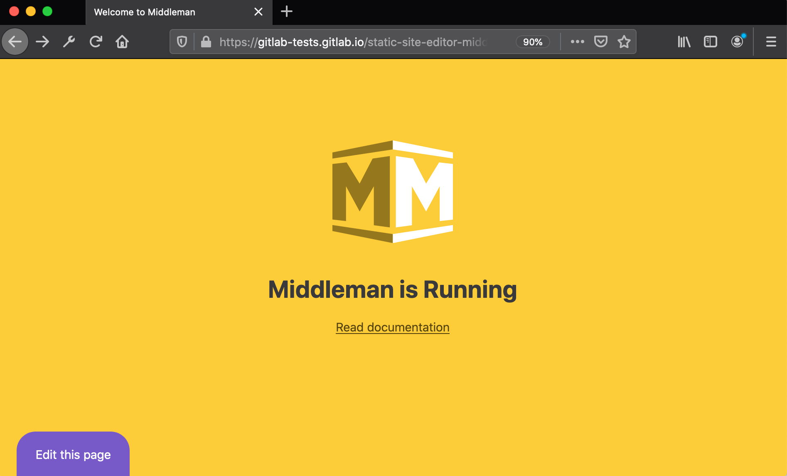
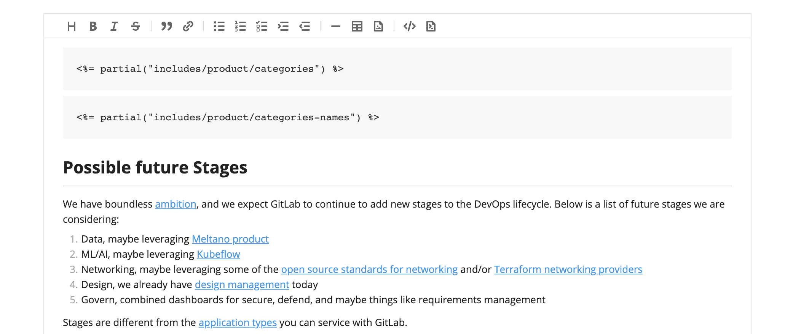
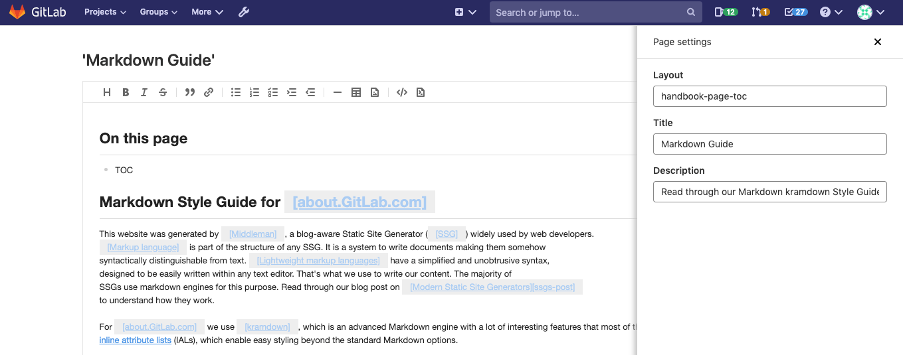

# Static Site Editor **(CORE)**

> - [Introduced](https://gitlab.com/gitlab-org/gitlab/-/merge_requests/28758) in GitLab 12.10.
> - WYSIWYG editor [introduced](https://gitlab.com/gitlab-org/gitlab/-/issues/214559) in GitLab 13.0.
> - Non-Markdown content blocks uneditable on the WYSIWYG mode [introduced](https://gitlab.com/gitlab-org/gitlab/-/issues/216836) in GitLab 13.3.

Static Site Editor (SSE) enables users to edit content on static websites without
prior knowledge of the underlying templating language, site architecture, or
Git commands. A contributor to your project can quickly edit a Markdown page
and submit the changes for review.

## Use cases

The Static Site Editors allows collaborators to submit changes to static site
files seamlessly. For example:

- Non-technical collaborators can easily edit a page directly from the browser;
  they don't need to know Git and the details of your project to be able to contribute.
- Recently hired team members can quickly edit content.
- Temporary collaborators can jump from project to project and quickly edit pages instead
  of having to clone or fork every single project they need to submit changes to.

## Requirements

- In order use the Static Site Editor feature, your project needs to be
  pre-configured with the [Static Site Editor Middleman template](https://gitlab.com/gitlab-org/project-templates/static-site-editor-middleman).
- The editor needs to be logged into GitLab and needs to be a member of the
  project (with Developer or higher permission levels).

## How it works

The Static Site Editor is in an early stage of development and only works for
Middleman sites for now. You have to use a specific site template to start
using it. The project template is configured to deploy a [Middleman](https://middlemanapp.com/)
static website with [GitLab Pages](../pages/index.md).

Once your website is up and running, you'll see a button **Edit this page** on
the bottom-left corner of its pages:

When you click it, GitLab opens up an editor window from which the content
can be directly edited. When you're ready, you can submit your changes in a
click of a button:

When an editor submits their changes, in the background, GitLab automatically
creates a new branch, commits their changes, and opens a merge request. The
editor lands directly on the merge request, and then they can assign it to
a colleague for review.

## Set up your project

First, set up the project. Once done, you can use the Static Site Editor to
easily edit your content.

1. To get started, create a new project from the [Static Site Editor - Middleman](https://gitlab.com/gitlab-org/project-templates/static-site-editor-middleman)
   template. You can either [fork it](../repository/forking_workflow.md#creating-a-fork)
   or [create a new project from a template](../../../gitlab-basics/create-project.md#built-in-templates).
1. Edit the `data/config.yml` file adding your project's path.
1. Editing the file triggers a CI/CD pipeline to deploy your project with GitLab Pages.
1. When the pipeline finishes, from your project's left-side menu, go to **Settings > Pages** to find the URL of your new website.
1. Visit your website and look at the bottom-left corner of the screen to see the new **Edit this page** button.

Anyone satisfying the [requirements](#requirements) will be able to edit the
content of the pages without prior knowledge of Git or of your site's
codebase.

## Edit content

After setting up your project, you can start editing content directly from the Static Site editor.

### Markdown files

> Support for `*.md.erb` files [introduced](https://gitlab.com/gitlab-org/gitlab/-/issues/223171) in GitLab 13.2.

The Static Site Editors supports Markdown files (`.md`, `.md.erb`) for editing text. <!-- Any other formats? -->
To edit a file:

1. Visit the page you want to edit.
1. Click the **Edit this page** button.
1. The file is opened in the Static Site Editor in **WYSIWYG** mode. If you wish to edit the raw Markdown
   instead, you can toggle the **Markdown** mode in the bottom-right corner.
1. When you're done, click **Submit changes**.
1. A new merge request is automatically created and you can assign a colleague for review.

### Upload images

> - Support for adding images through the WYSIWYG editor [introduced](https://gitlab.com/gitlab-org/gitlab/-/issues/216640) in GitLab 13.1.
> - Support for uploading images added through the WYSIWYG editor directly to the repository [introduced](https://gitlab.com/gitlab-org/gitlab/-/issues/218529) in GitLab 13.5.

You can upload image files directly from the WYSIWYG mode by clicking the image icon (**{doc-image}**).
The following formats are supported:

- `jpg`/`jpeg`
- `gif`
- `png`

A description (`ALT` text) is not required, but recommended for SEO and acessibility. Images are uploaded to a
default directory (`source/images/`).

### Front matter

> - Markdown front matter hidden on the WYSIWYG editor [introduced](https://gitlab.com/gitlab-org/gitlab/-/issues/216834) in GitLab 13.1.
> - Ability to edit page front matter [introduced](https://gitlab.com/gitlab-org/gitlab/-/issues/235921) in GitLab 13.4.

Front matter is a flexible and convenient way to define page-specific variables in data files
intended to be parsed by a static site generator. It is commonly used for setting a page's
title, layout template, or author, but can be used to pass any kind of metadata to the
generator as the page renders out to HTML. Included at the very top of each data file, the
front matter is often formatted as YAML or JSON and requires consistent and accurate syntax.

To edit the front matter from the Static Site Editor you can use the GitLab's regular file editor,
the Web IDE, or easily update the data directly from the WYSIWYG editor:

1. Click the **Page settings** button on the bottom-right to reveal a web form with the data you
   have on the page's front matter. The form is populated with the current data.
1. Update the values as you wish and close the panel.
1. When you're done, click **Submit changes**.
1. Describe your changes (add a commit message).
1. Click **Submit changes**.
1. Click **View merge request** and GitLab will take you there. You can click **Edit** to update
   its description.

Note that support for adding new attributes to the page's front matter from the form is not supported
yet. You can do so by editing the file locally, or through the GitLab regular file editor, or through the Web IDE. Once added, the form will load the new fields.

### Configuration files

A new configuration file for the Static Site Editor was [introduced](https://gitlab.com/groups/gitlab-org/-/epics/4267)
in GitLab 13.4. Beginning in 13.5, the `.gitlab/static-site-editor.yml` file will store additional
configuration options for the editor. When the functionality of the existing `data/config.yml` file
is replicated in the new configuration file, `data/config.yml` will be formally deprecated.
<!-- THIS SECTION WILL BE UPDATED BY https://gitlab.com/gitlab-org/gitlab/-/merge_requests/44507 -->

## Upgrade from GitLab 12.10 to 13.0

In GitLab 13.0, we [introduced breaking changes](https://gitlab.com/gitlab-org/gitlab/-/issues/213282)
to the URL structure of the Static Site Editor. Follow the instructions in this
[snippet](https://gitlab.com/gitlab-org/project-templates/static-site-editor-middleman/snippets/1976539)
to update your project with the 13.0 changes.

## Limitations

The Static Site Editor still cannot be quickly added to existing Middleman sites.
Follow this [epic](https://gitlab.com/groups/gitlab-org/-/epics/2784) for updates.
