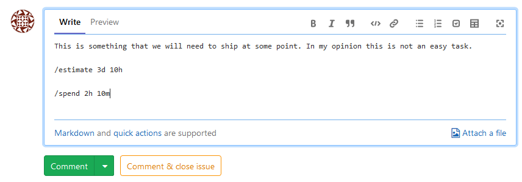

# Time Tracking

> Introduced in GitLab 8.14.

Time Tracking allows you to track estimates and time spent on issues and merge
requests within GitLab.

## Overview

Time Tracking allows you to:

- Record the time spent working on an issue or a merge request.
- Add an estimate of the amount of time needed to complete an issue or a merge
  request.

You don't have to indicate an estimate to enter the time spent, and vice versa.

Data about time tracking is shown on the issue/merge request sidebar, as shown
below.

## How to enter data

Time Tracking uses two [quick actions](quick_actions.md): `/spend` and `/estimate`.

If you use either quick action more than once in a single comment, only the last occurrence is applied.

Below is an example of how you can use those new quick actions inside a comment.

Adding time entries (time spent or estimates) is limited to project members
with [Reporter and higher permission levels](../permissions.md).

### Estimates

To enter an estimate, write `/estimate`, followed by the time. For example, if
you need to enter an estimate of 1 month, 2 weeks, 3 days, 4 hours and 5 minutes,
write `/estimate 1mo 2w 3d 4h 5m`.
Check the [time units you can use](#configuration).

Every time you enter a new time estimate, any previous time estimates are
overridden by this new value. There should only be one valid estimate in an
issue or a merge request.

To remove an estimation entirely, use `/remove_estimate`.

### Time spent

To enter time spent, write `/spend`, followed by the time. For example, if you need
to log 1 month, 2 weeks, 3 days, 4 hours and 5 minutes, you would write `/spend 1mo 2w 3d 4h 5m`.
Time units that we support are listed at the bottom of this help page.

Every new time spent entry is added to the current total time spent for the
issue or the merge request.

You can remove time by entering a negative amount: for example, `/spend -3d` removes three
days from the total time spent. You can't go below 0 minutes of time spent,
so GitLab automatically resets the time spent if you remove a larger amount
of time compared to the time that was entered already.

You can log time in the past by providing a date after the time.
For example, if you want to log 1 hour of time spent on the 31 January 2021,
you would write `/spend 1h 2021-01-31`. If you supply a date in the future, the
command fails and no time is logged.

To remove all the time spent at once, use `/remove_time_spent`.

## Configuration

The following time units are available:

- Months (mo)
- Weeks (w)
- Days (d)
- Hours (h)
- Minutes (m)

Default conversion rates are 1mo = 4w, 1w = 5d and 1d = 8h.

### Limit displayed units to hours **(FREE SELF)**

> [Introduced](https://gitlab.com/gitlab-org/gitlab-foss/-/merge_requests/29469/) in GitLab 12.1.

In GitLab self-managed instances, the display of time units can be limited to
hours through the option in **Admin Area > Settings > Preferences** under **Localization**.

With this option enabled, `75h` is displayed instead of `1w 4d 3h`.

## Other interesting links

- [Time Tracking solutions page](https://about.gitlab.com/solutions/time-tracking/)
