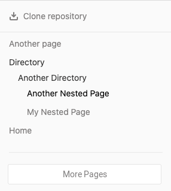
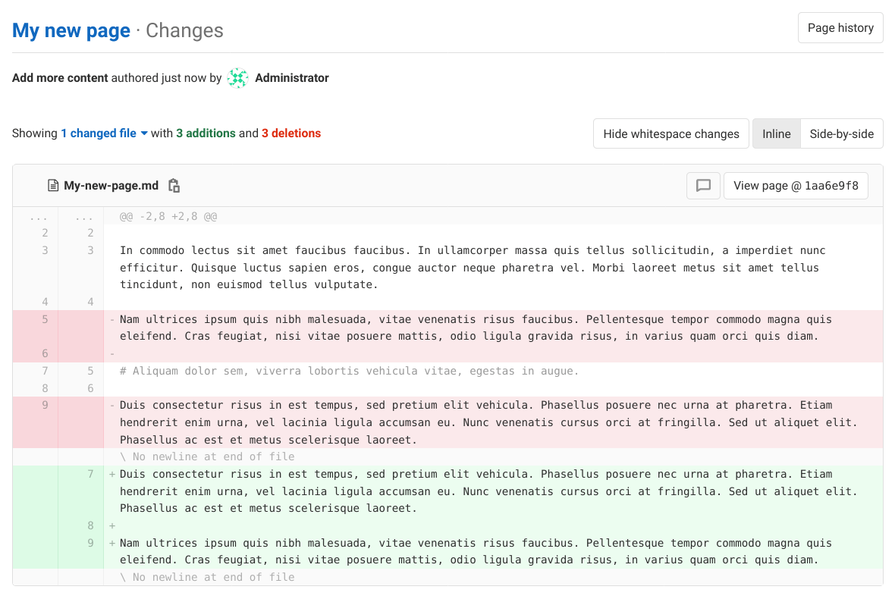

# Wiki **(CORE)**

A separate system for documentation called Wiki, is built right into each
GitLab project. It is enabled by default on all new projects and you can find
it under **Wiki** in your project.

Wikis are very convenient if you don't want to keep your documentation in your
repository, but you do want to keep it in the same project where your code
resides.

You can create Wiki pages in the web interface or
[locally using Git](#adding-and-editing-wiki-pages-locally) since every Wiki is
a separate Git repository.

[Introduced](https://gitlab.com/gitlab-org/gitlab/-/issues/13195) in [GitLab Premium](https://about.gitlab.com/pricing/) 13.5,
**group wikis** became available. Their usage is similar to project wikis, with a few [limitations](../../group/index.md#group-wikis).

## First time creating the Home page

The first time you visit a Wiki, you will be directed to create the Home page.
The Home page is necessary to be created since it serves as the landing page
when viewing a Wiki. You only have to fill in the **Content** section and click
**Create page**. You can always edit it later, so go ahead and write a welcome
message.


## Creating a new wiki page

NOTE:
Requires Developer [permissions](../../permissions.md).

Create a new page by clicking the **New page** button that can be found
in all wiki pages.

You will be asked to fill in a title for your new wiki page.

You can specify a full path for the wiki page by using '/' in the
title to indicate subdirectories. Any missing directories will be created
automatically. For example, a title of `docs/my-page` will create a wiki
page with a path `/wikis/docs/my-page`.

Once you enter the page name, it's time to fill in its content. GitLab wikis
support Markdown, RDoc, AsciiDoc, and Org. For Markdown based pages, all the
[Markdown features](../../markdown.md) are supported and for links there is
some [wiki specific](../../markdown.md#wiki-specific-markdown) behavior.

In the web interface the commit message is optional, but the GitLab Wiki is
based on Git and needs a commit message, so one will be created for you if you
do not enter one.

When you're ready, click the **Create page** and the new page will be created.


### Attachment storage

> [Introduced](https://gitlab.com/gitlab-org/gitlab-foss/-/issues/33475) in GitLab 11.3.

Starting with GitLab 11.3, any file that is uploaded to the wiki via GitLab's
interface will be stored in the wiki Git repository, and it will be available
if you clone the wiki repository locally. All uploaded files prior to GitLab
11.3 are stored in GitLab itself. If you want them to be part of the wiki's Git
repository, you will have to upload them again.

### Special characters in page titles

Wiki pages are stored as files in a Git repository, so certain characters have a special meaning:

- Spaces are converted into hyphens when storing a page.
- Hyphens (`-`) are converted back into spaces when displaying a page.
- Slashes (`/`) can't be used, because they're used as path separator.

### Length restrictions for file and directory names

> [Introduced](https://gitlab.com/gitlab-org/gitlab/-/merge_requests/24364) in GitLab 12.8.

Many common file systems have a [limit of 255 bytes for file and directory names](https://en.wikipedia.org/wiki/Comparison_of_file_systems#Limits), and while Git and GitLab both support paths exceeding those limits, the presence of them makes it impossible for users on those file systems to checkout a wiki repository locally.

To avoid this situation, these limits are enforced when editing pages through the GitLab web interface and API:

- 245 bytes for page titles (reserving 10 bytes for the file extension).
- 255 bytes for directory names.

Please note that:

- Non-ASCII characters take up more than one byte.
- It's still possible to create files and directories exceeding those limits locally through Git, but this might break on other people's machines.

## Editing a wiki page

You need Developer [permissions](../../permissions.md) or higher to edit a wiki page.
To do so:

1. Click the edit icon (**{pencil}**).
1. Edit the content.
1. Click **Save changes**.

### Adding a table of contents

To generate a table of contents from the headings in a Wiki page, use the `[[_TOC_]]` tag.
For an example, see [Table of contents](../../markdown.md#table-of-contents).

## Deleting a wiki page

You need Maintainer [permissions](../../permissions.md) or higher to delete a wiki page.
To do so:

1. Open the page you want to delete.
1. Click the **Delete page** button.
1. Confirm the deletion.

## Moving a wiki page

You need Developer [permissions](../../permissions.md) or higher to move a wiki page.
To do so:

1. Click the edit icon (**{pencil}**).
1. Add the new path to the **Title** field.
1. Click **Save changes**.

For example, if you have a wiki page called `about` under `company` and you want to
move it to the wiki's root:

1. Click the edit icon (**{pencil}**).
1. Change the **Title** from `about` to `/about`.
1. Click **Save changes**.

If you want to do the opposite:

1. Click the edit icon (**{pencil}**).
1. Change the **Title** from `about` to `company/about`.
1. Click **Save changes**.

## Viewing a list of all created wiki pages

> - [Introduced](https://gitlab.com/gitlab-org/gitlab/-/issues/17673/) in GitLab 13.5, wiki pages are displayed as a nested tree in the sidebar and pages overview.

Every wiki has a sidebar from which a short list of the created pages can be
found. The list is ordered alphabetically.



If you have many pages, not all will be listed in the sidebar. Click on
**View All Pages** to see all of them.

## Viewing the history of a wiki page

The changes of a wiki page over time are recorded in the wiki's Git repository,
and you can view them by clicking the **Page history** button.

From the history page you can see the revision of the page (Git commit SHA), its
author, the commit message, and when it was last updated.
To see how a previous version of the page looked like, click on a revision
number in the **Page version** column.


### Viewing the changes between page versions

> [Introduced](https://gitlab.com/gitlab-org/gitlab/-/issues/15242) in GitLab 13.2.

Similar to versioned diff file views, you can see the changes made in a given Wiki page version:

1. Navigate to the Wiki page you're interested in.
1. Click on **Page history** to see all page versions.
1. Click on the commit message in the **Changes** column for the version you're interested in:

   

## Wiki activity records

> - [Introduced](https://gitlab.com/gitlab-org/gitlab/-/issues/14902) in **GitLab 12.10.**
> - Git events were [Introduced](https://gitlab.com/gitlab-org/gitlab/-/issues/216014) in **GitLab 13.0.**
> - [Feature flag for Git events was removed](https://gitlab.com/gitlab-org/gitlab/-/issues/258665) in **GitLab 13.5**

Wiki events (creation, deletion, and updates) are tracked by GitLab and
displayed on the [user profile](../../profile/index.md#user-profile),
[group](../../group/index.md#view-group-activity),
and [project](../index.md#project-activity) activity pages.

## Adding and editing wiki pages locally

Since wikis are based on Git repositories, you can clone them locally and edit
them like you would do with every other Git repository.

On the right sidebar, click on **Clone repository** and follow the on-screen
instructions.

Files that you add to your wiki locally must have one of the following
supported extensions, depending on the markup language you wish to use,
otherwise they will not display when pushed to GitLab:

- Markdown extensions: `.mdown`, `.mkd`, `.mkdn`, `.md`, `.markdown`.
- AsciiDoc extensions: `.adoc`, `.ad`, `.asciidoc`.
- Other markup extensions: `.textile`, `.rdoc`, `.org`, `.creole`, `.wiki`, `.mediawiki`, `.rst`.

## Customizing sidebar

On the project's Wiki page, there is a right side navigation that renders the full Wiki pages list by default, with hierarchy.

To customize the sidebar, you can create a file named `_sidebar` to fully replace the default navigation.

WARNING:
Unless you link the `_sidebar` file from your custom nav, to edit it you'll have to access it directly
from the browser's address bar by typing: `https://gitlab.com/<namespace>/<project_name>/-/wikis/_sidebar` (for self-managed GitLab instances, replace `gitlab.com` with your instance's URL).

Example for `_sidebar` (using Markdown format):

```markdown
### [Home](home)

- [Hello World](hello)
- [Foo](foo)
- [Bar](bar)

---

- [Sidebar](_sidebar)
```

Support for displaying a generated table of contents with a custom side navigation is planned.
