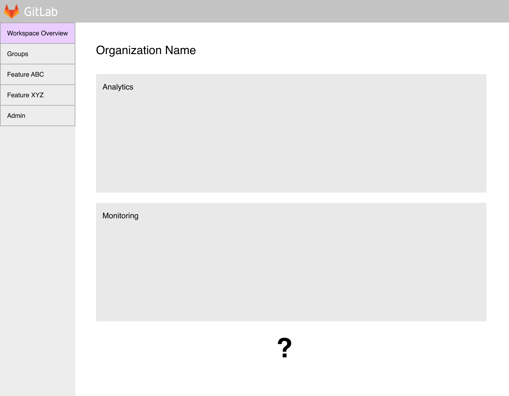
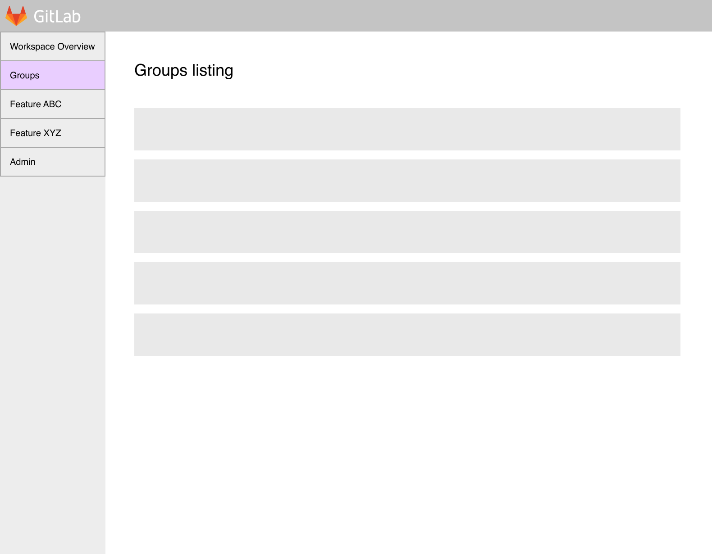
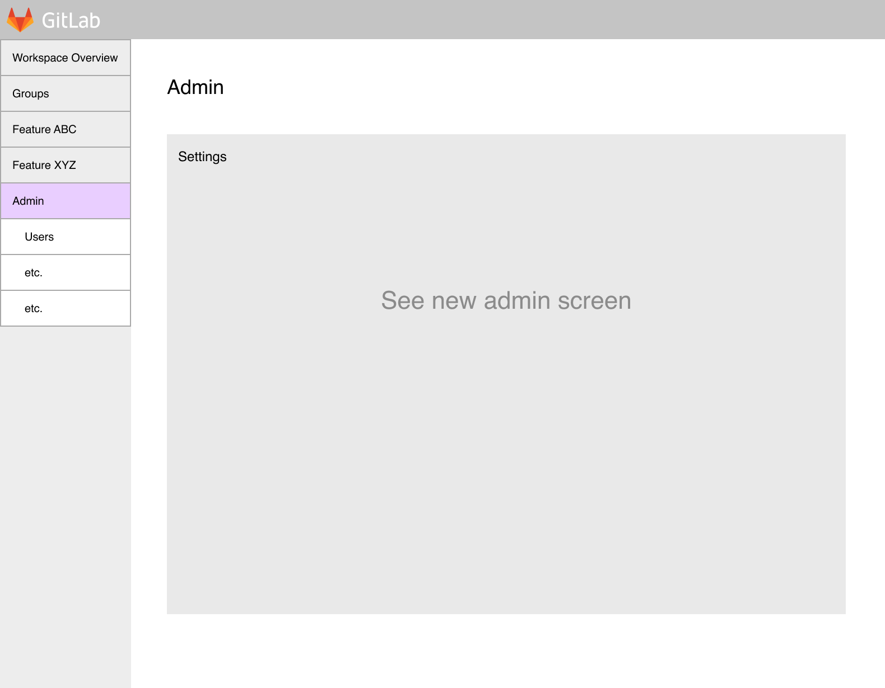
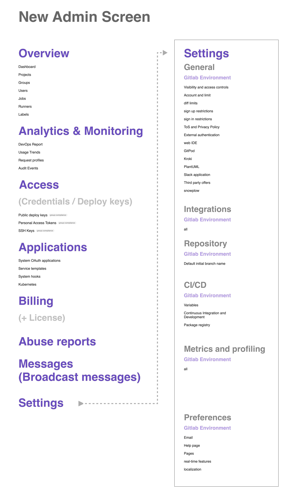

# Workspaces

Workspaces will be the top-level [namespace](../group/index.md#namespaces) for you to manage
everything GitLab, including:

- Defining and applying settings to all of your groups, subgroups, and projects.
- Aggregating data from all your groups, subgroups, and projects.

Workspaces will take many of the features from the
[Admin Area](../admin_area/index.md), and there will be one workspace per:

- Instance, for self-managed instances.
- Namespace, for GitLab.com.

NOTE:
Workspaces are currently in development.

## Concept previews

